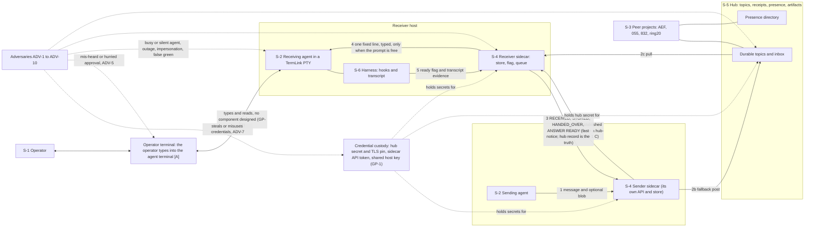
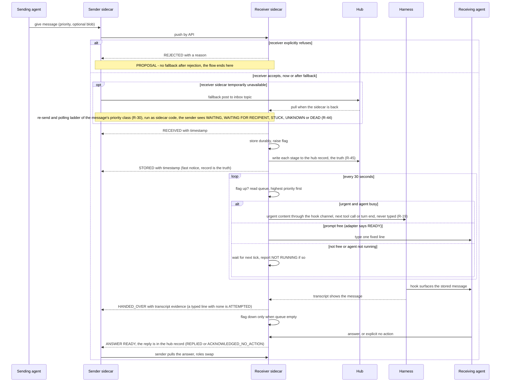
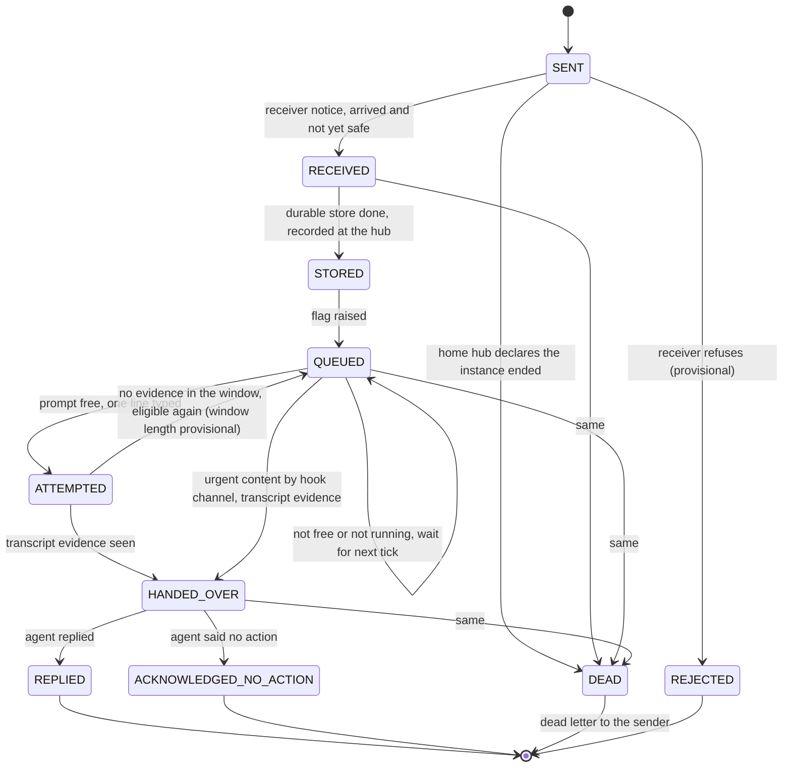

# Interactive agent communication: step 1, requirements

**Task:** T-3344 · **Arc:** arc-011 · **Chain:** arc-011-design, step 1 · **Role:** requirements collector
**Status:** DRAFT v0.4: the operator's step-1 rulings (OD-1..OD-18, the OD-17 candidates, GP-0, GP-12, the OD-3 correction of 2026-10-06 and the progressive insight of 2026-10-06) are folded in. GP-11 (operator as a party) stays OPEN. Condition 6.1 of the card is met in form. The operator's sign-off (T-3349, owner human) is pending and is the separate approval criterion. Where this document and the interview log differ, the log wins. Log: [`interactive-agent-communication/interview-step-01.md`](interactive-agent-communication/interview-step-01.md); summary: `docs/reports/T-3344-step1-rulings-summary.md`.
**Review link:** none yet. This project's Watchtower has no inline design-review page (profile P2.1). The operator reads this file in the repository.

## 0 Version history

| Version | Date | Change | Task |
|---|---|---|---|
| 0.4 | 2026-10-06 | Fold of the operator's step-1 rulings, from the interview log ([`interactive-agent-communication/interview-step-01.md`](interactive-agent-communication/interview-step-01.md)) and its summary (`docs/reports/T-3344-step1-rulings-summary.md`). (1) Section 9: OD-1..OD-18 marked ruled, each with its ruling and a link to its log section; GP-11 stays open (9.22). (2) Requirements R-2, R-3, R-6, R-7, R-8, R-9, R-12, R-13, R-14, R-15, R-19, R-21, R-22, R-23, R-24, R-26, R-27, R-28, R-29, R-30, R-31, R-32, R-33, R-34, R-35, R-36, R-37, R-39, R-40..R-43 changed as each ruling authorises (10.2 lists each, with its ruling). (3) R-29.e corrected: CLEAR needs recent surfacing progress, never a fresh heartbeat alone. (4) New requirements R-44..R-71 (6.16), each traced to its ruling. (5) Section 2.3: ADV-8, ADV-9, ADV-10 added, ADV-6 widened (GP-0); new 2.4a, evidence from the production incident of 2026-10-06. (6) R-6 acceptance rewritten to verified behaviour (GP-12), counts are tripwires only. (7) R-30/R-31: two polling ladders by priority; the chase runs as sidecar code, never an LLM turn. (8) Drawings D-2 and D-3 updated to the ruled stage names and states. (9) Authority level [O] added (6.1.h). (10) Section 13: what goes to steps 2-8. Nothing beyond what a ruling authorises was added; what could not be placed is in 13.2. | T-3344, T-3348 |
| 0.1 | 2026-10-04 | First draft, batch mode. The operator's confirmed requirements R-1.1..R-14.4 are re-cast into the role-card skeleton. The 18 open decisions are written as interview questions. | T-3344 |
| 0.3 | 2026-10-04 | Small fixes after review round 2 (`docs/reports/T-3344-step1-review/codex-r2.md` and `glm-r2.md`): authority labels aligned (3.3.1.g with the glossary Stage entry); [P]/[A] tags added to R-12.d, R-14.e, R-30.e, R-36.e, R-38.e and listed in section 10; R-38.d verification names the test reader; D-2 no longer continues after an explicit rejection, "no fallback after rejection" marked [P], render check re-run (11.6); R-19.e counts only demonstrated delivery and keeps escalation separate; R-28.e requires the woken agent itself to reply or say no action; OD-7 ownership allocations marked collector-synthesized; OD-2.d no longer treats the R-23 exclusion as established; dedupe stated as at-most-once acceptance per message id (GP-5, CAND-2); GP-13..GP-15 added (durability failure scope, trusted evidence producers, adversary privileges), routed to step 2. No requirement added, nothing decided. | T-3344 |
| 0.2 | 2026-10-04 | Remediation of review round 1 (`docs/reports/T-3344-step1-review/codex.md` and `glm.md`). (1) Fidelity: R-7, R-29, R-34, R-38 and R-3 restored to the operator's wording; the clauses the collector had added (R-2, R-14, R-16, R-18, R-21, R-23, R-39 and several acceptance criteria) are now marked [P] collector proposal pending the operator, and section 10 lists them as changed with reason and source. (2) Authority levels [C] [H] [A] [P] added to requirements and glossary. (3) "Holds against" added to R-16, R-20, R-23; R-34 acceptance now exercises the impersonation case or states what it does not test. (4) Section 9 neutrality fixes in OD-3, 6, 7, 9, 10, 14, 15, 17, 18; OD-3.c.D and OD-4.c.D marked collector-synthesized. (5) Drawings: provisional states marked, refusal distinguished from unavailability, sender sidecar, operator terminal and credential custody added to D-1. (6) Weak acceptance criteria fixed (R-1, R-4, R-10, R-19, R-28, R-30, R-36, R-38) and unconfirmed bounds marked open (R-3, R-14, R-17, R-37). (7) Priorities labelled collector proposals; R-9 no longer P3. (8) Condition 6.1 stated honestly. (9) Render check re-run, result in 11.6. | T-3344 |

## 1 Inputs of record

1.1 Short names used in this document. Line numbers are those of the file as hashed in 1.2.
1.1.a `RQ` = the headline requirements document.
1.1.b `IAC` = the full design.
1.1.c `RV1` = the external design review comparison.
1.1.d `RV2` = the routing consultation comparison.
1.1.e `T3330R`, `ARC11`, `HT`, `HA` and the other short names are as defined in the header of `RQ`.

1.2 Inputs, with the hash read at the start of this step.

| Short | Path | sha256 |
|---|---|---|
| RQ | `docs/design/interactive-agent-communication-requirements.md` | `1382ffcc0c028cb60a84e45cc9530c1958e0c06811a1cab6859af06078a6f8a1` |
| IAC | `docs/design/interactive-agent-communication.md` | `266fea47b5916d7b0181cf0f32968d408fb76a203d4b8da19d55f6f3a7e92196` |
| RV1 | `docs/reports/T-3335-design-review/comparison.md` | `a725852f9097511a9d2c2c67253ada3a3939b7483a9dbea36f1d512edfb6c887` |
| RV2 | `docs/reports/T-3335-routing-consult/comparison.md` | `7d40ef362096073b11628df256ea843d51788fc2f67fc14ca4bb5dd6aa7c7500` |

1.3 Also read: `docs/design/roles/cards/_common.md`, the requirements-collector card, the AEF adapter, the TermLink profile, `docs/design/roles/README.md`, the chain file and the hand-back schema.

1.4 How this step was run.
1.4.a Mode: batch. No human was present (`_common.md` 5.2).
1.4.b The operator's answers are the confirmed requirements R-1.1..R-13.1 of `RQ` (the operator said "Yes, that's fine", `RQ` header and decision log 2026-10-04). Section 14 of `RQ` (R-14.1..R-14.4) is labelled unconfirmed and is treated as unconfirmed here.
1.4.c Nothing in section 9 is decided. Section 9 is the list of questions the operator has not answered.
1.4.d Reviewer findings that the operator has not ruled on are in section 7 (Conflicts) and section 9 (Open questions). They are not in section 6 (Requirements).

## 2 Stakeholders, protected assets and adversaries

2.1 Stakeholders (the humans and agents that approve, use or are affected).
2.1.a **S-1 The operator.** The only human approver (profile P1.3). Talks to agents through each agent's own terminal. Wants 1:1, many-to-many and operator-to-agent conversation (`RQ` 1.1, 1 item 3).
2.1.b **S-2 Agents of this project.** Sessions of 010-termlink. Several may run at once (profile P3.1). They send, receive, get woken, reply.
2.1.c **S-3 Peer agents of other projects.** The framework agent (AEF, 999-Agentic-Engineering-Framework), 055-agentic-fleet-cockpit, 832-Workflow-designer, ring20-manager (hub .122), ring20-dashboard (hub .121), Penelope (profile P3.1). AEF built a parallel receiver (`RQ` 3 item 2).
2.1.d **S-4 Sidecars.** One process per agent. They hold the store, the flag and the queue, and they inject.
2.1.e **S-5 Hubs.** Carry topics, receipts, presence, artifacts and the fallback path.
2.1.f **S-6 Harnesses.** The programs that run an agent (Claude Code today, opencode at 055). They own the hooks and the transcript (`RQ` 7, `RV1` 13).
2.1.g **S-7 Maintainers of the estate.** Whoever deploys the sidecars (`RQ` 13).

2.2 Protected assets (what an attack or a failure would damage).
2.2.a **A-1 Message content and its durability.** A message that was accepted must not be lost.
2.2.b **A-2 The sender's knowledge of where its message is.** (`RQ` R-1.2.)
2.2.c **A-3 An agent's attention and session.** A typed line into a busy prompt can be discarded (T-2396, `RQ` 8 item 6).
2.2.d **A-4 Identity.** Project, agent and instance identity. All agents on one host sign as one TermLink identity today (`RQ` 11 item 5).
2.2.e **A-5 Credentials.** Hub secrets and TLS pins, sidecar API tokens (profile P3.2).
2.2.f **A-6 The truth of the status record.** The register and the docs must say what actually operates (`RQ` 15).

2.3 Adversaries. The operator has not named an adversary list. This list is the agent's proposal, built from failures that the record documents. **Ruled (GP-0, A, 2026-10-06, [log](interactive-agent-communication/interview-step-01.md#gap-review-section-8--walked-one-item-at-a-time)):** ADV-1..ADV-7 are confirmed as written; ADV-8, ADV-9 and ADV-10 are added and ADV-6 is widened. ADV-8..ADV-10 are the collector's proposal from the interview's rulings; step 2 may add more.

| Id | Adversary | Documented evidence |
|---|---|---|
| ADV-1 | A confused or overloaded agent: busy when typed into, silent when woken, unaware of mail | T-2396; the 2026-10-03 incident, mail stored and receipted and never surfaced (`RQ` 5 item 2) |
| ADV-2 | A compromised or misbehaving session that injects, impersonates or force-interrupts | `RV1` point 17: any project can impersonate another with the one host key |
| ADV-3 | A component that reports success it did not earn (a dark guard that reads green) | `RQ` 15 item 2: arc-003, arc-004, S10: recorded as built and not operating |
| ADV-4 | A hub, host or network outage, or a blip | `RQ` R-3.2 "the hub goes down"; offline queue (`RQ` 4 item 1) |
| ADV-5 | A hurried or mis-heard operator: voice transcription turned "15" into "50" and "C" into "Cozzyte" | `RQ` 10 item 5; `RQ` 11 item 11 |
| ADV-6 | A stale or wrong binding: a second local hub, a wrong runtime directory, a deaf agent that looks alive. Widened by GP-0 to a misfiled signing key and two live copies of one project | `RV2` items 36 and 65: two hubs on .107, an agent on the wrong one is deaf. Misfiled signing key: T-3346. Two live copies of one project: OD-11 (2d, 2e); the incident of 2.4a |
| ADV-7 | A malicious process with privilege on a host (reads secrets, calls the local sidecar API, edits the store) | Not documented as an incident. Named because the card requires it. The threat modeler (step 2) assesses it. |
| ADV-8 | A flooding or looping peer: re-sends too often, piles up messages, or answers automatic messages with automatic messages | CAND-12 (log, OD-17 item 9). Collector's proposal from the rulings; step 2 may refine |
| ADV-9 | A stale or partitioned authority holder: a holder of the role "main" that is alive as a process but cannot take a turn, or is cut off from its hub | OD-18; the 32,205-refusal sidecar of OD-14 (healthy heartbeat, no surfacing). Collector's proposal from the rulings |
| ADV-10 | Estate drift: skewed clocks, mixed versions, a re-vendor that deletes local fixes | CAND-13; G-062; the 2026-10-06 re-vendor (2.4a). Collector's proposal from the rulings |

2.4a Evidence: the production incident of 2026-10-06.
2.4a.1 It is the failure class these requirements exist for, so it is recorded here as evidence. Facts: `docs/reports/T-3344-aef-upgrade-analysis.md` and handover `S-2026-1006-1455` (in `.context/handovers/`). Nothing below was re-measured in this step.
2.4a.2 2026-10-06, wake-ups went to the wrong session. A fleet agent, `framework-agent-systemd` (working directory `/opt/termlink`), consumed and acked 010-termlink's inbox `inbox:cacc73ea32b121dd/010-termlink`, so wake-ups went to its PTY and not to the working session. The inbox was consumed by three identities at once: TermLink's notify-sidecar, the host default, and that fleet agent. This is ADV-6 (a stale or wrong binding) and the reason for "one receiver per inbox" (R-49) and the exact-instance rules (R-62).
2.4a.3 2026-10-06, the mirror case at AEF. AEF's duplicate session (a fleet pane resuming the same session id) took AEF's wake-ups. AEF recorded it as G-111 and fixed its side (T-3936). Two live copies of one identity is ADV-6 and the OD-10 / OD-11 rules (R-62, R-60).
2.4a.4 Until the 2026-10-06 re-vendor, vendored AEF 1.6.29 had no receiver. Peers' senders therefore saw HUB_ACCEPTED and never RECEIVED, so a message that arrived could not be told from one that was lost. This is ADV-3 (success not earned) and ADV-1 (a silent agent), and it is why R-14, R-15, R-42 and R-45 exist.
2.4a.5 2026-10-06, the first receiver start replayed about 94 already-handled messages from 2026-09-22..10-03 (the legacy `sidecar:010-termlink` plus an old inbox cursor). All had been handled; this was checked thread by thread. This is the failure that CAND-2 (one hand-over per message id, R-51) and the sender sequence numbers of CAND-18 (R-59) address, and an instance of ADV-10 (estate drift after a re-vendor).
2.4a.6 The same re-vendor overwrote 15 TermLink-origin toolkit files with older template copies, and 21 local fixes were at risk (CARRIED 6, PARTIAL 4, NOT-CARRIED 10, RESTRUCTURED 1). This is ADV-10 and G-062; it motivates the standing controls of R-69.

2.4 What each stakeholder sees: the sender (S-2) sees the stages of section 4; the operator (S-1) sees escalations and, later, the digest; peers (S-3) see presence and receipts.

## 3 Drawings

### 3.1 Drawing D-1: context view (structure)

**Drawing D-1 — context: the system, its stakeholders, the adversaries and the neighbours**

3.1.1 Text equivalent of D-1.
3.1.1.a The sending agent hands a message and an optional blob to its own sidecar (arrow 1).
3.1.1.b The sender sidecar delivers it to the receiver sidecar by API (arrow 2). [O] Ruled (OD-1 C): the hubs set up a circuit and an established conversation runs sidecar to sidecar, also across hosts; the hub path is the fallback and carries new conversations (R-46). The fallback is a post to a hub topic that the receiver sidecar pulls (arrows 2b and 2c).
3.1.1.c The receiver sidecar reports the stages RECEIVED, STORED, HANDED_OVER and ANSWER READY to the sender sidecar (arrow 3) as a fast notice; each stage is first written to the hub record, which is the truth (R-45).
3.1.1.d The receiver sidecar types one fixed line into the receiving agent's session when the prompt is free (arrow 4); urgent content for a busy agent goes by the harness's hook channel instead (R-19). The receiving agent runs under a harness. The harness reports readiness and transcript evidence to the sidecar (arrow 5).
3.1.1.e The operator talks to an agent through the operator terminal, which is that agent's own terminal [A]. No component for this leg is built (`RQ` 1 item 3). The sender sidecar (arrow 1 and 2) holds the sender's API and store, like the receiver sidecar.
3.1.1.e2 Credential custody (hub secret and TLS pin, sidecar API token, the shared host key) is a touchpoint of both sidecars and the hub. Who holds what is an open gap (GP-1). The adversaries reach the credentials (ADV-7) and the operator terminal (ADV-5).
3.1.1.f Peer projects reach the same hub topics and the presence directory.
3.1.1.g The adversaries act on the receiving agent, the receiver sidecar and the hub topics.

### 3.2 Drawing D-2: main flow (behaviour)

**Drawing D-2 — main flow from send to answer, including the refusal paths**

3.2.1 Text equivalent of D-2.
3.2.1.a The sender gives a message to its sidecar. The sidecar pushes it to the receiver sidecar by API.
3.2.1.b Unavailability path, no receiver sidecar answering: the sender sidecar posts to the hub inbox topic. The receiver sidecar pulls it when it is back. The re-send and polling ladder of the message's priority class runs (R-30, R-31); the sender sees one of five states (R-44). The chase is sidecar code, never an LLM turn. [O] Ruled: OD-3. Temporary unavailability is not a refusal. For an established conversation the hubs have set up a circuit and the push is sidecar to sidecar, with this hub path as the fallback (R-46).
3.2.1.b2 Explicit refusal path: the receiver sidecar answers REJECTED with a reason. The sender sees REJECTED and the flow ends: it does not continue into RECEIVED or STORED. [P] "No fallback post after rejection" is a collector proposal, not a confirmed rule. REJECTED is a collector state in D-3 (provisional); no ruling says which refusals exist, so this is open (13.2).
3.2.1.c On the accepting branch (including after fallback and pull), the receiver sidecar answers RECEIVED, stores the message durably, raises the flag, then answers STORED (R-14, R-15, R-16). Each stage is written to the hub record first; the call to the sender is a fast notice (R-45).
3.2.1.d Every 30 seconds the receiver sidecar checks the flag and reads the queue, highest priority first (R-17, R-18).
3.2.1.e Urgent and the agent is busy: the content reaches the agent through the harness's hook channel, at the next tool call or at turn end. Nothing is typed into a busy prompt (R-19). [O] Ruled: OD-2.
3.2.1.f Prompt free (the harness adapter says READY): the sidecar types the one-line doorbell (R-20, R-21, R-47).
3.2.1.g Wait path, not ready or the agent is not running: the message waits for the next tick. NOT RUNNING is reported, never treated as busy (`IAC` 20a). A session with no typable terminal shows WAITING FOR RECIPIENT (R-48).
3.2.1.h The hook surfaces the stored message. The transcript shows it. Only then is HANDED_OVER reported to the sender (R-24); a typed line with no evidence is ATTEMPTED. The flag comes down only when the queue is empty (R-25).
3.2.1.i The agent replies or says "no action" (R-28). The receiver sidecar tells the sender sidecar ANSWER READY. The sender pulls it from the hub record. Roles swap (R-26, R-27).

### 3.3 Drawing D-3: lifecycle of a message (behaviour)

**Drawing D-3 — states of a message and the transitions the requirements allow**

3.3.1 Text equivalent of D-3.
3.3.1.a [O] Ruled (OD-8): the chain is SENT, RECEIVED, STORED, HANDED_OVER, then REPLIED or ACKNOWLEDGED_NO_ACTION. A message starts as SENT. It becomes RECEIVED, then STORED, then QUEUED when the flag is raised.
3.3.1.b Provisional: a SENT message ends as REJECTED if the receiver refuses. REJECTED is a collector proposal; no ruling names it. UNDELIVERABLE and ESCALATED of v0.3 no longer exist: the failure ending is DEAD (below) and "stuck" is a sender-visible label, not a state of the chain (3.3.1.g).
3.3.1.c A QUEUED message stays QUEUED each tick while the prompt is not free or the agent is not running. It becomes ATTEMPTED when the prompt is free and one line is typed.
3.3.1.d ATTEMPTED is a non-terminal marker: a typed line with no transcript evidence. The sender is told HANDED_OVER only on transcript evidence (R-24), whether the content arrived by typing or by the hook channel. With no evidence in the window the message goes back to QUEUED.
3.3.1.e An urgent message to a busy agent goes QUEUED to HANDED_OVER through the hook channel (R-19). The evidence window (AEF uses 90 s) is provisional.
3.3.1.f A HANDED_OVER message ends as REPLIED or as ACKNOWLEDGED_NO_ACTION, both terminal (R-28).
3.3.1.g DEAD is reached from any non-final state when the recipient's home hub declares that instance ended: polling stops and the sender gets a dead letter (R-44, R-62). Beside the chain the sender sees one label at each poll: WAITING, WAITING FOR RECIPIENT, STUCK, UNKNOWN or DEAD (R-44); they are computed from the hub record (R-45), appear and clear, and do not change the chain.
3.3.1.h Authority: the chain and the names are [O] (OD-8); REJECTED is [P]; the evidence window is provisional. The transitions between RECEIVED, STORED, HANDED_OVER and the reply follow the operator's confirmed requirements (R-14, R-15, R-24, R-27).

## 4 Answers

4.0 v0.4 note: section 4 records the answers as of v0.3, the confirmed requirements of `RQ`. Where an interview ruling changed one (for example the polling ladder in QS-10, the urgent route in QS-6.2, the stage name in QS-8), section 6 and 9 carry the ruled form and the ruling wins over the text of this section.

4.1 The question set is drafted here, one question per topic of `RQ`, because the profile supplies none (card 2.2). Each answer is the operator's confirmed requirement, with the operator's own words where `RQ` records them. A question for which `RQ` holds no confirmed answer is listed in 4.3 as an open gap.

4.2 Answers from the confirmed requirements.

**QS-1 What does interactive communication mean, and who talks?**
4.2.1 Answer: agents hold interactive, two-way conversations while they work, 1:1, many-to-many and with the operator (R-1.1 of `RQ`). The sender always knows where its message is (R-1.2). No agent has to be attached or polling by hand for delivery to proceed (R-1.3). Source: operator read-back, `RQ` 1.
4.2.2 Operator's words: "I am absolutely very clear that I want to have this … after 20 times me telling you this is a really important part of this design, you don't have this quite essential part of bi-directional interactive communication." (`RQ` 1 item 11, CONSULT:13).
4.2.3 Follow-up QS-1.1, how does the operator talk to an agent? Answer on record: through the agent's own terminal. No component is built (`RQ` 1 item 3). Open as a design question, see GP-11.

**QS-2 What original capability must stay?**
4.2.4 Answer: keystroke injection and output read-back into a terminal (R-2.1), and conversation over the hub instead of fire-and-forget dispatch (R-2.2). Operator's words: "i wanted a means to simulate keyboard input and capture console output" (`RQ` 2 item 9, T243R:96).

**QS-3 What is a sidecar?**
4.2.5 Answer: one per agent; a separate, very simple process with an API (`RQ` R-3.1). Independent of the hub "because the hub goes down" (`RQ` R-3.2). It always respawns, portably, not only under systemd (`RQ` R-3.3). It carries the startup chain: start agent, session, project, hub (`RQ` R-3.4). It re-resolves when an FQDN or IP stops resolving (`RQ` R-3.5). Operator wording, "verbatim in intent": "a separate process exposing an API, deliberately independent of the hub because the hub goes down. Very simple. Always respawns. It also carries the startup chain — start agent, start session, start project, start hub — and re-resolves when an FQDN or IP stops resolving." (`RQ` 3 item 10, RAIL:111-117).
4.2.6 Operator's principle for respawn: "reliability and fragility, so I'm not to save a few tokens just to get a quick solution. I want a solid solution." (`RQ` 3 item 12, ARC11:360-361).
4.2.7 Follow-up QS-3.1, is the sidecar API local only or does it send across hosts? The record holds two answers that conflict, see conflict C-2 and OD-1.

**QS-4 How is a message sent?**
4.2.8 Answer: the sender gives the message, optionally with a blob, to its own sidecar's API (`RQ` R-4.1). The sender's sidecar delivers it to the receiver's sidecar API, push first (`RQ` R-4.2). The hub is the fallback, plus discovery and blob storage (`RQ` R-4.3). Operator's words: "Send: sender agent -> its own sidecar (API) -> the receiver's sidecar (API)." (T3330R:252). And "We have multiple hosts, so that's not a question." (`RQ` 4 item 6, T-3397:270-273).

**QS-5 How is a message received?**
4.2.9 Answer: RECEIVED, the receiver's sidecar calls the sender's sidecar immediately (`RQ` R-5.1). STORED, the message is stored durably and a second call goes back (`RQ` R-5.2). A new-message flag is raised (`RQ` R-5.3). Operator's words: "We store it and immediately go back to the sidecar receiver … an API call that's received." (`RQ` 5 item 10, T3330R:229). The read-back has four calls: RECEIVED, STORED, INJECTED, ANSWER READY (T3330R:252-259).

**QS-6 How often, and what does the tick do?**
4.2.10 Answer: a cron-style job checks the flag every 30 seconds (`RQ` R-6.1). With the flag up it reads the queue, highest priority first (`RQ` R-6.2). Urgent is injected immediately even when the agent is busy, by a route that cannot silently lose the message (`RQ` R-6.3). Not urgent: injected if the prompt is free, otherwise it waits for the next tick (`RQ` R-6.4). Operator's words: "Every 30 seconds … when the flag is up, the message queue gets read … urgent gets injected immediately. Non-urgent, we check again if the prompt is free. If the prompt is not free, we wait again until the next 30 seconds." (CONSULT:17).
4.2.11 Follow-up QS-6.1, what is urgent and how is it marked? Answer on record: the queue has a `priority` clamped to [-9,9], and urgent is band 5 or more by default in the built injector (`RQ` 6 item 3, ARC11 S8 and S9). No confirmed requirement fixes the marking. See candidate CAND-4 in OD-17.
4.2.12 Follow-up QS-6.2, urgent into a busy prompt. Answer: confirmed as a bypass (R-6.3). The operator's earlier ruling SQ-4 said the opposite and has not been recorded as superseded. Open: OD-2.

**QS-7 Who says the prompt is free?**
4.2.13 Answer: the agent's own harness. The Stop hook marks ready at the end of a turn, and the prompt-submit hook clears it before the next turn (`RQ` R-7.1). It is not inferred from the screen: a long tool call looks idle but is not safe to type into (`RQ` R-7.2).

**QS-8 What is typed, and when is it reported?**
4.2.14 Answer: one short line is typed into the session with `termlink pty inject` (`RQ` R-8.1). INJECTED (AEF: HANDED_OVER) is reported only with evidence from the agent's transcript that it saw the message (`RQ` R-8.2). The flag comes down only when the queue is empty (`RQ` R-8.3). Operator's words: "INJECTED: called back to the sender's sidecar once the message is in the prompt. … The flag is cleared only when the queue is empty." (T3330R:257-258).

**QS-9 How does the answer come back?**
4.2.15 Answer: ANSWER READY, the receiver's sidecar tells the sender's sidecar and the sender pulls the answer (`RQ` R-9.1). Roles swap for the reply (`RQ` R-9.2). A woken agent always replies or explicitly says "no action", never silence (`RQ` R-9.3). If an agent's ears are dead it halts instead of assuming there is no mail (`RQ` R-9.4).

**QS-10 What happens when a push cannot land?**
4.2.16 Answer: the other side polls: 15 s, 1 min, 5 min, 15 min, 1 h, 4 h, 1 day, 3 days, 1 week, 1 month, 1 quarter, 1 year, each rung twice (`RQ` R-10.1). This ladder is the framework default for all polling, changeable per situation (`RQ` R-10.2). Operator's words: "that should be the standard fallback mechanism for the framework for any polling activities. It can be changed situationally, but that should be the standard." (IN-AEF@180).
4.2.17 Follow-up QS-10.1, was the first rung 15 s or 50 s? Dictation said "50". It was read as 15 and "pending operator correction" (T3330R:261). The operator confirmed the read-back, but no explicit correction is recorded. Open: OD-3.

**QS-11 How is an agent addressed?**
4.2.18 Answer: five levels, host, hub, project, session, agent (`RQ` R-11.1). Each level has a canonical name and an instance identity: FQDN for the host, a hub name, the `pid` for the project, a role for the agent (`RQ` R-11.2). Messages carry `to_circuit` and never fall back across projects (`RQ` R-11.3). Operator's decision on the key: T-3325 Q1 = C, recorded from a voice reading, overturnable (`RQ` 11 item 11).

**QS-12 What is recorded, reported and alarmed?**
4.2.19 Answer: every step is a timestamped event, copied to the hub, pullable from any agent (`RQ` R-12.1). Each agent posts a daily digest and reflects on it (`RQ` R-12.2). Alarms only for urgent messages. Everything else escalates when it piles up, like audit warnings (`RQ` R-12.3). Later: an observability database and learning from it, possibly a hub-steward agent (`RQ` R-12.4). Operator's words: "Liveness alarm only for urgent messages. Everything else accumulates and escalates when it piles up, like audit warnings (design to be decided)." (T3330R:265).

**QS-13 How does it ship?**
4.2.20 Answer: every sidecar ships with every TermLink deployment (`RQ` R-13.1). Operator's words: "are all the sidecars we develop … part of our [TermLink] package? When the deployment is done we should deploy all the sidecars with it." (T3330R:230).

**QS-14 Which earlier items were discussed once and lost? (UNCONFIRMED)**
4.2.21 `RQ` section 14 lists four candidates: R-14.1 native consumer, R-14.2 typed assignment and result messages, R-14.3 the hub refuses to call a message delivered without a receipt, R-14.4 the startup chain. The operator has not confirmed or dropped them. They are carried as R-40..R-43 with status "unconfirmed". Open: OD-13.

4.3 Open gaps: questions for which no answer is on record. Each is also a finding of the gap review (section 8).

| Id | Question | Status |
|---|---|---|
| QS-15 | Who may call a sidecar API, and with what credential? | Open gap GP-1 |
| QS-16 | What if a session in the conversation is compromised or hostile? | Open gap GP-2 |
| QS-17 | How many messages may one peer push, and how many may be outstanding? | Open gap GP-3 |
| QS-18 | What must keep working when the hub, the sender host or the receiver host is offline? | Open gap GP-4 |
| QS-19 | What is the recovery after a sidecar restarts in the middle of a delivery? | Open gap GP-5 |
| QS-20 | How is an agent, a peer, a credential or a role revoked? | Open gap GP-6 |
| QS-21 | Which identifiers are stable, who mints them, and what is the unit of "read"? | Open gap GP-7 |
| QS-22 | What does the sender see when the target cannot be reached by design (no hooks, no PTY, other OS)? | Open gap GP-8 |
| QS-23 | Who are the adversaries? | Open gap GP-0, list proposed in 2.3 |

## 5 Glossary

5.1 Each term is defined once, with its authority level (6.1.h) in the last column. Later roles MUST use these meanings and MUST NOT treat a [P] or [A] part as confirmed. A term marked (contested) has a definition the operator has not settled.

| Term | Meaning | Authority |
|---|---|---|
| Agent | A running AI session that does work. It has a role and an instance. | [A] |
| Circuit | The five-level address of an agent: host, hub, project, session, agent. Carried in `to_circuit`. | [C] |
| Conversation | A series of messages with one `conversation_id`. | [H] |
| Doorbell | The one fixed line typed into a session to make it look at its stored mail. It carries a count and ids, no peer content. | [C] one line typed (R-23); [P] no peer content, count and ids |
| Flag | The new-message marker the sidecar raises when a message is stored and lowers only when the queue is empty. | [C] raised; [C] lowered only when queue empty |
| Hub | The server that carries durable topics, receipts, presence and artifacts. Per host or per fleet. State is per hub (G-060). | [H] |
| Harness | The program that runs an agent and owns its hooks and its transcript. | [A] |
| Home hub | The hub that holds a project's identity card and is the only one that may declare an instance DEAD; what it cannot confirm is UNKNOWN (OD-11, OD-18). | [O] |
| Hub record | The per-message record at the receiver's home hub of each stage with its timestamp. It is the single source of truth for a message's state; the call to the sender is a fast notice (OD-5, R-45). | [O] |
| Project id | The id minted once by the project's framework (AEF's pid) and written in the project's own `.framework.yaml`. Names, folder and host are display or observed attributes, never identity (OD-11). | [O] |
| Main | The one role the home hub resolves now for a project with several agents, held under a readiness-gated fenced lease (OD-18, R-67). | [O] |
| Grant | A recorded permission under which mail may start or resume an agent: Tier 2 one-off, Tier 3 pre-approved category, with budget, restart limit and allowed senders (OD-15, R-64). | [O] |
| Injection | Typing the doorbell into the agent's session. Typing is not the same as the agent seeing the message. | [C] |
| HANDED_OVER | The one name for "the agent's session received the content", proven from its transcript, by hook or by typing. "Inject" names the action, not the stage (OD-8). Replaces INJECTED of v0.3. | [O] |
| ATTEMPTED | A typed line with no transcript evidence. A non-terminal marker, never reported as HANDED_OVER (OD-8). | [O] |
| INJECTED | Retired as a stage name in v0.4; the stage is HANDED_OVER. Kept here because earlier records use it. | [O] |
| Message states | The sender-visible labels computed at each poll from the hub record: WAITING, WAITING FOR RECIPIENT, STUCK, UNKNOWN, DEAD (OD-3, R-44). Not the delivery chain. | [O] |
| Instance | One running copy at a level, for example one session. It has a runtime id. | [C] |
| Message | One post carrying content, a priority, an id and a conversation id, with an optional blob. | [A] |
| Polling ladder | Two ladders by priority (R-30): normal (priority below 5) each rung twice from 1 min to 1 year, 22 polls; urgent (priority 5 or higher) continuous from 15 s to 2 years, 43 polls. A message's ladder also governs its re-sends before STORED (OD-3 correction, 2026-10-06). | [O] |
| Priority | A number in [-9,9], default 0, clamped at the receiver. Urgent is 5 or more by default; the receiver may change its own threshold (CAND-4, R-52). | [O] |
| Queue | The sidecar's store of messages not yet handed over, ordered by priority then arrival. | [C] priority order; [P] tie-break by arrival |
| RECEIVED | The receiver's sidecar tells the sender's sidecar immediately that the message arrived. Informational: arrived, not yet safe (OD-4). | [O] |
| Retry ladder | AEF's schedule for re-sending a post, 2×1 min to 2×1 month, then dead-letter (D-600). For agent mail the normal polling ladder replaces it (OD-3 correction); it is D-600 extended to years instead of dead-lettering at a month. | [H] AEF D-600; [O] replaced for agent mail |
| Role | The function an agent serves in a project, such as manager. A role is not an instance. | [C] (R-11.2) |
| Sidecar | The separate, simple process per agent that stores, flags, queues, injects and reports. | [C] |
| STORED | The message is durably saved on the receiver side. The only call that releases the sender (OD-4). | [O] |
| Stage | One named step of delivery reported to the sender: SENT, RECEIVED, STORED, HANDED_OVER, then REPLIED or ACKNOWLEDGED_NO_ACTION (OD-8). | [O] |
| ACKNOWLEDGED_NO_ACTION | The terminal stage beside REPLIED: the woken agent explicitly says no action is needed (OD-8, R-28). | [O] |
| Startup chain | Start agent, start session, start project, start hub (R-9, never built). | [C] never built |
| Tick | The 30-second check of the flag. | [C] |
| Transcript evidence | A record in the receiver's own session transcript that shows the agent saw the message. | [C] |
| Urgent | A message with priority 5 or higher (default threshold). It bypasses the wait, never the prompt-free check: a busy agent gets it by the hook channel, an idle one by the normal one-line inject (R-19, R-52). | [O] |
| Unreachable | An agent that cannot be woken now. Not the same as dead. | [A] |

## 6 Requirements

6.1 How to read this section.
6.1.a R-1..R-39 are the operator's confirmed requirements (`RQ` R-1.1..R-13.1), carried over one for one, as amended by the step-1 rulings. R-40..R-43 were unconfirmed (`RQ` section 14) and were ruled in OD-13 (6.15). R-44..R-71 are new, each from a ruling (6.16). A clause tagged [O] is the operator's ruling in the step-1 interview, with its log reference; section 10.2 lists every requirement the rulings changed.
6.1.b Each requirement has: **a** statement, **b** type, priority and source, **c** rationale, **d** verification method, **e** acceptance criteria, **f** what it holds against (only where it says something MUST be impossible), **g** status note.
6.1.c Types: functional, security invariant, interface, operational, quality. Priority is a **collector proposal**, never an operator ruling: P1 needed for the goal, P2 needed for a solid system, P3 can come later in the build order, U unconfirmed requirement (R-40..R-43). A priority says nothing about whether the operator confirmed the requirement.
6.1.h Authority levels. Every sentence that is not plain description carries one of these, or inherits the one of its requirement. **[C]** confirmed: the operator's wording, from `RQ` R-1.1..R-13.1. **[H]** historical fact: what the record or a build shows, not re-measured. **[A]** collector assumption: an inference the operator did not state. **[P]** proposed safeguard or change: a collector proposal pending the operator, which the operator may drop. **[O]** operator ruling: given in the step-1 interview and recorded in the interview log (the log section is cited); where the log marks a detail as the orchestrator's addition accepted by the ruling (for example a number), it is [O] and the log's "can be overturned" note applies. A requirement statement without a tag is [C]. Section 10 lists every place where [P] or [A] text sits inside a requirement.
6.1.d The closing rule applies to every verification below. [O] Ruled (CAND-3, A revised and staged, R-69): tests are selected per failure mode in four tiers, with kill-checked negative controls; nothing is called working until the tier its failure mode needs has passed. This replaces the v0.3 reading "two real running agents for every requirement" (profile P1.2.e, `IAC` item 58), which the operator found too heavy.
6.1.e Where a requirement is contested by a reviewer, the statement stays as the operator confirmed it. Clauses that the collector added are tagged [P] and are not part of the confirmed statement. The contest is named in **g** and decided in section 9.
6.1.f "Status" facts come from `RQ` section 15 (2026-10-03) and were not re-measured in this step.

### 6.2 Goal (`RQ` section 1)

R-1 **Interactive conversation.**
R-1.a Agents MUST hold interactive, two-way conversations with each other while they are working: 1:1, many-to-many, and agents with the operator.
R-1.b Functional · P1 · source `RQ` R-1.1; operator, 2026-10-03: "I am absolutely very clear that I want to have this …".
R-1.c Rationale: this is the goal the other requirements serve.
R-1.d Verification: live test with two real agents (1:1), then three (many-to-many); a demonstration for the operator leg.
R-1.e Acceptance. (1) Given agents A and B both running, when A sends a turn with a `conversation_id`, then the turn is in B's transcript and B's reply, with the same id, reaches A. (2) Given agents A, B and C on one broadcast topic, when A posts and B replies with the same `conversation_id`, then C receives both A's post and B's reply, and A receives B's reply (many-to-many, not receipt only). (3) The operator leg has no acceptance criterion yet, because no component is designed for it (GP-11).
R-1.g Status: 1:1 and broadcast carry on the hub. The live leg into a running agent does not operate on this host. The operator leg is designed only.

R-2 **The sender always knows where its message is.**
R-2.a [C] The sender MUST always know where its message is. [P] Collector expansion: the sender MUST be able to see, for every message it sent, the stage the message has reached, with a timestamp, and no message may be in transit with its stage invisible (the new impossibility clause is the collector's reading of R-1.2). [O] The stage and the sender-visible state (R-44) are computed from the hub record, so sender, receiver and cockpit see the same state (OD-5, R-45).
R-2.b Functional, security invariant · P1 · source `RQ` R-1.2.
R-2.c Rationale: the operator's failure was "you've been telling me it works" while mail sat stored and unseen (`RQ` 1 item 11).
R-2.d Verification: negative-control test. Stop the receiver's injector, then read the sender's record.
R-2.e Acceptance. Given a message was sent and the receiver's sidecar is stopped, when the sender reads its record, then the stage is SENT or waiting or overdue and is never HANDED_OVER or delivered. Given the receiver is healthy, when the message passes each stage, then the sender's record carries one timestamped row per stage. [O] Given the sender was down while the stages passed, when it returns and reads the hub record, then it sees the same stages and states, and it does not re-send a message whose STORED is already recorded.
R-2.f Holds against: ADV-3 (false success), ADV-4 (outage), ADV-1 (silent agent).
R-2.g Status: built in pieces (sender ledger, ack tracker). The per-message timeline is designed, not built (`RQ` 1 item 4d).

R-3 **No one has to be attached.**
R-3.a No agent MUST have to be attached or polling by hand for delivery to proceed.
R-3.b Operational · P1 · source `RQ` R-1.3.
R-3.c Rationale: an agent in the middle of work cannot also watch a mailbox.
R-3.d Verification: live test with a receiver left idle at its prompt that runs no polling.
R-3.e Acceptance. [O] Ruled (OD-6 B, [log](interactive-agent-communication/interview-step-01.md#od-6-already-running-sessions-section-99--ruled-b)): there is no forced relaunch. (1) Given a working session, running or not under a TermLink PTY, with the mail check in its existing hooks (R-48), when a message is sent, then the message appears in its transcript at its next hook call, with transcript evidence. (2) Given an idle session with no typable terminal, then the sender sees WAITING FOR RECIPIENT (R-44), never delivered, until the session next starts through the reachable launcher or acts. (3) Given the receiving agent is idle at its prompt in a typable terminal and runs no polling, when a message is sent, then the message appears in its transcript within a bound. The bound for (3) is still open: the OD-3 stuck deadline "not handed over within about 1 min of the agent being ready" is the only number the rulings give, and two ticks plus margin stays a placeholder to make the test runnable.
R-3.g Status: NOT met for idle sessions without a typable terminal on this host (`RQ` 1 item 5). A running session cannot be made injectable afterwards (PL-237). [O] Conflict C-3 is resolved by OD-6 B: working sessions are reached by hooks, idle ones become pushable over time through the launcher on each natural restart, never forced.

### 6.3 Origins (`RQ` section 2)

R-4 **Keep keystroke injection and output read-back.**
R-4.a The system MUST keep the ability to inject keystrokes into a terminal session and read its output back.
R-4.b Interface · P1 · source `RQ` R-2.1; operator: "i wanted a means to simulate keyboard input and capture console output".
R-4.c Rationale: the founding verb of TermLink and the base of the injector.
R-4.d Verification: `scripts/session-selftest.sh` (spawn, exec a sentinel, cleanup).
R-4.e Acceptance. (1) Given a spawned session at a shell prompt, when `termlink pty inject <s> "echo <sentinel>" --enter` runs, then `termlink output <s>` shows the sentinel after the command ran (keystroke injection and read-back). (2) The prover `scripts/session-selftest.sh` checks the neighbouring `exec` round trip (ok, exit code 0, sentinel in stdout); it is evidence for R-4 only together with (1).
R-4.g Status: built and operating.

R-5 **Conversation over the hub, not fire-and-forget.**
R-5.a Agents MUST be able to exchange conversation turns as durable hub messages that carry a `conversation_id`, in place of fire-and-forget dispatch.
R-5.b Functional · P1 · source `RQ` R-2.2.
R-5.c Rationale: T-256 replaced one-shot dispatch with a conversation.
R-5.d Verification: fixture and live test over `channel post` and `channel subscribe`.
R-5.e Acceptance. Given a topic and two agents, when A posts a turn with a `conversation_id` and B subscribes, then B reads the turn with the same id.
R-5.g Status: built on the hub.

### 6.4 The sidecar (`RQ` section 3)

R-6 **One sidecar per agent, simple, with an API.**
R-6.a Each agent MUST have one sidecar: a separate, very simple process with an API.
R-6.b Functional, quality · P1 · source `RQ` R-3.1; operator wording "a separate process exposing an API … Very simple."
R-6.c Rationale: carrying delivery must not depend on any LLM turn.
R-6.a1 [O] Ruled (OD-9 C, sequenced; GP-12 A revised): the receive side ships as `termlink sidecar` in the binary, with AEF supplying harness adapters, to the same contract as the OD-3, 4, 5, 7 and 8 rulings; there is exactly one receiver per inbox at every moment (R-49). One sidecar per agent stays.
R-6.d Verification: by verified behaviour, not counts (GP-12): the status call, the end-to-end probe, the standing fault injections and the drilled diagnosis time of R-70; process inspection and an API call for adjacency.
R-6.e Acceptance. [O] "Very simple" is accepted by verified behaviour (GP-12, [log](interactive-agent-communication/interview-step-01.md#gap-review-section-8--walked-one-item-at-a-time) item 3): (1) a status call answers truthfully, with separately verified, freshness-stamped facts and an end-to-end probe; (2) each of the five real failures is a standing fault injection and the status call names its specific diagnosis within a declared time (the time is open, step 3); (3) recovery is automatic with zero manual steps; (4) the diagnosis time is drilled; (5) a clean install works, with upgrade, rollback and restart. Inventories of components, stores, identities and keys, API operations and message states are kept, and every addition is justified (R-70). Line counts and component counts are growth tripwires only and are never an acceptance criterion. Adjacency stays as a check: given agent X is registered, when the agent's own process is killed, then X's sidecar is still running and its status call answers; given two agents, then there are two sidecar processes.
R-6.g Status: built as shell scripts for three agents; the API that exists is local control only (`RQ` 3 item 1). The v0.3 note "very simple has no measure (GP-12)" is closed by the ruling. Applying the rule to AEF's Python sidecar is open (step 3).

R-7 **Independent of the hub.**
R-7.a A sidecar MUST be independent of the hub, because the hub goes down.
R-7.b Operational · P1 · source `RQ` R-3.2; operator: "deliberately independent of the hub because the hub goes down".
R-7.c Rationale: a hub outage must not stop local delivery.
R-7.d Verification: stop the hub, then run the live test on one host.
R-7.e Acceptance. [P] Proposed test scope, same host only: given the hub is stopped, when agent A on host H sends to agent B on host H, then B's sidecar stores and flags the message and the flow of R-17..R-25 completes. [O] Ruled (OD-1 C, [log](interactive-agent-communication/interview-step-01.md#od-1-cross-host-send-path-section-94--ruled-c)): for an established conversation on a circuit the sidecars talk directly, so independence of the hub holds for it across hosts too; how long a circuit may run without its hub is bounded by the lifetime of the hub-minted per-circuit credential, which is open (step 2, R-46). The criterion for the cross-host case is therefore: given an established circuit and the hubs briefly unreachable, turns continue to be delivered under the one delivery contract, until the credential lifetime ends; its numbers are step 2's.
R-7.g Status: partial. TermLink's sidecar reads hub topics to learn of mail. AEF's receiver takes loopback mail with no hub (`RQ` 3 item 3). `RV1` section 2 says GLM and 055 call this requirement untestable or without a stated benefit. [O] OD-1 is ruled C: the circuit gives the requirement its stated benefit for established conversations; new conversations and fallback use the hub path.

R-8 **Always respawns, portably.**
R-8.a A sidecar that dies MUST be restarted by a supervisor on hosts with systemd and on hosts without it.
R-8.b Operational · P1 · source `RQ` R-3.3; operator: "I want a solid solution." (SQ-8).
R-8.c Rationale: a sidecar that stays dead is a silent deaf agent.
R-8.d Verification: kill the sidecar with SIGKILL and watch for the new process, on a systemd host and on a cron or launchd host.
R-8.e Acceptance. Given a running sidecar, when it is killed with SIGKILL, then a new sidecar for the same agent runs within the supervision interval (today 5 min) and its heartbeat is fresh.
R-8.f1 [O] Scope (OD-15 A, consent rules beside R-8): this requirement restarts the sidecar. Starting or resuming an AGENT is not covered by it; that needs a grant and follows R-64 and R-65.
R-8.g Status: built and operating on this host. Not verified on macOS.

R-9 **Carries the startup chain.**
R-9.a The sidecar MUST carry the startup chain: start the agent, the session, the project and the hub.
R-9.b Functional · P2 · source `RQ` R-3.4 (confirmed; the priority is a collector proposal); operator spec wording (RAIL:111-117).
R-9.c Rationale: the operator wants one component that brings the whole chain up.
R-9.d Verification: start from a fully stopped state, in a test estate.
R-9.e Acceptance. Given the project, session, agent and hub are all stopped, when the startup chain runs, then the agent, the session, the project and the hub are each started and each is live. [P] Collector addition: they start in the listed order and each is verified live before the next starts (the order and the serial check are not confirmed).
R-9.f1 [O] Ruled (OD-15 A refined, 3f): R-9 stays as confirmed; its "start the agent" step follows R-64 (mail may start an agent only for role or project addressing with nothing live, under a Tier-2 approval or a Tier-3 grant) and R-65 (an exact instance that died mid-conversation is resumed only under the stated conditions). The operator's tiers: Tier 2 one-off approval, Tier 3 pre-approved category. The IAC-72 narrowing of R-9 is not ruled and stays open (13.2).
R-9.g Status: not built, not designed beyond one sentence. [O] The scope conflict C-12 is resolved by OD-15: no agent is started by inbound mail without a grant, and this requirement's "start the agent" step is subject to it.

R-10 **Re-resolves a moved peer.**
R-10.a A sidecar MUST re-resolve a peer's address when the FQDN or IP stops resolving.
R-10.b Functional · P2 · source `RQ` R-3.5.
R-10.c Rationale: hosts change address.
R-10.d Verification: fixture that changes name resolution between two sends.
R-10.e Acceptance. Given a peer's FQDN now resolves to a new IP, when the sender's sidecar sends, then it re-resolves and the message reaches the peer at the new address. Negative control: given the name no longer resolves at all, then the failure is reported and nothing is sent to the old address silently.
R-10.g Status: partial. It notices a change and does not reconnect (`RQ` 3 item 6).

### 6.5 Sending (`RQ` section 4)

R-11 **Hand the message to the own sidecar.**
R-11.a The sender MUST give the message, optionally with a blob, to its own sidecar's API.
R-11.b Interface · P1 · source `RQ` R-4.1.
R-11.c Rationale: one local send point where durability and identity are applied.
R-11.d Verification: API fixture and live test.
R-11.e Acceptance. Given a sender and its sidecar, when the sender calls send with a message and a blob, then the call returns a message id. [P] Collector addition: the receiver verifies the blob's sha256 before the message is flagged.
R-11.g Status: there is no send API on the TermLink sidecar. Senders use `agent-send.sh` and `channel post` (`RQ` 4 item 1). AEF has `fw sidecar send` on one host.

R-12 **Sidecar to sidecar, push first.**
R-12.a The sender's sidecar MUST deliver the message to the receiver's sidecar API, trying push first.
R-12.b Functional · P1 · source `RQ` R-4.2; operator: "Send: sender agent -> its own sidecar (API) -> the receiver's sidecar (API)."
R-12.c Rationale: delivery without the hub as the first path.
R-12.d Verification: [P] live test with a hub-side counter that stays unchanged on the push path (collector test instrument, see R-12.e).
R-12.e Acceptance. Given both sidecars are up, when a message is sent, then it reaches the receiver sidecar by a direct API call. [P] Collector addition, as a test instrument for "push first": no message post to a hub topic is observed on that path.
R-12.f1 [O] Ruled (OD-1 C): "push first" applies to an established conversation on a circuit, also across hosts. A new conversation, and any case where the circuit is not up, goes by the hub path (R-13). The circuit's conditions (set-up and authorisation through the hubs, per-circuit short-lived credentials minted by the hubs, one delivery contract and one log per conversation on both paths) are R-46. The R-12.e instrument "no hub post on the push path" holds for turns on an established circuit; each turn is still copied to the receiver's home hub as telemetry (R-45), which is not a message post.
R-12.g Status: same host in AEF only. Cross-host circuits are designed only. [O] Conflict C-2 is resolved by OD-1 C, built in the order identity hygiene and hub directory with liveness, then conversations bound to an instance on the hub path, then the direct circuit; the hub-to-hub directory/relay principle and the charter rewording are not ruled (13.2).

R-13 **The hub is the fallback.**
R-13.a The hub MUST serve as the fallback path, and as discovery and blob storage.
R-13.b Functional · P1 · source `RQ` R-4.3.
R-13.c Rationale: a message must still arrive when no receiver sidecar answers.
R-13.d Verification: stop the receiver sidecar, send, restart it.
R-13.e Acceptance. Given the receiver's sidecar is down, when a message is sent, then it is on the receiver's hub inbox topic, and when the sidecar returns it is pulled, stored and flagged, and the sender's record shows each stage reached.
R-13.f1 [O] Ruled (OD-1 C): the hub is the path for new conversations and the fallback for established ones, and it sets up the circuits. It carries the directory and the liveness of the home hubs (R-60). Hubs never sync messages (R-60).
R-13.g Status: built and operating.

### 6.6 Receiving (`RQ` section 5)

R-14 **RECEIVED, immediately.**
R-14.a On accepting a message the receiver's sidecar MUST call the sender's sidecar with RECEIVED, immediately. [P] The call carries a timestamp (collector addition; R-35 needs it).
R-14.b Interface · P1 · source `RQ` R-5.1; operator: "an API call that's received".
R-14.c Rationale: the sender learns at once that the message arrived.
R-14.d Verification: live test with timestamps on both sides.
R-14.e Acceptance. [P] Given the receiver sidecar is up, when it accepts a message, then the sender's record gains a RECEIVED row, with the receiver's timestamp, within a bound (the timestamp and the row are the collector proposal of R-14.a; the confirmed part is only that the call is made immediately). "Immediately" is the operator's word and has no number; the only number the rulings give is the OD-3 stuck deadline: no acceptance within 1 min while the destination hub is reachable shows the message as STUCK.
R-14.o [O] Ruled (OD-4 A, [log](interactive-agent-communication/interview-step-01.md#od-4-received-and-stored-section-97--ruled-a); OD-5): RECEIVED means arrived and not yet safe, and is informational; STORED (R-15) is the only call that releases the sender. On the hub path, where the store is instant, both stages may travel in one message carrying both, with two timestamps. The receiver writes RECEIVED to the hub record first; the call to the sender is a fast notice of one or two quick attempts, never a retry storm (R-45). OD-3's "not accepted" splits into "not received" (transport) and "received, not stored" (receiver).
R-14.g Status: TermLink posts a hub receipt on a 15 s poll, per topic, with no per-message id (`RQ` 5 item 1). AEF answers synchronously, same host. [O] Conflicts C-7 (part) resolved by OD-4 A and OD-5.

R-15 **STORED, durably, then a second call.**
R-15.a The receiver MUST store the message durably, and then call the sender again with STORED. STORED MUST NOT be reported before the store is durable.
R-15.b Functional, security invariant · P1 · source `RQ` R-5.2; operator read-back "STORED: called again once stored."
R-15.c Rationale: a message that survives a sidecar restart is the base of "no silent loss".
R-15.d Verification: kill the receiver sidecar after STORED and restart it.
R-15.e Acceptance. Given STORED was reported, when the receiver sidecar is killed and restarted, then the message is still in the store with the same id. Given a store that fails, then STORED is not reported.
R-15.f Holds against: ADV-3, ADV-4.
R-15.o [O] Ruled (OD-4 A, OD-5): STORED is the only call that releases the sender and the second step of the message states (R-44). It is written to the hub record before the call to the sender (R-45). Idempotence per stage is R-51.
R-15.g Status: no distinct STORED call exists in either build. AEF's RECEIVED already means stored. [O] The two-call form is ruled (OD-4 A).

R-16 **A new-message flag is raised.**
R-16.a [C] A new-message flag MUST be raised. [A] The flag is raised after the message is durably stored and MUST NOT be raised before the store (ordering is the collector's reading of R-5.2 then R-5.3).
R-16.b Functional · P1 · source `RQ` R-5.3.
R-16.c Rationale: the tick reads the flag, so the flag is the trigger for injection.
R-16.d Verification: fixture and live inspection of the flag file.
R-16.e Acceptance. Given a message is stored, then the flag exists with a timestamp and a pending count, and the message is already readable from the store at that moment.
R-16.f Holds against: ADV-3 (a flag up for a message that is not yet durable makes the tick type a doorbell for mail that a crash then loses), ADV-4 (an outage between flag and store).
R-16.g Status: built and operating for three agents. Its pending count is shared with the sidecar's own auto-ack, so 0 can mean "receipted", not "seen" (`RQ` 5 item 2).

### 6.7 The 30-second tick (`RQ` section 6)

R-17 **Check the flag every 30 seconds.**
R-17.a A job MUST check the new-message flag every 30 seconds.
R-17.b Functional · P1 · source `RQ` R-6.1; operator: "Every 30 seconds …".
R-17.c Rationale: bounds pickup latency when the agent is idle. System cron cannot do 30 s, so it is a supervised loop (`IAC` 17a).
R-17.d Verification: tick log over 100 consecutive ticks.
R-17.e Acceptance. Given a running sidecar, then consecutive ticks are at most 30 s plus a tolerance apart (the tolerance is open: operator), and a tick that finds the flag up proceeds to R-18.
R-17.g Status: TermLink: not built (installed driver is `*/5`, checks no prompt). AEF: built (`SIDECAR_TICK`, default 30) for armed agents only.

R-18 **Read the queue, highest priority first.**
R-18.a With the flag up, the job MUST read the queue in order of priority, highest first. [P] Within one priority, oldest first (collector addition from the built injector, `RQ` 6 item 3).
R-18.b Functional · P1 · source `RQ` R-6.2.
R-18.c Rationale: urgent mail must not wait behind routine mail.
R-18.d Verification: fixture with three queued messages.
R-18.e Acceptance. Given queued messages P=5 (arrived second), P=0 (first) and P=-1 (third), when the tick reads the queue, then the order is P=5, P=0, P=-1. [P] Two messages with equal priority are read oldest first.
R-18.g Status: built inside the injector, which nothing schedules (`RQ` 6 item 1).

R-19 **Urgent: injected immediately, by a route that cannot silently lose it.**
R-19.a An urgent message MUST be injected immediately, even when the agent is busy, by a route that cannot silently lose the message.
R-19.b Security invariant · P1 · source `RQ` R-6.3; operator, 2026-10-03: "inject when it's free and with urgent bypass" and "urgent gets injected immediately".
R-19.c Rationale: the operator wants an interruption that is not waited out. The qualifier is the operator's own: "Reliability is important at all times but can also be out of band." (SCAPI:207-208).
R-19.d Verification: live test with the receiver inside a long tool call, plus a negative control in which the typed line is discarded.
R-19.r [O] Ruled (OD-2 B, [log](interactive-agent-communication/interview-step-01.md#od-2-urgent-into-a-busy-prompt-section-95--ruled-b)): the route is the harness's hook channel. Urgent content reaches a busy agent at its next tool call, or at turn end through the Stop hook; nothing is ever typed into a busy prompt; an idle agent gets the normal one-line inject. SQ-4 is reconciled, not superseded: urgent bypasses the wait, never the prompt-free check, so the words "injected immediately" in R-19.a are read as "delivered without waiting for a free prompt". Mid-turn urgent delivery only from senders the receiver allows by verified key (R-63); other senders are downgraded to normal, never dropped. Urgent deadlines (OD-3, 3g): accepted within 15 s, handed over at the next tool call or turn end, answered within 5 min (R-44).
R-19.e Acceptance. [O] Given an urgent message and a receiver in the middle of a long tool call, when the message is handled, then (1) it is already durable in the store, (2) nothing is typed into the busy prompt, (3) the content reaches the agent at its next tool call or turn end through the hook channel, with transcript evidence (a mid-turn hook-context entry in the receiver's transcript), and HANDED_OVER is reported, (4) the message count in the store is the same before and after, and (5) negative control: with the hook channel disabled, no HANDED_OVER is reported, the message stays eligible and the sender sees STUCK within the deadline. Only demonstrated delivery (transcript evidence and HANDED_OVER, R-24) counts as delivery. An escalation is a separate outcome and is never counted as delivery.
R-19.f Holds against: ADV-1 (a busy agent discards the typed line, T-2396), ADV-4.
R-19.g Status: ruled. The v0.3 conflict C-1 is resolved by OD-2 B. Not built: the hook delivery of R-48 and the adapter of R-47 are the route. Claude Code delivers PostToolUse hook output into a running turn after each tool call (verified in the orchestrator's session, log OD-2 point 2); other harnesses' routes are open (R-47).

R-20 **Not urgent: only when the prompt is free.**
R-20.a A non-urgent message MUST be injected only if the prompt is free. Otherwise it MUST wait for the next tick.
R-20.b Functional · P1 · source `RQ` R-6.4; operator: "If the prompt is not free, we wait again until the next 30 seconds."
R-20.c Rationale: typing into a busy prompt loses the text.
R-20.d Verification: live test with a busy receiver and a negative control.
R-20.e Acceptance. Given a non-urgent message and a receiver that is not ready, when a tick runs, then nothing is typed and the message stays queued with the flag up. Given the receiver becomes ready, when the next tick runs, then the line is typed. If the agent is not running, then NOT RUNNING is reported and not treated as busy.
R-20.f Holds against: ADV-1 (a busy agent discards typed text, T-2396).
R-20.g Status: TermLink built it behind the screen classifier, not scheduled. AEF built it behind the ready flag, armed agents only.

### 6.8 Readiness (`RQ` section 7)

R-21 **Readiness is reported by the harness.**
R-21.a The harness's own hooks MUST report readiness: the Stop hook marks the session ready at the end of a turn and the prompt-submit hook clears it before the next turn. [O] Ruled (OD-7 C, [log](interactive-agent-communication/interview-step-01.md#od-7-readiness-hooks-or-screen-and-who-owns-it-section-910--ruled-c)): the wording is harness-neutral. Readiness is reported through the harness adapter contract of R-47 (READY, BUSY, NOT RUNNING, plus evidence of hand-over); the hooks named here are the Claude Code adapter's implementation. [P] A missing or unreadable flag MUST read as not ready (collector addition from AEF's build, `RQ` 7 item 1: `adapter.py`).
R-21.b Interface · P1 · source `RQ` R-7.1.
R-21.c Rationale: only the harness knows a turn is open.
R-21.d Verification: hook fixture and live test.
R-21.e Acceptance. Given the Stop hook fired for session S, then S's record says ready. Given a prompt is submitted, then S's record says not ready before the new turn starts. [P] Given S's record is missing, then S reads not ready.
R-21.g Status: AEF built it for `claude-fw --termlink` sessions. TermLink has none. [O] The harness-neutral adapter is ruled (OD-7 C, R-47); conflict C-5 is resolved. TermLink owns the contract; each harness's adapter comes from the team that runs that harness (the orchestrator's proposal; the log marks it to be confirmed with OD-9, which ruled C, and it is open for step 4, 13.2).

R-22 **Readiness is not inferred from the screen.**
R-22.a The system MUST NOT decide that a prompt is free from what the screen shows.
R-22.b Security invariant · P1 · source `RQ` R-7.2.
R-22.c Rationale: a long tool call looks idle and is unsafe to type into.
R-22.d Verification: live test with a long silent tool call.
R-22.e Acceptance. Given a receiver inside a 60-second silent tool call with a quiet screen, when a tick runs, then no non-urgent line is typed.
R-22.f Holds against: ADV-1.
R-22.o [O] Ruled (OD-7 C): the screen classifier is kept only as a diagnostic. It never gates a hand-over and never decides that a prompt is free.
R-22.g Status: the built TermLink classifier infers from the screen. `IAC` still says so. The operator once said "use PTY inject when the cursor is silent". [O] Conflict C-5 is resolved by OD-7 C; the classifier must be demoted to diagnostic use.

### 6.9 Injection (`RQ` section 8)

R-23 **One short line is typed.**
R-23.a The sidecar MUST type one short line into the agent's session with `termlink pty inject`. [P] The line MUST NOT carry peer content (collector addition from the AEF build, `RQ` 8 item 1; see CAND-1).
R-23.b Interface · P1 · source `RQ` R-8.1.
R-23.c Rationale: the content arrives by the prompt hook, so a lost keystroke cannot lose content.
R-23.d Verification: fixture that records the typed text.
R-23.e Acceptance. Given a queued message, when the sidecar injects, then the typed text is one line. [P] Collector additions: it holds a count and message ids and no message body, and the target is the session named in a claim written before typing.
R-23.f Holds against: ADV-2 (a hostile or compromised sender whose text would otherwise be typed into another agent's prompt as input), ADV-1 (a lost keystroke would lose content typed inline).
R-23.o [O] Ruled (OD-2 B): the line is typed only when the agent is idle; a busy agent is never typed into (R-19). Peer content in any form is untrusted data, framed as such (R-50).
R-23.g Status: built in AEF and in the TermLink injector. Operating for armed sessions only.

R-24 **HANDED_OVER only with evidence.**
R-24.a HANDED_OVER (v0.3 and the operator's wording: INJECTED) MUST be reported only when the agent's transcript shows the agent's session received the content, whether it arrived by a hook or by typing. A typed line alone MUST NOT be reported as HANDED_OVER; a typed line with no transcript evidence is ATTEMPTED, a non-terminal marker. [O] Ruled (OD-8 B, [log](interactive-agent-communication/interview-step-01.md#od-8-stage-names-and-acknowledged-no-action-section-911--ruled-b)): HANDED_OVER is the one name; "inject" names the action. After OD-2 and OD-6 many hand-overs arrive through the hook channel, where "injected" would be inaccurate.
R-24.b Security invariant · P1 · source `RQ` R-8.2; operator: "INJECTED: called back to the sender's sidecar once the message is in the prompt." (renamed by OD-8)
R-24.c Rationale: "a rung is not a read" (PL-253).
R-24.d Verification: the receiver-side prover `scripts/session-message-selftest.sh`, plus a discard negative control.
R-24.e Acceptance. Given a line typed into a prompt that discards it, when the evidence window passes (AEF: 90 s), then HANDED_OVER is not reported, ATTEMPTED is recorded and the message is eligible again. Given the transcript carries the message, by hook or by typing, then HANDED_OVER is reported with its timestamp. The chain is SENT, RECEIVED, STORED, HANDED_OVER, then REPLIED or ACKNOWLEDGED_NO_ACTION (R-28).
R-24.f Holds against: ADV-3 (a sidecar that claims success), ADV-1.
R-24.g Status: AEF built it under the name HANDED_OVER. The TermLink injector posts a weaker stage on a BUSY transition and must be mapped to ATTEMPTED. [O] Conflict C-10 is resolved by OD-8 B. The vocabulary is proposed to AEF together with the five states (framework:pickup offset 314).

R-25 **The flag comes down only when the queue is empty.**
R-25.a The sidecar MUST lower the flag only when the queue is empty.
R-25.b Functional · P2 · source `RQ` R-8.3.
R-25.c Rationale: a lowered flag with queued mail hides that mail from the tick.
R-25.d Verification: fixture with two queued messages.
R-25.e Acceptance. Given two queued messages, when one is handed over, then the flag stays up. When the second is handed over, then the flag is down.
R-25.g Status: designed. Not verified as built. The injector has an open gap that re-serves the oldest offset (`RQ` 8 item 5).

### 6.10 Answering (`RQ` section 9)

R-26 **ANSWER READY.**
R-26.a When an answer is ready, the receiver's sidecar MUST tell the sender's sidecar, and the sender MUST be able to pull the answer.
R-26.b Interface · P1 · source `RQ` R-9.1; operator read-back "ANSWER READY: … the sender pulls it."
R-26.c Rationale: the sender learns of the answer without polling.
R-26.d Verification: live test.
R-26.e Acceptance. Given the receiver stored a reply, when it calls ANSWER READY, then the sender's record shows it with a timestamp, and the pulled answer equals the reply.
R-26.o [O] Ruled (OD-5): the reply is written to the hub record first; the sender pulls the answer from the record, and the ANSWER READY call is a fast notice (one or two quick attempts). A sender that was down reads the record when it returns. The cross-hub read of a message's stage and reply by id is the primitive TermLink supplies (T-3347).
R-26.g Status: not built in TermLink. AEF delivers a reply as a new send. [O] Resolved by OD-5: record first, callback a fast notice.

R-27 **Roles swap for the reply.**
R-27.a The reply MUST use the same path and the same stages with sender and receiver swapped.
R-27.b Functional · P2 · source `RQ` R-9.2.
R-27.c Rationale: one path, one set of guarantees.
R-27.d Verification: live test of both directions.
R-27.e Acceptance. Given a reply from B to A, then A's sidecar shows RECEIVED, STORED and HANDED_OVER for it, with timestamps, as B's did for the first message.
R-27.g Status: partial. TermLink's reply goes through `channel.post` (`RQ` 9 item 3).

R-28 **A woken agent replies or says "no action".**
R-28.a A woken agent MUST reply, or explicitly say "no action". It MUST NOT stay silent. [O] Ruled (OD-8 B; OD-13 2a): the two outcomes are the terminal stages REPLIED and ACKNOWLEDGED_NO_ACTION. R-40 (the native consumer) is merged here: a receipt cannot exist unless the agent's own turn took place, which OD-2, OD-6 and OD-8 satisfy.
R-28.b Security invariant · P1 · source `RQ` R-9.3.
R-28.c Rationale: "silence always means a bug" (T-2402).
R-28.d Verification: live test with a negative control in which the agent posts nothing.
R-28.e Acceptance. Given an injected message, then the woken agent itself produces either a reply or an explicit "no action"; forwarding a reply that someone else wrote does not satisfy this. When the agent replies, the sender sees the reply. Given the agent explicitly says "no action", then the sender sees the terminal stage ACKNOWLEDGED_NO_ACTION. Negative control: given the turn ends with neither, then the message shows as unanswered to the sender: STUCK, "not answered", when no reply or no-action comes within 1 h of HANDED_OVER while the agent is alive (a sender may set another deadline per message; urgent: 5 min) [O] (R-44), and the unanswered message appears in the receiver's owed-answers list (R-58) and, past the escalation rung, in needs-attention (R-37).
R-28.f Holds against: ADV-1.
R-28.g Status: skill text only, no hook enforces it. Neither sender state set has a no-action state (`RQ` 9 item 4). [O] The terminal state is ruled (OD-8 B); the deadline is ruled (OD-3 3d).

R-29 **Deaf means halt.**
R-29.a If an agent's ears are dead it MUST halt instead of assuming there is no mail, and it MUST say so.
R-29.b Security invariant · P1 · source `RQ` R-9.4 (June, confirmed).
R-29.c Rationale: "no flag" only means "no mail" if the listener is alive.
R-29.d Verification: stale-heartbeat fixture and live test.
R-29.e Acceptance. [O] Corrected (CAND-3 4d, CAND-6, [log](interactive-agent-communication/interview-step-01.md#od-17-proposed-requirement-changes-section-920--walked-one-candidate-at-a-time)): CLEAR requires recent surfacing progress, never a fresh heartbeat alone. Given the sidecar heartbeat is stale, when the agent checks for mail, then the verdict is DEAF and the agent reports the halt. Given a fresh heartbeat and no flag but no recent surfacing progress (no real HANDED_OVER or confirmation within the no-surfacing threshold), then the verdict is NOT CLEAR, shown as UNKNOWN or DEAF by R-53, never CLEAR. Given a fresh heartbeat, no flag and recent surfacing progress, then the verdict is CLEAR. Negative control: a sidecar with a seconds-old heartbeat that refuses every confirmation (the 32,205-refusal failure of OD-14) must read NOT CLEAR. The no-surfacing threshold for an idle agent is open (step 4).
R-29.f Holds against: ADV-3, ADV-4, ADV-6 (a deaf agent that looks alive).
R-29.g Status: what "halts" stops is not defined in the June wording (all work, or only work that depends on mail); open for steps 2 and 4. `notify-check.sh` exists. Nothing runs it at a yield point, so no owner (`RQ` 9 item 5).

### 6.11 Fallback polling (`RQ` section 10)

R-30 **Two polling ladders, by priority.**
R-30.a Where a push cannot land, the sender side MUST poll on the ladder of the message's priority class. [O] Ruled (OD-3 A modified, then corrected 2026-10-06 point 6, [log](interactive-agent-communication/interview-step-01.md#od-3-polling-ladder-section-96--ruled-a-modified-continuous-ladder-plus-defined-message-states)):
R-30.a1 Normal messages (priority below 5): each rung twice, at 1 min, 5 min, 15 min, 1 h, 4 h, 1 day, 3 days, 1 week, 1 month, 1 quarter, 1 year: 22 polls over a little more than two years. The rungs are those of the operator's 2026-10-03 ladder (R-10.1 of `RQ`); its 15 s rung is dropped because the operator began the normal ladder at 1 min.
R-30.a2 Urgent messages (priority 5 or higher): the continuous ladder, poll moments after the send: 15 s, 30 s, 45 s; 1, 2, 3, 4, 5, 10, 15, 30, 45 min; 1, 2, 3, 4, 8, 12, 16, 20, 24 h; 2, 3, 4, 5, 6, 7 days; 2, 3, 4 weeks; 1, 2, 3 months; 2, 3, 4 quarters; 2 years (the last poll): 43 polls over two years.
R-30.a3 The states of R-44 and their stuck deadlines are unchanged by the ladder choice. The ladder decides when the sender looks; the state is a label, and polling continues behind it.
R-30.a4 The chase is code, never an LLM turn. [O] Progressive insight of 2026-10-06 ([log](interactive-agent-communication/interview-step-01.md), final section): the sender-side chase of an unanswered message MUST run as an API call on the sidecar, as vendor-neutral code: a cron job, or a one-shot script that on each run computes the next rung and reschedules itself. It MUST NOT be a resident model loop and MUST NOT call the model to poll. When a reply arrives it reaches the agent by the normal path (prompt injection or hook, R-19). Ownership: AEF, together with send-and-wait (R-55, framework:pickup offset 319). It runs without a harness: the interim `scratchpad/ladder-watch.sh` used in the interview session is the right shape and runs inside the agent's harness, which is the part the requirement removes.
R-30.b Functional · P2 · source `RQ` R-10.1 as corrected by OD-3; operator: "that should be the standard fallback mechanism for the framework for any polling activities."
R-30.c Rationale: a standard cadence instead of ad-hoc retries; an LLM turn per poll is slow and wasteful.
R-30.d Verification: simulated-clock test of the rung times for both classes; a process check that the chase runs without a model call and without a harness.
R-30.e Acceptance. Given a failed push of a normal message and a simulated clock, then the intervals between successive polls are 1 min, 1 min, 5 min, 5 min, 15 min, 15 min and so on through 1 year, 1 year (22 polls), each interval counted from the previous poll. Given an urgent message, then the polls fall at 15 s, 30 s, 45 s, then 1, 2, 3, 4, 5, 10, 15, 30, 45 min and so on to 2 years (43 polls). Given a chase running, then no model call is made to poll and the schedule survives a restart of the agent's harness. "Each rung twice" read as two consecutive polls at the same interval is [A] the collector's reading, confirmed by the 22-poll count the operator's correction states.
R-30.g Status: designed only. The first-rung and fourth-rung dictation questions ("50") are closed by the ruling (15 s and 15 min, then the correction). The reviewers' objection that year-long polling is wrong (`RV1` point 4) is answered by the states of R-44: polling continues, but "stuck" becomes visible. [O] Conflict C-6 is resolved by OD-3. The superseded form is at framework:pickup offset 314; offset 318 carries the correction to AEF.

R-31 **The ladders are the framework default, and govern re-sends.**
R-31.a The two ladders of R-30 MUST be the framework default for all polling, one per priority class, and MUST be changeable per situation. [O] A message's ladder also governs its re-sends before STORED: there is one schedule per priority class for re-sending and polling. For agent mail this replaces AEF's D-600 (the normal ladder is D-600 extended to years instead of dead-lettering at a month); AEF's retry ladder for re-sending otherwise stays AEF's, and AEF is to be told (offset 318). Re-sends are also governed by R-56 (ladder-governed with jitter, early re-sends refused).
R-31.b Functional · P2 · source `RQ` R-10.2; OD-3 point 6d.
R-31.c Rationale: one default, no per-script cadence.
R-31.d Verification: config fixture.
R-31.e Acceptance. Given a poll or a re-send with no explicit schedule, then it uses the default ladder of its priority class. Given a per-situation override, then it uses the override and the default is unchanged. Given a re-send before STORED, then it follows the same schedule as the polls.
R-31.g Status: designed only. AEF filed T-3770 to reconcile it with its retry ladder; the correction replaces its premise.

### 6.12 Addressing and identity (`RQ` section 11)

R-32 **Five-level circuit.**
R-32.a An agent MUST be addressed by a five-level circuit: host, hub, project, session, agent.
R-32.b Interface · P1 · source `RQ` R-11.1.
R-32.c Rationale: a message must name its target exactly.
R-32.d Verification: parser fixture on both grammars.
R-32.e Acceptance. Given a circuit in path form and in the V9 form, then both parse to the same five levels, and writing emits path form.
R-32.o [O] Ruled (OD-10 C, OD-12 D, OD-18 A revised): the address carries both ids, canonical plus runtime. A NEW request goes to project plus role and the project's home hub resolves it to one live copy (role "main" only, R-67). Mail INSIDE a conversation goes to the exact copy the conversation is bound to; the exact-instance rules are R-62. Inbox names use each hub's canonical id (R-61).
R-32.g Status: built as `to_circuit` (T-3325). It decides which sidecar wakes. Nothing wakes an agent on this host. [O] D-599's circuit form stands (OD-12 3a); AEF is asked for the amended D-660 text so both records agree; conflict C-8 is resolved by OD-12 D.

R-33 **Two identities per level.**
R-33.a Each level MUST have a canonical name and an instance identity: FQDN for the host, a hub name, the `pid` for the project, a role for the agent.
R-33.b Interface · P2 · source `RQ` R-11.2.
R-33.c Rationale: names survive restarts, instance ids tell copies apart.
R-33.d Verification: identity fixture.
R-33.o [O] Ruled (OD-11 A with location rules; OD-12 D): at the project level the canonical id is the project id minted once by the project's framework (AEF's pid) and written in the project's own `.framework.yaml`; names are display only. At the hub level each hub has a canonical id minted once and stored with its runtime state, used in inbox names; the TLS fingerprint is the hub's instance id, observed on its card. Today's fingerprint-based ids become the existing hubs' canonical ids, so nothing is renamed now. Runtime ids belong to the running copy and are never reused (R-62). The directory, card exchange and location rules are R-60; the hub identity rule is R-61.
R-33.e1 Acceptance, added: given a project folder is renamed or moved on the same host, then the project id is unchanged. Given the hub's certificate is regenerated, then no inbox is renamed.
R-33.e Acceptance. Given an address, then each of the five levels yields both a name and an instance id. Given the hub's TLS fingerprint rotates, then the hub's canonical id is unchanged.
R-33.g Status: partial. The hub id used today is the rotating TLS fingerprint and a canonical hub id is not built (T-3345, done 2026-10-06, exposes `hub_id` in `hub.version`). The project slot still uses the folder name (`RQ` 11 item 3). Where and how the hub id is minted is open (step 4). [O] OD-11 and OD-12 are ruled.

R-34 **Never fall back across projects.**
R-34.a Messages MUST be addressed with `to_circuit`, and MUST NOT fall back across projects: a message addressed with `to_circuit` MUST NOT be delivered to an agent of a different project.
R-34.b Security invariant · P1 · source `RQ` R-11.3; agreed by both sides (IN-AEF@129, IN-010@141).
R-34.c Rationale: a wrong delivery is worse than a visible failure.
R-34.d Verification: fixture with only a wrong-project sidecar present.
R-34.e Acceptance. (1) Routing: given `to_circuit` names project P and only project Q's sidecar is present, then nothing is delivered or woken at Q and the sender sees the target as unreachable. (2) Hostile session: given a session of project Q that signs with the shared host key and asserts it is P, when a message to P arrives, then Q's sidecar and agents are not woken for it and the sender does not see it as delivered. (2) tests the routing decision under that assertion. It does not test authentication of the sender, which is GP-1 and is not required by R-34.
R-34.f Holds against: ADV-6 (wrong binding) in full. ADV-2 (impersonation, shared host key) only for the routing decision in (2): detecting that a session lies about its project needs sender authentication (GP-1, step 2), which R-34 does not provide.
R-34.o [O] Ruled (OD-10 C): the principle extends below the project. A message addressed to an exact instance MUST fail loudly if that instance has ended and MUST NEVER be silently redirected to another copy, in the same project or any other; a role message re-resolves at the home hub (R-62, R-67). OD-18: two live copies of one authority give "authority unknown", never a guess. Acceptance, added (3): given an exact-instance message and the instance has ended (home hub says DEAD), then the sender gets a dead letter and no other copy of that project is woken for it.
R-34.g Status: built for the wake decision. A message with no address still wakes everyone (`IAC` 11a). [O] The session level is ruled (OD-10 C).

### 6.13 Telemetry (`RQ` section 12)

R-35 **Every step is a timestamped event, copied to the hub.**
R-35.a Every step MUST be recorded as a timestamped event, copied to the hub, and pullable from any agent.
R-35.b Operational · P2 · source `RQ` R-12.1; operator: "to collect the telemetry of our communications … the different steps, how much time it takes and how much delay".
R-35.c Rationale: the operator wants to learn from delivery delays.
R-35.d Verification: fixture that sends a message through all stages, then a pull from a second agent.
R-35.e Acceptance. Given a message that passed four stages, when a different agent pulls its journey, then it receives events carrying message id, step, time, from and to, in order, and the copy to the hub did not sit in the message's own path.
R-35.o [O] Ruled (OD-5): the hub record is the single source of truth for a message's state (R-45); for circuits each turn is copied to the receiver's home hub, the single log per conversation. Ruled (OD-16 C refined, [log](interactive-agent-communication/interview-step-01.md#od-16-telemetry-retention-window-section-919--ruled-c-refined)), retention by class: (1) journey events are kept until 14 days after the message reaches a final state (REPLIED, ACKNOWLEDGED_NO_ACTION or DEAD), and never cut while the message is open; (2) digests are kept 1 year, as an explicit forever-class exception with owner and reason (IW-2 rule); (3) the IW-2 ceilings apply: past a count or size ceiling the oldest final events are trimmed first, loudly, and open messages only as a last resort, with a needs-attention entry. The numbers 14 days and 1 year are the orchestrator's, accepted by the ruling, and can be overturned. Telemetry is tagged with the stamping host and a skew estimate (R-57).
R-35.e1 Acceptance, added: given a message that reached REPLIED, then its journey events are still present on day 13 and trimmed after day 14; given an open message older than 14 days, then its events are still present.
R-35.g Status: designed only. The ceiling values are open (step 4).

R-36 **Daily digest and reflection.**
R-36.a Each agent MUST post a daily digest and reflect on it.
R-36.b Operational · P3 · source `RQ` R-12.2; operator: "one times per day".
R-36.c Rationale: traffic data is only useful if someone reads it.
R-36.d Verification: scheduled-job fixture.
R-36.e Acceptance. Given 24 hours of traffic, then each agent has posted one digest with counts per step, delays, stuck messages and unanswered messages. [P] Reflection: the digest carries a record that the agent reflected on it (collector proposal; what counts as reflection is open: operator). [P] A missing digest appears as an entry on the pile-up escalation surface of R-37 (collector proposal for the destination; the surface is open: OD-14).
R-36.o [O] Ruled (OD-16 C): digests are kept 1 year, a declared forever-class exception (R-35.o). The destination of a missing-digest entry is the needs-attention list of OD-14 (R-37.o); that a missing digest is such an entry remains the collector's [P] proposal.
R-36.g Status: not built.

R-37 **Alarms only for urgent.**
R-37.a The system MUST raise an immediate alarm only for urgent messages. All other problems MUST escalate when they pile up, like audit warnings.
R-37.b Operational · P2 · source `RQ` R-12.3; operator: "Liveness alarm only for urgent messages. Everything else accumulates and escalates …".
R-37.c Rationale: alarm fatigue.
R-37.d Verification: fixture with an overdue urgent message and a pile of routine ones.
R-37.e Acceptance. Given an urgent message unhandled past its deadline, then an alarm is raised at once. Given many routine messages unhandled, then no immediate alarm is raised and an escalation entry appears when the pile crosses a threshold. The threshold is open (operator, "design to be decided"), so the pile-up half of this criterion cannot fail a test yet.
R-37.o [O] Ruled (OD-14 B, [log](interactive-agent-communication/interview-step-01.md#od-14-alarms-escalation-and-the-last-rung-section-917--ruled-b); amended by OD-18 point 4): the urgent-only alarm rule stands. (1) A daily end-to-end canary between two real agents checks RECEIVED, STORED, HANDED_OVER in the receiver's transcript, and REPLIED, against the OD-3 stuck deadlines (R-66). (2) A canary failure is an escalation entry, never an alarm. (3) The last escalation rung lands in the main agent's session-start "needs attention" list (the role holder per OD-18), plus `/canaries`, the daily digest and the 055 cockpit view when it exists. (4) By OD-18 the last rung also goes to the operator or the cockpit whenever main is unassigned, failing or being taken over, because main's own list is circular when main is the failure. (5) The build proves the landing with a negative control: stop the injector, and the entry appears by the next session. The pile-up threshold stays open ("design to be decided").
R-37.g Status: designed only. The channel by which the urgent alarm reaches the operator is open (GP-11, 9.22). The hub steward (T-3333) stays parked.

R-38 **Later: observability database, learning, hub steward.**
R-38.a [C] Later: an observability database and the learning from it; possibly a hub-steward agent (a hub-steward agent MAY be added). [P] Until then, the telemetry MUST stay readable by such a later consumer.
R-38.b Quality · P3 · source `RQ` R-12.4.
R-38.c Rationale: the operator wants learning from traffic later.
R-38.d Verification: a test reader reads the telemetry events through the pull of R-35 only (see R-38.e).
R-38.e Acceptance. [P] Given telemetry events on the hub, a test reader that uses only the pull of R-35 and the event fields of R-35.e reads all of them with no change to the message path. The compatibility contract is those fields; a real database consumer and the learning step are later and have no criterion yet.
R-38.g Status: later. The steward is T-3333, captured.

### 6.14 Deployment (`RQ` section 13)

R-39 **Every sidecar ships with every deployment.**
R-39.a Every sidecar MUST ship with every TermLink deployment. [P] It MUST start from the deployment and not from a source checkout (collector inference from `RQ` section 13, not the operator's words).
R-39.b Operational · P1 · source `RQ` R-13.1; operator: "When the deployment is done we should deploy all the sidecars with it."
R-39.c Rationale: today about 13 scripts run only from `/opt/termlink`.
R-39.d Verification: install on a clean host or container from the release artifact, then start a sidecar.
R-39.e Acceptance. [P] (the criterion tests the collector's inference) Given a clean host with the release artifact installed and no `/opt/termlink` checkout, when an agent is registered, then its sidecar can be started and passes the live test.
R-39.o [O] Ruled (OD-9 C, sequenced, [log](interactive-agent-communication/interview-step-01.md#od-9-who-owns-the-receive-side-and-how-sidecars-ship-section-912--ruled-c-sequenced)): the receive side ships inside the binary as `termlink sidecar`, which is what the [P] inference "start from the deployment, not from a checkout" asks for. The switch from AEF's receiver to `termlink sidecar` is per host and only after the two-agent acceptance test with a negative control; AEF's receiver is then retired on that host (R-49). The ownership split with AEF is open: it is to be proposed to AEF (13.2).
R-39.g Status: NOT met. Releases publish the binary only (`RQ` 13 item 1). Conflict C-11 is resolved by OD-9 C.

### 6.15 Discussed once and lost (`RQ` section 14), ruled in OD-13

6.15.1 R-40..R-43 were not confirmed by the operator in v0.3. [O] Ruled (OD-13 A refined, [log](interactive-agent-communication/interview-step-01.md#od-13-section-14-items-section-916--ruled-a-refined)): R-40 is merged into R-28; R-41 is kept as a later slice with extra fields; R-42 is promoted to a requirement now; R-43 is dropped as a duplicate of R-9. Each block below carries its disposition.

R-40 **Native consumer. MERGED into R-28 (OD-13 2a).** The text below is kept for traceability; it is satisfied by OD-2, OD-6 and OD-8 and is no longer a separate requirement.
R-40.a For agents the project launches, the agent SHOULD confirm receipt from inside its own turn.
R-40.b Functional · U · source `RQ` R-14.1 (T-2838, GO 2026-08-25).
R-40.c Rationale: "A receipt cannot exist unless a turn happened." (T2838R:175-208).
R-40.d Verification: spike S2 re-run.
R-40.e Acceptance. Given an agent launched by the project, then no receipt exists for a message unless a turn of that agent took place.
R-40.g Status: partly met by AEF's prompt hook plus transcript evidence (`RQ` 14 item 1).

R-41 **Typed assignment and result messages. KEPT, later slice (OD-13 2c; planner, step 8).**
R-41.o [O] For messages that hand over work, the slice carries Codex's fields: an expiry, authorisation checked at execution time, and a fencing token. It also carries the work-request obligation states of CAND-14: accepted or declined, a progress deadline, completed or failed, with the CAND-1 task proposal counting as "accepted" (R-58).
R-41.a Assignments and results SHOULD be typed messages (`assignment.v0`, `result_manifest.v0`).
R-41.b Interface · U · source `RQ` R-14.2.
R-41.c Rationale: an orchestrator needs machine-readable hand-offs.
R-41.d Verification: schema fixture.
R-41.e Acceptance. Given an `assignment.v0` message, then a consumer validates it against the schema and a malformed one is refused with a stated reason.
R-41.g Status: helpers only, no verb uses them.

R-42 **Nothing reports "delivered" without a recorded HANDED_OVER. PROMOTED to a requirement now (OD-13 2b, as part of OD-5).**
R-42.a [O] Neither the hub nor any tool MUST report "delivered" without a recorded HANDED_OVER; until then it says "accepted" or "stored". (Originally: the hub SHOULD refuse to call a message delivered without a receipt.)
R-42.b Security invariant · U · source `RQ` R-14.3.
R-42.c Rationale: "delivered" equal to "hub accepted" was the original failure.
R-42.d Verification: hub fixture.
R-42.e Acceptance. Given a post with no recorded HANDED_OVER, then the hub and every sender tool report it as accepted or stored (delivered-unconfirmed) and never as delivered. Priority: P1 [P] (a promoted requirement; step 3 phases it).
R-42.f Holds against: ADV-3.
R-42.g Status: not built. The CLI already says delivered-unconfirmed versus consumed (`RQ` 14 item 1).

R-43 **The startup chain. DROPPED as a duplicate of R-9 (OD-13 2d).** Nothing in this block is a requirement; the text is kept so the drop is traceable.
R-43.a Same sentence as R-9.
R-43.b Functional · U · source `RQ` R-14.4.
R-43.c Rationale: see R-9.
R-43.d Verification: see R-9.
R-43.e Acceptance: see R-9.
R-43.g Status: `RQ` itself says it duplicates R-3.4. [O] Dropped as a duplicate of R-9 (OD-13 2d).

### 6.16 Requirements added by the step-1 rulings (new in v0.4)

6.16.1 Every requirement below comes from an operator ruling, cited as OD-n or CAND-n with its section of the interview log (`interactive-agent-communication/interview-step-01.md`, log). Each statement is [O] unless tagged. Priorities are the ruling's where it gave one (P1, P2) and otherwise a collector proposal; phasing is step 3's. "Open" lists what the ruling leaves to a later step; nothing is decided here beyond the ruling.

R-44 **Message states and "stuck".**
R-44.a The sender MUST see, at each poll, one of five states for every message it sent, computed from the hub record (R-45): WAITING (the next step is not yet due); WAITING FOR RECIPIENT (the recipient is known not to be running or not able to receive: keep polling, show it, deliver when it returns); STUCK (the next step is overdue AND the responsible party is reachable and alive); UNKNOWN (the sender cannot get information: destination hub unreachable or liveness unknown; keep polling, show "unknown since T", never treat as dead); DEAD (the recipient's home hub declares that instance ended: stop polling, dead letter to the sender). STUCK, UNKNOWN and WAITING FOR RECIPIENT MUST be visible to the sender and in the cockpit, and STUCK MUST name the stalled step.
R-44.b Functional · P1 [P] · source OD-3 point 3 (log).
R-44.c Rationale: "stuck" means someone can fix something now; "unknown" and "waiting for recipient" mean nothing to fix yet. Nothing turned "waiting" into a visible "stuck" before (the 2026-10-03 failure).
R-44.d Verification: simulated-clock fixture over the hub record; live canary (R-66).
R-44.e Acceptance. The stuck deadlines are: not accepted (SENT, no STORED within 1 min while the destination hub is reachable); not handed over (STORED, no HANDED_OVER within 2 ticks of the agent becoming ready, about 1 min, while alive and ready); not answered (HANDED_OVER, no reply or no-action within 1 h while alive; a sender may set another deadline per message). Urgent: accepted within 15 s; handed over at the next tool call or turn end (R-19); answered within 5 min. Given each deadline is missed while the responsible party is reachable, then the state is STUCK naming that step. Given the destination hub is unreachable, then the state is UNKNOWN and polling continues. Given the home hub declares the instance ended, then DEAD and polling stops. Given a dead or absent recipient that may return, then WAITING FOR RECIPIENT, never STUCK. Only the home hub may say DEAD (R-60).
R-44.g Status: designed only. AEF's WAITING_NO_RECIPIENT is the existing form of one state. Where escalation of STUCK lands: R-37.o. The state vocabulary is proposed to AEF (offset 314).

R-45 **The hub record is the truth; the callback is a fast notice.**
R-45.a The receiver MUST write each step (RECEIVED, STORED, HANDED_OVER, REPLIED or ACKNOWLEDGED_NO_ACTION) to the hub record first. The hub record is the single source of truth for a message's state. The call back to the sender MUST be a fast notice only: one or two quick attempts, never a retry storm. A sender that was down MUST read the hub record for its open messages when it returns and MUST NOT re-send a message whose STORED is already recorded. Nudgers and watchers MUST compute from the record (the AEF T-3804 class). For circuits, each turn is copied to the receiver's home hub: one log per conversation.
R-45.b Functional, security invariant · P1 [P] · source OD-5 (log); OD-4 point 4.
R-45.c Rationale: a callback "fails exactly when the sender is down" (GLM); a nudger that kept nudging after a reply by the other path (055 M3).
R-45.d Verification: fixture with the sender down during all stages, then up.
R-45.e Acceptance. Given the sender is down while a message passes RECEIVED to HANDED_OVER, when it returns, then its read of the hub record shows each stage with its timestamp and it sends nothing again. Given a reply arrived by another path, then no nudge is sent after it.
R-45.g Status: designed only. Telemetry retention: R-35.o; alarm surface: R-37.o.

R-46 **The direct circuit and its conditions.**
R-46.a [O] Ruled (OD-1 C): the hubs MUST set up a circuit for an established conversation, and the sidecars then talk directly, also across hosts; the hub path is the fallback. The circuit MUST satisfy: (1) set-up and authorisation go through the hubs; (2) per-circuit short-lived credentials are minted by the hubs; (3) one delivery contract (stages, idempotence, order, receipts) and one log per conversation apply on both paths, so a message behaves the same on the circuit and on the hub path (CAND-16, settled by OD-1). Build order: identity hygiene and the hub directory with liveness first (R-60, R-61, R-54); conversations bound to an instance on the hub path (R-62); then the direct circuit.
R-46.b Interface, security invariant · P1 [CAND-16 ruled P1 as a requirement of the circuit slice] · source OD-1, CAND-16 (log).
R-46.c Rationale: all four reviewers accept a hub-set-up circuit under these conditions; "a conversation is not merely N letters" (GLM).
R-46.d Verification: two-hub fixture; circuit-break and fallback test; credential-expiry test.
R-46.e Acceptance. Given an established circuit, when it breaks, then the conversation continues on the hub path with the same message ids, stages and order, and nothing is lost or delivered twice. Given a circuit credential past its lifetime, then the circuit is refused and re-set-up through the hubs. AEF's measurement (circuit-break rate, hub-path share of turn time) is part of the circuit's first build.
R-46.g Status: designed only. Open: the circuit's trust model and credential lifetime and binding (step 2); the hub-to-hub directory/relay principle and the charter rewording (13.2); transport details (step 4).

R-47 **The harness adapter contract.**
R-47.a [O] Ruled (OD-7 C; OD-2): a harness adapter contract MUST define READY, BUSY and NOT RUNNING plus evidence of hand-over. The Claude Code adapter is the hooks of R-21 and R-48; 055's opencode adapter is the second. A harness without hooks needs a delivery adapter that can still carry urgent content to a busy agent without typing into it (055's adapter point), or its urgent messages are downgraded and the sender sees why. A parity test runs per release. The screen classifier is a diagnostic only and never gates a hand-over (R-22). Framing markers for peer content are the adapter's (R-50).
R-47.b Interface · P1 [P] · source OD-7, OD-2 (log).
R-47.c Rationale: all three reviewers want hooks; 055 runs opencode, so a Claude-only wording is not enough.
R-47.d Verification: the parity test, run for both adapters against the same fixtures.
R-47.e Acceptance. Given the same scenario for both adapters, then READY, BUSY, NOT RUNNING and hand-over evidence are reported with the same meaning. Given a harness with no adapter, then the sender sees it as unreachable by design, never as delivered (GP-8).
R-47.g Status: designed only. TermLink owns the contract; each harness's adapter comes from the team that runs that harness (orchestrator's proposal, to be confirmed). Open: other harnesses' routes; framing markers.

R-48 **Hook delivery to running sessions; the launcher.**
R-48.a [O] Ruled (OD-6 B): a mail check in the harness's existing PostToolUse and Stop hooks MUST deliver to every working session with transcript evidence. Nothing forces a relaunch. Each session's next natural start MUST go through the reachable launcher, so idle sessions become pushable over time. Until then an idle session without a typable terminal shows WAITING FOR RECIPIENT (R-44).
R-48.b Functional · P1 [P] · source OD-6 (log).
R-48.c Rationale: PL-237, a running headless session cannot be retrofitted; every session of this project already runs `fw hook checkpoint post-tool` after every tool call.
R-48.d Verification: live test with a working session that was started before the hook; transcript evidence.
R-48.e Acceptance. Given a working session with the mail check in its hooks, when a message is stored, then the content is in its transcript at the next tool call, and HANDED_OVER is reported. Given an idle session with no typable terminal, then WAITING FOR RECIPIENT is shown and nothing is claimed as delivered.
R-48.g Status: not built. Open (unverified): whether Claude Code picks up newly registered hooks without a restart. Idle sessions fire no hook. Other projects need their own vendored hook (AEF 1.7.424 ships sidecar hooks).

R-49 **One receiver per inbox, at every moment.**
R-49.a [O] Ruled (OD-9 C, sequenced): exactly ONE receiver MUST serve an inbox at every moment. (1) Now: AEF's receiver is the running receiver wherever AEF is installed; TermLink's notify-sidecar scripts are retired from those inboxes. (2) Build: `termlink sidecar` in the binary, to the same contract. (3) Switch per host only after it passes the two-agent acceptance test with a negative control; AEF's receiver is then retired on that host. No other identity MAY consume or ack the inbox (the 2026-10-06 incident, 2.4a).
R-49.b Operational, security invariant · P1 [P] · source OD-9 (log); 2.4a.
R-49.c Rationale: the T-3341 rehearsal showed a re-vendor would start AEF's receiver beside ours on the same inbox; on 2026-10-06 three identities consumed one inbox.
R-49.d Verification: list the consumers of the inbox; negative control: start a second consumer and require a visible refusal or alarm.
R-49.e Acceptance. Given an inbox, then exactly one identity has consumed or acked it in the last window, and a second consumer is refused or flagged within the status call (R-70).
R-49.g Status: reached on this host after the T-3370 re-vendor (handover S-2026-1006-1455); not enforced by any check. Open: the ownership split with AEF, to be proposed to AEF.

R-50 **Peer content is untrusted.**
R-50.a [O] Ruled (CAND-1 A, P1 security invariant): peer text MUST be delivered framed as untrusted data. A request from a peer is a task proposal, never direct execution (AEF D-695; extends the pickup rule G-020/T-469 to all agent mail). A reply to something the receiver itself asked for is still data but MAY be acted on within the receiver's own task.
R-50.b Security invariant · P1 · source CAND-1 (log, OD-17 item 2).
R-50.c Rationale: a compromised or confused peer must not be able to make the receiver execute (ADV-2).
R-50.d Verification: fixture with a hostile instruction in peer text.
R-50.e Acceptance. Given a peer message containing an instruction, then the receiver's session shows it framed as untrusted data and no action is taken without the receiver's own task; given a reply to the receiver's own request, then it may be used within that task. Holds against ADV-2.
R-50.g Status: AEF D-695 exists; not required of TermLink senders. Open: framing markers (adapter, R-47); threat coverage (step 2).

R-51 **Idempotence per stage.**
R-51.a [O] Ruled (CAND-2 A refined; CAND-19 merged): the hub record (R-45) keeps a stage memory per message id, giving one stored copy, one hand-over and one reply. A duplicate before STORED is stored (retransmit works); a known id with lost content triggers a resend request; STORED but not handed over: not stored twice, the hand-over continues and the sender is told the stage; HANDED_OVER without reply: never handed over twice, the sender is told when; REPLIED: the reply is returned again. A duplicate MUST NOT reset the chase of R-30. Retention follows R-35.o.
R-51.b Functional, security invariant · P1 · source CAND-2, CAND-19 (log, OD-17 item 3).
R-51.c Rationale: the hub dedupe holds (sender, id) for 5 minutes only, nothing receiver-side looks at `client_msg_id`, and the ladder re-sends for years; the 2026-10-06 replay of about 94 handled messages (2.4a.5).
R-51.d Verification: duplicate-send fixture per stage.
R-51.e Acceptance. Given the same message id sent twice at each stage, then there is one store, one hand-over and one reply, and the sender is told the stage.
R-51.g Status: not built. Open: same id with different content (step 2).

R-52 **How urgent is marked.**
R-52.a [O] Ruled (CAND-4 A): the sender sets a priority from -9 to 9, default 0, clamped at the receiver; urgent is 5 or more by default (confirmed), the receiver may change its own threshold; urgency is honoured only from allowed senders (R-63), others downgraded and never dropped.
R-52.b Interface · P1 · source CAND-4 (log, OD-17 item 5).
R-52.c Rationale: the built injector already works this way; the send tooling has no `--priority`, and AEF does not carry the field.
R-52.d Verification: fixture with priorities -20, 0, 5, 20.
R-52.e Acceptance. Given priority 20, then it is clamped to 9; given 5 from an allowed sender, then urgent; given 5 from a sender not allowed, then handled as normal and still delivered.
R-52.g Status: partly built (receiver clamp `journal-mirror.sh:164`, threshold `notify-injector.sh:98`). Follow-ups: a `--priority` option in the send tooling; ask AEF to carry the field. Revisit the threshold after the canary has run.

R-53 **Reachability as a visible per-agent state.**
R-53.a [O] Ruled (CAND-6 A with 16e, P1): the home-hub card of each agent MUST carry four fields: receiver up; right hub (a binding check, R-54); adapter present; last surface time (the latest real HANDED_OVER or confirmation, never a heartbeat). Peers can read them under R-63 and the operator can read them; a field going bad creates a needs-attention entry. They are computed from the existing back channel of R-45, no new channel. A silent back channel shows UNKNOWN, never DEAD.
R-53.b Functional · P1 · source CAND-6 (log, OD-17 item 6).
R-53.c Rationale: every existing signal proves a process is alive, not that mail reaches the agent (the 32,205-refusal sidecar).
R-53.d Verification: standing fault injection of the 32,205-refusal failure (R-69).
R-53.e Acceptance. Given a sidecar with a fresh heartbeat that refuses every confirmation, then last surface time ages and the card shows the field bad. Given the back channel is silent, then UNKNOWN. This is the card of R-29.e.
R-53.g Status: not built. Open: the no-surfacing threshold for an idle agent (step 4).

R-54 **Explicit mail-hub declaration.**
R-54.a [O] Ruled (CAND-8 A with 14e-14h, P1): projects MUST declare their mail hub by canonical id plus address. Clients verify `hub_id` and refuse on mismatch. The runtime directory is for local files only. A restart or certificate rotation keeps the id; a new hub has a new id, clients refuse, and recovery is a restore or an operator-approved re-home via runme with mail rescue; the same id in two places is flagged, never guessed; agents on any host reach the declared home hub over authenticated TLS, never a local fallback; a project move includes re-homing ("moved to X").
R-54.b Operational, security invariant · P1 · source CAND-8 (log, OD-17 item 7).
R-54.c Rationale: `TERMLINK_RUNTIME_DIR` does two jobs; the stray hub of 2026-10-04 split 32 sessions; a wrong delivery is worse than a visible failure (R-34).
R-54.d Verification: stray-hub fixture as a standing control (R-69).
R-54.e Acceptance. Given a client declared for hub A and the address answering with hub B's id, then the client refuses and the status call says so. Given a hub restarted with a rotated certificate, then the id is unchanged and clients continue.
R-54.g Status: T-3345 exposes `hub_id` in `hub.version` (done 2026-10-06). Open: declaration file and format (step 4).

R-55 **Sender-side send-and-wait (yield and wake).**
R-55.a [O] Ruled (CAND-10 A, P1): a send MAY carry "awaiting reply by <deadline>". The sender yields. The reply is handed over into its session linked to the conversation. Past the deadline the sender is woken with STUCK. An unwakeable idle sender shows WAITING FOR RECIPIENT. A short blocking wait remains for quick exchanges. Late replies after STUCK still wake the sender, marked late. The default deadline follows OD-3 (1 h natural; open).
R-55.b Functional · P1 · source CAND-10 (log, OD-17 item 8); asked for on 2026-04-26 (T-243) and 2026-05-25 (T-1800).
R-55.c Rationale: the operator asked for "send and wait instead of immediate response".
R-55.d Verification: live two-agent test with a late reply.
R-55.e Acceptance. Given a send with a deadline, when the reply arrives in time, then it is handed over into the sender's session linked to the conversation; when it does not, the sender is woken with STUCK; when it arrives late, it wakes the sender marked late.
R-55.g Status: ownership (operator, 2026-10-06): the tool belongs to AEF, where messages are formed and agents receive instructions; TermLink supplies primitives, the missing one being the cross-hub read of a message's stage and reply by id (T-3347). It polls on the message's own ladder when push cannot land (R-30), run as sidecar code (R-30.a4). Proposed to AEF at framework:pickup offset 318 and 319.

R-56 **Flooding and storm control.**
R-56.a [O] Ruled (CAND-12 A refined): (1) re-sends are ladder-governed with jitter and early re-sends are refused [P1]; (2) a cumulative per-agent cap on open messages starts at 100 and is adaptive, like a congestion window; overflow waits at the sender and shows in needs-attention [P1]; (3) storm prevention: hop limit, circuit breaker, coalesced hand-overs, and the three message classes below [P1]; (4) expiry, cancellation and a receiver-advertised window [P2]. The three classes: protocol receipts always flow, are never answered and do not count against the cap; automatic content carries a marker, gets receipts, never triggers an automatic content reply, counts against the cap, is hop-limited and may be answered deliberately; deliberate content follows the normal rules. Nothing automatic answers anything automatic; receipts answer nothing; only an agent's decision creates content.
R-56.b Security invariant, quality · P1 and P2 as listed · source CAND-12 (log, OD-17 item 9).
R-56.c Rationale: the risk is flooding; the hub is not the bottleneck (1,000 open messages at the 15 s rung is about 67 per second against the governor's 1,000 per second), receiver attention is. The cap 100 is a guess until telemetry (about 20 answers/h x 1 h x 5 peers).
R-56.d Verification: loop fixture of two automatic responders; cap fixture.
R-56.e Acceptance. Given two agents that auto-reply to each other, then the exchange stops at the hop limit. Given 101 open messages, then the 101st waits at the sender and a needs-attention entry appears; receipts still flow. Holds against ADV-8.
R-56.g Status: not built. Open: jitter width, adaptive-cap parameters, hop-limit value (step 4); telling AEF.

R-57 **One clock per deadline; versions on the card.**
R-57.a [O] Ruled (CAND-13 A): every deadline MUST be measured on one clock, the observer's own, never across hosts [P1]. NTP SHOULD be required and checked; telemetry is tagged with the stamping host and a skew estimate; cross-host delays are flagged past a bound [P2]. Versions are on the agent card, "old" is distinct from "deaf", and an incompatible protocol is refused loudly [P2].
R-57.b Operational, interface · P1 and P2 as listed · source CAND-13 (log, OD-17 item 10).
R-57.c Rationale: the urgent 15 s deadline and cross-host telemetry make skew matter; nothing checks clocks on other hosts.
R-57.d Verification: skewed-clock fixture; version-mismatch fixture.
R-57.e Acceptance. Given a sender host whose clock is 10 min fast, then no deadline is judged from the remote timestamp. Given a peer on an incompatible protocol version, then the send is refused with a reason, not silently dropped. Holds against ADV-10.
R-57.g Status: not built; the protocol-too-old error is unwired (T-2700, the operator's own decision, not taken here). Open: the skew bound (step 4); 055's "one version estate-wide".

R-58 **The owed-answers list.**
R-58.a [O] Ruled (CAND-14 A, P1): each agent MUST have a list of what it owes, computed from the hub record, shown at session start and resume and in needs-attention. The sender-side unanswered state is covered by R-28, R-44 and R-37.
R-58.b Functional · P1 · source CAND-14 (log, OD-17 item 11).
R-58.c Rationale: ring20-manager's 8 unanswered requests; the receiver had no list of what it owes.
R-58.d Verification: fixture with three open obligations.
R-58.e Acceptance. Given a message in HANDED_OVER with no reply, then it appears in the receiver's list at the next session start and resume, and in needs-attention past its deadline.
R-58.g Status: not built. Open: escalation to another role holder (R-67). Work-request obligation states are in R-41.o.

R-59 **Sender-assigned sequence numbers.**
R-59.a [O] Ruled (CAND-18 A refined): each sender MUST assign a per-conversation number, durable and never reused; it is the truth about the conversation. Hub offsets are local to a hub and are mapped to the number in the hub record. Receipts carry a cumulative `up_to` per conversation; the receiver flags gaps, duplicates and reused numbers. With the circuit slice: bounded buffering, gap reports with resend, and resume from the last acknowledged number. Order is per conversation only; messages outside a conversation are ordered by hub arrival.
R-59.b Functional · P1 for numbers, mapping and `up_to`; the circuit part belongs to the circuit slice · source CAND-18 (log, OD-17 item 13).
R-59.c Rationale: two paths plus retries break per-conversation order (GLM); the model is TCP, SCTP and Kafka's idempotent producer.
R-59.d Verification: out-of-order and duplicate fixture.
R-59.e Acceptance. Given numbers 1, 3 delivered, then a gap at 2 is flagged and a resend requested; given 2 delivered twice, then the second is a duplicate; given a number reused for different content, then it is flagged.
R-59.g Status: not built. Open: gap-wait bound (step 4); same number with different content (step 2).

R-60 **The directory, project identity and location rules.**
R-60.a [O] Ruled (OD-11 A with location rules 2a-2f): each home hub keeps a card per project, filled only from authenticated registrations it observed (project id, roles, live copies, liveness, version). Hubs exchange cards, never messages, and never re-announce another hub's cards. Only the home hub MAY say dead; anything it cannot confirm is unknown. Identity is the project id minted once by the project's framework and written in `.framework.yaml`; folder path and host are observed attributes (cf. T-2815). (2b) A folder renamed or moved on the same host keeps its project id; the card updates. (2c) A move to another host: the same id registers at the new host's hub, which becomes the home hub; the old hub marks the project "moved to hub X" and stops answering for it; senders follow the new card; no silent redirect. (2d) A copy with both running is by default a SECOND INSTANCE of the same project; a copy meant as a new project (a fork) MUST re-mint its own id. (2e) The first time a hub sees an id in a new place while the old one is alive, it does not guess: it flags "same project id seen at X and Y" to the operator and the cockpit, and treats the copy as a second instance until declared a fork. (2f) Runtime ids are never reused.
R-60.b Interface, security invariant · P1 [P] · source OD-11 (log).
R-60.c Rationale: names change; a fork must not receive the original's mail.
R-60.d Verification: rename, move, copy and fork fixtures on two hubs.
R-60.e Acceptance. Given a copy of a project started on a second host while the first runs, then both hubs flag "same project id seen at X and Y" and the copy receives no conversation mail meant for the original. Holds against ADV-6.
R-60.g Status: not built. Needs a charter rewording ("hubs never sync messages; hubs may exchange a directory of whom they serve"), which the operator approves separately via T-2470. Open: relay of addressed mail between hubs as a fallback; the re-mint command for a fork (AEF owns id minting, to be proposed to AEF).

R-61 **Hub identity.**
R-61.a [O] Ruled (OD-12 D): each hub MUST have a canonical id minted once and stored with its runtime state, used in inbox names; the TLS fingerprint is the hub's instance id, observed on its card. Today's fingerprint-based ids become the canonical ids of the existing hubs, so nothing is renamed now; only a future rotation stops renaming inboxes.
R-61.b Interface · P1 [P] · source OD-12 (log).
R-61.c Rationale: a certificate regeneration (PL-021 class) would silently rename every inbox on that hub.
R-61.d Verification: fixture that regenerates the certificate.
R-61.e Acceptance. Given a hub whose certificate is regenerated, then its canonical id and every inbox name are unchanged and the card shows the new instance id.
R-61.g Status: T-3345 exposes `hub_id`. Open: where and how the id is minted (step 4).

R-62 **Exact instance: fail loudly, never redirect.**
R-62.a [O] Ruled (OD-10 C): a new request goes to project plus role, and the home hub resolves it to one live copy. Mail INSIDE a conversation goes to the exact copy the conversation is bound to; if that copy has ended the sender gets a dead letter (state DEAD), never a silent redirect. A conversation moves to another copy only by an explicit hand-over with its context. A fresh copy never answers conversation mail. A copy's runtime id is never reused.
R-62.b Security invariant · P1 [P] · source OD-10 (log).
R-62.c Rationale: a wrong delivery is worse than a visible failure; the 2026-10-06 wrong-session wake-ups (2.4a).
R-62.d Verification: fixture that ends the bound copy while another copy is live.
R-62.e Acceptance. Given a conversation bound to copy X and X ended, then a message of that conversation yields a dead letter and the live copy Y is not woken for it. Given a new request to the role, then it reaches one live copy.
R-62.g Status: not built. Open: how a role is resolved (R-67).

R-63 **Interrupt consent.**
R-63.a [O] Ruled (OD-15 A refined, 3a): mid-turn urgent delivery MUST be accepted only from senders the receiver allows by verified key; the default allow-list is its own project plus the operator. Others are downgraded to normal and never dropped. Senders are verified by signing key (T-1427); per-agent keys exist (T-3346).
R-63.b Security invariant · P1 [P] · source OD-15 (log).
R-63.c Rationale: with urgent delivery by hook, a peer could otherwise force-interrupt a working session; one host key lets a project impersonate another (GP-1).
R-63.d Verification: fixture with an allowed and a disallowed sender at priority 9.
R-63.e Acceptance. Given priority 9 from a sender not on the allow-list, then it is delivered as normal and not mid-turn. Holds against ADV-2.
R-63.g Status: not built (R-9 consent unbuilt). Open: grant fields and storage (step 4); the authentication model (step 2, GP-1).

R-64 **Mail may start an agent only under a grant.**
R-64.a [O] Ruled (OD-15 A refined, 3b, 3e): mail MAY start an agent only for role or project addressing with nothing live, under a Tier-2 approval or a Tier-3 grant (budget, restart limit, allowed senders). The agent MAY propose a Tier-3 grant after 3 recurring Tier-2 approvals; the operator approves. Addressing something that is not running (role, project, dead session) MAY be started; an exact agent that existed and is gone is not a valid start (R-65 governs it).
R-64.b Security invariant, operational · P1 [P] · source OD-15 (log).
R-64.c Rationale: the 7-vendor result: no agent is respawned by inbound mail without an explicit grant.
R-64.d Verification: fixture with and without a grant; third-approval fixture.
R-64.e Acceptance. Given mail to a role with nothing live and no grant or approval, then nothing starts and the sender sees WAITING FOR RECIPIENT. Given the grant, then one start occurs within its budget.
R-64.g Status: not built. Open: grant fields and storage (step 4).

R-65 **Resume of an exact instance that died mid-conversation.**
R-65.a [O] Ruled (OD-15 A refined, 3c, 3d): an exact instance that died mid-conversation MUST be resumed (same transcript, `--resume <session-id>` in Claude Code) only if the home hub says DEAD (never UNKNOWN), the conversation is open, the transcript is resumable, and a grant covers it. A resume counts against the restart limit; a second death on the same message flags it to the operator while the sender sees STUCK. An instance that ended cleanly or cannot be resumed produces a dead letter, the sender sees DEAD, re-addressing to the role is the sender's choice, and a fresh copy never answers conversation mail.
R-65.b Functional, security invariant · P1 [P] · source OD-15 (log).
R-65.c Rationale: the line is "resume the same conversation, never substitute a fresh copy".
R-65.d Verification: resume-allowed and resume-refused fixtures (CAND-3 tier 4).
R-65.e Acceptance. Given the bound instance died, the home hub says DEAD, the transcript resumes and a grant covers it, then it resumes once. Given the hub says UNKNOWN, then it does not. Given a second death on the same message, then the operator is flagged.
R-65.g Status: not built.

R-66 **The daily end-to-end canary.**
R-66.a [O] Ruled (OD-14 B): a daily canary between two real agents MUST check RECEIVED, STORED, HANDED_OVER in the receiver's transcript, and REPLIED, against the R-44 stuck deadlines. A canary failure is an escalation entry, never an alarm (R-37.o). It runs continuously from the installed artifact, is rotated across agent pairs, is checked for staleness, and re-runs after a rotation, a re-vendor and a reboot (CAND-3).
R-66.b Operational · P2 [P] · source OD-14, CAND-3 (log).
R-66.c Rationale: three failures fired nothing (2026-10-03 unsurfaced mail, the stray hub, the 32,205-refusal sidecar).
R-66.d Verification: stop the injector; the entry must appear by the next session.
R-66.e Acceptance. Given the injector is stopped, then the canary fails and a needs-attention entry appears by the next session start; given the canary itself stops, then its staleness is detected.
R-66.g Status: not built. The on-demand provers `comms-selftest.sh` and `session-message-selftest.sh` exist. Open: the channel for the urgent alarm to the operator (GP-11).

R-67 **The role "main".**
R-67.a [O] Ruled (OD-18 A revised): only "main" is resolved now. It is held under a readiness-gated lease at the project's home hub: adapter ready plus a real hand-over or an idle readiness check, not a heartbeat. Busy keeps main; takeover only after lapse plus a quiet period plus a cooldown, never an automatic take-back. A durable generation, never reused, is checked at role state changes (not per message); the old holder is told and releases on a clean shutdown; its replies inside its conversations stay valid; unfenceable external effects are reconciled. Unaccepted role requests move to the new holder, accepted ones stay; a dead holder's obligations are classified and the uncertain ones go to the operator. Selection: operator pin, else healthy incumbent, else priority then reachability then stable id, with eligibility attested on the card; the first holder is appointed at setup. A vacancy is shown "unassigned" to the operator and starts an agent only under an OD-15 grant (R-64). Two live copies give "authority unknown". Remote senders resolve via the verified home hub. "Who holds main" is visible and an override is audited.
R-67.b Functional, security invariant · P1 [P] · source OD-18 (log; review `docs/reports/T-3344-od18-review/`).
R-67.c Rationale: a sidecar-renewed lease proves the process is alive, not that the agent can take a turn (the 32,205-refusal sidecar would hold "main" forever); busy is not dead; ring20-manager's 8 unanswered requests.
R-67.d Verification: the two standing tests of R-68.
R-67.e Acceptance. Given main is busy, then it keeps main. Given main lapses past the quiet period and cooldown, then the next eligible agent takes over, the generation increases and the old holder is told. Given two live copies, then "authority unknown" is shown. Holds against ADV-9.
R-67.g Status: not built. Open: lease duration, quiet period, cooldown, idle readiness check, priority configuration format (step 4).

R-68 **Two standing tests for "main".**
R-68.a [O] Ruled (OD-18): two tests MUST stand and each MUST end in a visible takeover: (1) a lease lapse during an open obligation; (2) a stuck holder with a live sidecar.
R-68.b Quality · P1 [P] · source OD-18 (log).
R-68.c Rationale: the two failures the external review named.
R-68.d Verification: the tests themselves, run per release and by the canary of R-66.
R-68.e Acceptance. Each test ends with a takeover visible in "who holds main" and an entry for the operator.
R-68.g Status: not built.

R-69 **The closing rule: tests by failure mode, in four tiers.**
R-69.a [O] Ruled (CAND-3 A revised, with staging, [log](interactive-agent-communication/interview-step-01.md#od-17-proposed-requirement-changes-section-920--walked-one-candidate-at-a-time) item 4): verification MUST be selected per failure mode, in four tiers: (1) fixture; (2) a live hub; (3) one real agent plus a scripted peer, through the installed scheduler and hooks, per harness; (4) real agents for round trips, including three-agent many-to-many, no-action and resume-refused. Dimensions: two hubs, crash and reboot, the installed system. Negative controls MUST be kill-checked, and the three real failures (2026-10-03 unsurfaced mail, the stray hub, the 32,205-refusal sidecar) are standing controls. The canary of R-66 runs from the installed artifact. Mutants run per push only for invariants. Staging: each dimension is required once its subject exists, and all of them before arc-011 closes.
R-69.b Quality · P1 · source CAND-3 (log).
R-69.c Rationale: Codex and GLM: select per failure mode, "tier 1 overclaims", check binding not identity; GLM: the first draft "would have passed all three cited failures". Usability here is value to the user, not test effort.
R-69.d Verification: the test plan of step 5.
R-69.e Acceptance. Each requirement names the tier its failure mode needs; reverting the fix for a standing control makes that control fail.
R-69.g Status: standing rule. Open: the test estate and agent pairs (step 5).

R-70 **Simplicity inventories and tripwires.**
R-70.a [O] Ruled (GP-12 A revised): inventories of components, stores, identities and keys, API operations and message states MUST be kept, and every addition justified. Size and counts are growth tripwires only, never acceptance. The status call of R-6.e is truthful, with separately verified, freshness-stamped facts and an end-to-end probe.
R-70.b Quality · P1 [P] · source GP-12 (log, gap review item 3); reviews `docs/reports/T-3344-gp12-review/`.
R-70.c Rationale: five structural proxies "measure packaging": the misfiled key, the waker exclusion and the runtime wrong hub pass all five (Codex, GLM).
R-70.d Verification: the five real failures as standing fault injections, each with a specific diagnosis in a declared time; recovery with zero manual steps; a drilled diagnosis time; clean install with upgrade, rollback and restart.
R-70.e Acceptance. See R-6.e. A tripwire crossing opens a review; it does not fail acceptance.
R-70.g Status: not built. Open: the diagnosis-time bound and the state cap (step 3); applying it to AEF's Python sidecar.

R-71 **The `sidecar:` alias ends.**
R-71.a [O] Ruled (OD-12 3d): the `sidecar:` alias ends one release after the T-3342 re-vendor. Until then mail posted there is forwarded and the sender is warned. D-599's circuit form stands.
R-71.b Operational · P2 [P] · source OD-12 (log).
R-71.c Rationale: `sidecar:` topics are still posted to (sidecar:999 holds 30 messages on the canonical hub); an open-ended alias is a second address.
R-71.d Verification: post to the alias before and after the end date.
R-71.e Acceptance. Before the end date, a post to `sidecar:` is forwarded and the sender is warned; after it, the post is refused with a reason.
R-71.g Status: not built. The request to AEF for the amended D-660 text is open (R-32.o).

## 7 Conflicts

7.1 How to read this section. A conflict is a place where two sources say different things about the same requirement. "Left open" means the operator has not ruled. Reviewer findings that the operator has not ruled on are here and in section 9, not in section 6.

7.2 Conflicts as recorded in v0.3. The "Disposition" column is the v0.3 text, kept as history; the resolution after the interview is in 7.4.

| Id | Conflict | Sources | Affects | Disposition |
|---|---|---|---|---|
| C-1 | Urgent into a busy prompt. The operator's 2026-10-03 words say bypass. The operator's SQ-4 (2026-09-23) says "urgent NEVER injects into a BUSY prompt". Codex and GLM say never type into a busy prompt. 055 agrees with the bypass on conditions. | `RQ` 6 item 16a; `RV1` section 2 and point 10 | R-19, R-23, R-24 | Left open: OD-2. R-19 stands as confirmed. SQ-4 is still recorded RESOLVED with no supersession. |
| C-2 | Cross-host send. The operator's read-back sends sidecar to sidecar. SQ-1 keeps sending on the hub, and the charter forbids a second bus. Codex, GLM and 055 all say the hub carries cross-host mail. In `RV2` round 2 Codex, GLM and 055 accept a hub-set-up circuit for established conversations, and AEF wants a hub-path binding and a socket only after a measurement. | `RQ` O1; `RV1` points 2 and 11; `RV2` items 22-33, 61-62, 72 | R-7, R-12, R-13 | Left open: OD-1. R-12 stands as confirmed. |
| C-3 | "No agent has to be attached" against the fact that a running session cannot be given a PTY afterwards (PL-237). Today R-3 is false for running agents on this host. | `RQ` O16 item 1, O3, section 15 | R-3 | Left open: OD-6. |
| C-4 | Independence from the hub against the hub fallback and discovery. The design's own paths use the hub. `RV1` calls the independence "untestable" (GLM) and "has no stated failure it buys" (055). | `RQ` 3 item 3; `RV1` section 2 | R-7, R-13 | Left open: OD-1. The acceptance criterion of R-7 is proposed with a same-host test scope [P]. The statement of R-7 is the operator's unqualified wording, and the scope of "independent" across hosts is part of OD-1. |
| C-5 | Screen against harness for readiness. The operator said once "use PTY inject when the cursor is silent". R-22 forbids inferring from the screen. `IAC` section 3a text still describes the screen classifier. | `RQ` 7 item 12a | R-21, R-22 | Left open: OD-7. R-22 stands as confirmed. |
| C-6 | The polling ladder against the retry ladder, and against the reviewers. R-30 runs to a year. D-600 stops at about 76 days and dead-letters. All three weighted reviewers call the year-long polling wrong. The first rung "15" was a reading of "50". | `RQ` 10 item 7; `RV1` point 4 | R-30, R-31 | Left open: OD-3. |
| C-7 | Callbacks against record-and-pull. The operator's read-back has synchronous calls back to the sender. Codex and GLM call the call back "wrong as written". All three reviewers say the durable record is the truth and the callback is an optimisation. RECEIVED and STORED are two calls in the read-back and one in AEF. | `RQ` 5 items 12 and 13, 9 item 12; `RV1` points 5 and section 2 | R-14, R-15, R-26 | Left open: OD-4, OD-5. |
| C-8 | Address rulings. D-599 says `inbox:<circuit-id>`. D-660 says `inbox:<agent-id>` and "does NOT keep sidecar:". AEF says D-660's wording is being amended, and the amended text was not found. R-33 wants a hub name, and the id in use is a rotating fingerprint. | `RQ` 11 item 13 | R-32, R-33 | Left open: OD-12. |
| C-9 | Alarms only for urgent against GLM's liveness invariant, canary mail with deadlines. All three reviewers say an end-to-end canary is what detects drift. | `RQ` 12 item 12b; `RV1` point 9 | R-37 | Left open: OD-14, CAND-5. R-37 stands as confirmed. |
| C-10 | INJECTED needs transcript evidence (R-24). The built TermLink injector reports a weaker stage on a BUSY transition. The mapping to AEF's HANDED_OVER is "not decided anywhere". | `RQ` 8 items 3, 4 and 13 | R-24 | Left open: OD-8. |
| C-11 | Two parallel receivers. TermLink has shell sidecars that run from a checkout. AEF has a receiver, watcher and hooks, for wrapper-started agents. All three reviewers say one owner. | `RQ` 3 and 13; `RV1` point 7 | R-6, R-39 | Left open: OD-9. |
| C-12 | "Always respawns" and the startup chain against the 7-vendor result that no agent is respawned by inbound mail without an explicit grant. | `RQ` O15 item 2 | R-8, R-9 | Left open: OD-15. |
| C-13 | Several agents under one project address. A project or role address has no rule for which agent answers. | operator, 2026-10-04; `RV2` sections 9-14 | R-32, R-34 | Left open: OD-18. |

7.3 Conflicts resolved by the record.
7.3.a **Tick interval.** TermLink built `*/5`. AEF proposed 15 s, "never validated". The operator said 30 s on 2026-10-02 and 2026-10-03. Resolved: 30 s (`RQ` 6 item 16b). R-17 carries it.
7.3.b **Three calls or four.** The T-3330 brief had three calls. The read-back has four. Resolved: four, because it is later and the operator confirmed it (`RQ` 5 item 13a).
7.3.c **Receiver-to-sender direction of the answer.** R-26 says the sender pulls. AEF delivers the reply as a pushed new message. Not a conflict in the requirement, which the operator confirmed. It is a design difference for step 4. It is raised in OD-5.

7.4 Resolution of C-1..C-13 by the step-1 rulings (v0.4).

| Id | Resolved by | How |
|---|---|---|
| C-1 | OD-2 B | Urgent never types into a busy prompt; content goes by the hook channel. SQ-4 is reconciled: urgent bypasses the wait, never the prompt-free check (R-19) |
| C-2 | OD-1 C | Hubs set up a circuit; established conversations run sidecar to sidecar; the hub path is the fallback and carries new conversations (R-12, R-13, R-46). Charter rewording and hub-to-hub relay stay open (13.2) |
| C-3 | OD-6 B | Hooks reach working sessions; no forced relaunch; idle sessions show WAITING FOR RECIPIENT and become pushable through the launcher over time (R-3, R-48) |
| C-4 | OD-1 C | Independence holds for an established circuit; the hub carries discovery, fallback and circuit set-up (R-7, R-13) |
| C-5 | OD-7 C | Harness adapter contract; the screen classifier is diagnostic only (R-21, R-22, R-47) |
| C-6 | OD-3 (A modified, corrected 2026-10-06) | Two ladders by priority; polling continues behind visible states (R-30, R-31, R-44) |
| C-7 | OD-4 A, OD-5 | Two stages; the hub record is the truth and the callback a fast notice (R-14, R-15, R-26, R-45) |
| C-8 | OD-12 D | D-599's circuit form stands; hub canonical id plus fingerprint as instance id; `sidecar:` alias ends (R-32, R-33, R-61, R-71) |
| C-9 | OD-14 B | An end-to-end canary exists; its failure is an escalation entry, never an alarm (R-37, R-66) |
| C-10 | OD-8 B | HANDED_OVER is the one name; ATTEMPTED for a typed line without evidence (R-24) |
| C-11 | OD-9 C, sequenced | One receiver per inbox at every moment; `termlink sidecar` in the binary after the acceptance test (R-39, R-49) |
| C-12 | OD-15 A refined | Mail starts an agent only under a grant; resume only under stated conditions (R-9, R-64, R-65) |
| C-13 | OD-18 A revised | Only "main" now, under a readiness-gated fenced lease (R-67, R-68) |

7.5 Conflicts found while folding. None that the rulings do not settle. One residual tension is recorded for step 3: R-37 keeps "alarms only for urgent" while R-44 makes STUCK sender-visible; the rulings reconcile them (STUCK is a visible state and an escalation entry, not an alarm, OD-14 3b), and step 3 phases it.

## 8 Gap review

8.1 Method. Card 3.4 asks what the questions did not cover. Eight classes are checked, plus the adversary list and four more that the reviewers raised. For each: what the record says, and what is missing. A gap is not a requirement. Each gap goes to the operator, or to the threat modeler at step 2, in the column "Goes to".

| Id | Class | What the record shows | What is missing | Goes to |
|---|---|---|---|---|
| GP-0 | Adversary list | The operator named failures, not adversaries. | An operator-confirmed adversary list. 2.3 is the agent's proposal. | Operator, step 2 |
| GP-1 | Credential custody | One host key signs for every agent. AEF's receiver uses a bearer token on loopback. Hub secrets live in the runtime directory (`RQ` 11 item 5; profile P3.2). | Who holds which credential, who may call a sidecar API, how the sidecar proves who sent a message. GLM: sidecar-to-sidecar calls "have no trust model" (`RV1` point 17). | Step 2, OD-15 |
| GP-2 | Compromised sessions | AEF frames peer text as untrusted data (D-695, `RQ` O16 item 2). | No requirement says peer content is untrusted. No requirement limits what a compromised session can inject or claim. | CAND-1, step 2 |
| GP-3 | Approval fatigue and attention | The operator wants alarms only for urgent mail (R-37). Codex: "successful delivery can itself make the agents unusable" (`RV1` point 18). | Rate limits, a bound on outstanding requests, expiry and cancellation. No limit on how often an urgent message may interrupt. | CAND-12, OD-15 |
| GP-4 | Offline operation | R-7 and R-13 cover a hub outage. The offline queue covers hub blips (`RQ` 4 item 1). | What the sender sees when the receiver's host is offline for days. What a sidecar does when its own host has no network. Same-host delivery with the hub down is only partly built. | Step 4 |
| GP-5 | Recovery | R-15 covers restart after STORED. The injector has an open gap that re-serves the oldest offset (`RQ` 8 item 5). | The recovery rule after a sidecar dies mid-delivery. Retry safety: receiver-side dedupe on `client_msg_id` gives at-most-once acceptance per message id; effects are exactly-once only if the receiver's actions are idempotent. It is proposed as needed because the ladder outlives the hub's 5-minute dedupe window (`RQ` O16 item 3). | CAND-2 |
| GP-6 | Revocation | The `sidecar:` alias has "no end date". | How a credential, a peer, a role holder or an address is revoked. How a revoked agent stops receiving. | Step 2, OD-12 |
| GP-7 | Resource identity | The hub id is a rotating TLS fingerprint. The project slot is the folder name. All agents on a host share one key. 055 measured a read marker per inbox instead of per instance (`RV2` item 70). | Which identifiers are stable, who mints them, and the unit of "read" (inbox, instance or message). | OD-10, OD-11, OD-12 |
| GP-8 | Unsupported targets | Injection needs a TermLink-owned PTY and a hook-capable harness. 055 runs opencode too. README promises macOS. Local models fail design review but that is not a target. | What the sender sees when the target has no hooks, no PTY, a headless session or another OS. Reachability must be a visible state, not an inference. | OD-6, OD-7, CAND-6 |
| GP-9 | Time and order | GLM: clock skew across hosts corrupts the timestamped timeline (`RV1` point 19). GLM: two paths plus retries break per-conversation order (`RV2` item 16). | A rule for which clock a timestamp uses. Sequence numbers per conversation. | CAND-13, CAND-18 |
| GP-10 | Version skew | 055: version skew makes a deaf agent look like an old one. AEF: refuse cross-version sends unless declared compatible (`RV2` item 66). | A version rule between sidecars. | CAND-13 |
| GP-11 | Operator leg | R-1 includes agents with the operator. No component is built or designed for it (`RQ` 1 item 3). | A design for how the operator is a party to a conversation. | Operator, step 4 |
| GP-12 | "Very simple" | R-6 says "very simple". The receive chain is about 2,460 shell lines (`RQ` 3 item 1d). | A measurable proxy for "simple". | Operator, step 3 |
| GP-13 | Durability failure scope | R-15 requires a durable store before STORED. | What failures the store must survive (process crash, host crash, disk full, corruption). | Step 2 |
| GP-14 | Trusted evidence producers | R-24 needs transcript evidence; the harness and the sidecar produce it. | Which component is trusted to produce evidence, and what a compromised producer can fake. | Step 2 |
| GP-15 | Adversary privileges | 2.3 lists adversaries by name. | The exact privileges each adversary holds (files, sockets, keys, hub access). | Step 2 |

8.2 Status of the gap review after the interview (v0.4).

| Id | Status | Ruling or destination |
|---|---|---|
| GP-0 | RULED A (2026-10-06) | ADV-1..ADV-7 confirmed; ADV-8, ADV-9, ADV-10 added; ADV-6 widened (2.3) |
| GP-1 | Step 2 | Partly answered by OD-15 (allow-list, R-63) and OD-1 (per-circuit credentials, R-46); the authentication model is step 2's |
| GP-2 | Answered | CAND-1 (R-50); step 2 for threat coverage |
| GP-3 | Answered | CAND-12 (R-56), OD-15 (R-63) |
| GP-4 | Step 4 | Offline operation; the ladder (R-30) and UNKNOWN (R-44) cover the sender's view |
| GP-5 | Answered | CAND-2 (R-51) |
| GP-6 | Step 2 | Revocation; OD-12 gives the alias end (R-71) |
| GP-7 | Answered | OD-10, OD-11, OD-12 (R-60, R-61, R-62) |
| GP-8 | Answered | OD-6, OD-7, CAND-6 (R-47, R-48, R-53) |
| GP-9 | Answered | CAND-13, CAND-18 (R-57, R-59) |
| GP-10 | Answered | CAND-13 (R-57) |
| GP-11 | **OPEN** | Operator as a party. Out-of-band channels exist (ntfy, Signal, Mattermost, Watchtower, runme). Answers pending; see 9.22 |
| GP-12 | RULED A revised (2026-10-06) | Acceptance by verified behaviour; counts are tripwires only (R-6.e, R-70). Diagnosis-time bound and state cap: step 3 |
| GP-13 | Step 2 | Durability failure scope |
| GP-14 | Step 2 | Trusted evidence producers |
| GP-15 | Step 2 | Adversary privileges |

8.3 What the gap review did not check: whether any of the status facts in section 15 of `RQ` changed after 2026-10-03; T-3770, T-3688 and T-3751 were not looked up.

## 9 Open questions

9.0 Status in v0.4: **all of OD-1..OD-18 are ruled** by the operator (2026-10-04 to 2026-10-06), one at a time as the standing instruction of 2026-10-01 requires. Each heading below carries its ruling (line "R", with a link to its section of the interview log, `interactive-agent-communication/interview-step-01.md`). The question text, the options and the "recommendation" lines are kept as the question record of v0.3: where a ruling differs from a recommendation, the ruling wins. The only item still open is GP-11 (9.22).

9.1 These were the questions the operator had not answered at v0.3. They are `RQ` and `IAC` OD-1..OD-18. The orchestrator put them to the operator one at a time, in this order, and waited for "next" before the following one (standing instruction, 2026-10-01).
9.2 For each question: **a** the question in one sentence; **b** why it matters; **c** options A to D, each with the strongest reviewer position, quoted from `RV1` or `RV2`; **d** the recommendation and its reason; **e** the requirements it changes; **f** sources. Nothing here is decided.
9.3 Reviewer positions are quoted from the two comparison files. "Codex", "GLM" and "055" are the three weighted reviewers of `RV1`. In `RV2` the reviewers are Codex, GLM, 055 and AEF.

### 9.4 OD-1 Cross-host send path: RULED C

OD-1.R **Ruled C, 2026-10-04** ([log § OD-1](interactive-agent-communication/interview-step-01.md#od-1-cross-host-send-path-section-94--ruled-c)). The hubs set up a circuit; established conversations run sidecar to sidecar; the hub path is the fallback. Built in order: identity hygiene and hub directory with liveness; conversations bound to an instance on the hub path; then the direct circuit under the reviewers' conditions. Changes R-7, R-12, R-13; new R-46. Open: hub-to-hub directory/relay principle, charter rewording, transport details.

OD-1.a Question: may a sidecar push a message directly to a sidecar on another host, or does the hub carry every cross-host message?
OD-1.b Why: R-12 says push first. The charter forbids a second bus. The 2026-10-03 ruling hands the cross-host leg to AEF, and the charter objection then applies to AEF's plan.
OD-1.c Options.
OD-1.c.A The hub carries cross-host mail. Sidecar-to-sidecar push is for one host. Codex: "retain hub-mediated transport … If cross-host delivery while hubs are down is mandatory, explicitly amend the charter: assigning the second transport to AEF does not remove it from the architecture." 055: "Keep the hub as the cross-host carrier; sidecar-to-sidecar calls on one host only … A second bus adds a path, and E4 shows two paths diverge." GLM: "Cross-host sidecar-to-sidecar push *is* a second bus … The T-3330 ruling handing cross-host to AEF should be reopened." (`RV1` point 2).
OD-1.c.B Sidecar to sidecar across hosts, and amend the charter openly. The operator's read-back: "Send: sender agent -> its own sidecar (API) -> the receiver's sidecar (API)." and "We have multiple hosts, so that's not a question." (`RQ` O1). `RV1` section 2: "Your read-back says sender sidecar to receiver sidecar first, with the hub as fallback. All three say the hub should be the carrier, and that the alternative is a charter change that must be decided openly, not inherited through the T-3330 ruling."
OD-1.c.C The hubs set up a circuit and the sidecars then talk directly for an established conversation. Codex (`RV2` item 22): "direct circuits are a reasonable preferred transport for established conversations, provided their delivery contract survives reconnection and fallback." GLM: "A conversation is not merely N letters." Both attach conditions: set-up through the hubs, per-circuit short-lived credentials, one delivery contract on both paths (`RV2` items 25-27).
OD-1.c.D The conversation is a binding on the hub path, and a socket circuit comes only after a measurement. AEF (`RV2` item 62): "Build a socket circuit only when a measurement shows either: the hub path costs more than ~10 % of median turn time; hub outages break more than a few conversations a week."
OD-1.d Recommendation: A for the first build, with C or D decided later on measurements. Reason: A is what Codex, GLM and 055 said in the first review. It is consistent with AEF's measured position (D). It needs no charter change. It contradicts the operator's confirmed read-back, so only the operator can choose it.
OD-1.e Changes: R-7, R-12, R-13.
OD-1.f Sources: `RQ` O1; `RV1` points 2 and 11; `RV2` items 22-33, 61-62, 72.

### 9.5 OD-2 Urgent into a busy prompt, and the safe route: RULED B

OD-2.R **Ruled B, 2026-10-04** ([log § OD-2](interactive-agent-communication/interview-step-01.md#od-2-urgent-into-a-busy-prompt-section-95--ruled-b)). Urgent content reaches a busy agent through the harness's hook channel (next tool call, or turn end); nothing is ever typed into a busy prompt; an idle agent gets the normal one-line inject. SQ-4 is reconciled, not superseded. Changes R-19, R-23, R-24; new R-47. Open: interrupt consent (OD-15, ruled); other harnesses' routes.

OD-2.a Question: when a message is urgent and the agent is busy, may the sidecar type into the prompt, and by what route is it kept from being lost?
OD-2.b Why: this is the T-2396 loss mode. R-19 confirms the bypass. SQ-4 says never, and is not recorded as superseded.
OD-2.c Options.
OD-2.c.A Confirm the bypass, type only the fixed doorbell line, content stored first. 055 (`RV1` section 2): "**For** the bypass: record SQ-4 superseded; type only the fixed one-line doorbell, never content, message durable first; measure re-injects".
OD-2.c.B Never type into a busy prompt. Deliver urgent content through the harness's own hook channel. GLM: "Typing into a busy PTY should remain forbidden, full stop." Deliver urgent via the Stop-hook context channel. `RV1` point 10: "GLM offers a route none of the documents considered: deliver urgent content through the harness's own hook-context channel, which cannot be lost as unsubmitted input."
OD-2.c.C Use an authenticated harness interrupt, and if none exists report the limit and escalate. Codex (`RV1` section 2): "Against typing into a busy terminal; prefer an authenticated harness interrupt, else report the limit and escalate. Keeping busy-PTY typing must be 'an explicit risk acceptance'".
OD-2.c.D Keep SQ-4. Urgent only shortens the wait for a free prompt. SQ-4 text: "Urgent shortens the WAIT; it does not bypass the prompt-free CHECK." (`RQ` 6 item 13).
OD-2.d Recommendation: A, with the content also delivered by the hook route of B, and SQ-4 recorded as superseded. Reason: it is the operator's confirmed rule. The reviewers' loss concern is about content, and the [P] clause of R-23 (not yet confirmed by the operator) would keep content out of the typed line. A discarded doorbell then costs a delay, not a message. Re-injects are measured so the choice can be reversed on evidence.
OD-2.e Changes: R-19, R-23, R-24.
OD-2.f Sources: `RQ` O4; `RV1` point 10.

### 9.6 OD-3 Polling ladder against retry ladder: RULED A, modified, then corrected

OD-3.R **Ruled A modified, 2026-10-04; corrected 2026-10-06** ([log § OD-3](interactive-agent-communication/interview-step-01.md#od-3-polling-ladder-section-96--ruled-a-modified-continuous-ladder-plus-defined-message-states)). A continuous ladder plus five defined message states; the 2026-10-06 correction made it two ladders by priority (normal: each rung twice from 1 min, 22 polls; urgent: continuous from 15 s, 43 polls). The ladder governs re-sends before STORED and replaces D-600 for agent mail. Changes R-30, R-31; new R-44. Open: where escalation of "stuck" lands (OD-14, ruled).

OD-3.a Question: is R-10.1 (15 s to one year, each rung twice) the right polling ladder, and how does it relate to AEF's retry ladder?
OD-3.b Why: topics are retention-bounded, so late rungs poll for mail that no longer exists. The dictation said "50 seconds" and "50 minutes" for the first and fourth rungs, read as 15 s and 15 min, "pending operator correction" (`RQ` 10 item 5). Urgent compression of the ladder is also undesigned (D-600: "designed in a separate conversation"; AEF's `retry_ladder.py` raises `NotImplementedError`), and `RQ` O11 lists it as a question to decide.
OD-3.c Options.
OD-3.c.A Keep R-10.1 as the operator confirmed, and confirm the first rung as 15 s. The operator, relayed to AEF: "that should be the standard fallback mechanism for the framework for any polling activities. It can be changed situationally, but that should be the standard." (`RQ` 10 item 5).
OD-3.c.B Two mechanisms. `RV1` point 4: "The year-long polling ladder (R-10.1) is wrong. Topics are retention-bounded, so late rungs poll for messages that no longer exist. All three want two separate mechanisms: bounded retry for re-sending, and a short wait that ends in a visible 'stuck' escalation." The 12-rung ladder stays the default for other polling.
OD-3.c.C Use AEF's retry ladder only: 2×1 min to 2×1 month, then dead-letter, about 76 days (D-600, `RQ` 10 item 4).
OD-3.c.D Keep R-10.1 and cap its rungs by the retention of the topic being polled. (Collector-synthesized: no reviewer proposed this option.)
OD-3.d Recommendation: B. Reason: all three reviewers say it, it does not drop the operator's ladder (it stays the framework default for other polling), and it gives the operator a visible "stuck". The operator also has to rule on the first rung (15 s or 50 s), the fourth rung (15 min or 50 min) and how urgent mail compresses the ladder; none of these is covered by A to D.
OD-3.e Changes: R-30, R-31.
OD-3.f Sources: `RQ` O11; `RV1` point 4.

### 9.7 OD-4 RECEIVED and STORED: one call or two: RULED A

OD-4.R **Ruled A, 2026-10-04** ([log § OD-4](interactive-agent-communication/interview-step-01.md#od-4-received-and-stored-section-97--ruled-a)). Two calls, defined precisely: RECEIVED = arrived, not yet safe, informational; STORED = durably saved, the only call that releases the sender. On the hub path both may travel in one message with two timestamps. Changes R-14, R-15.

OD-4.a Question: does the receiver call the sender once (after the durable write) or twice (RECEIVED, then STORED)?
OD-4.b Why: the operator's read-back has two calls. AEF answers once, after the store.
OD-4.c Options.
OD-4.c.A Two calls, defined precisely. Codex (`RV1` section 2): "Keep both, defined precisely: RECEIVED = volatile, STORED = durable, only STORED releases the sender".
OD-4.c.B One call after the durable write. GLM: "answer once, after fsync-and-rename". 055: "RECEIVED after the durable write".
OD-4.c.C Two events on the wire only if a sender can act on the gap, otherwise one (`IAC` item 61).
OD-4.c.D Two calls, and RECEIVED may be merged into STORED when the store is faster than a set bound. (Collector-synthesized: no reviewer proposed this option.)
OD-4.d Recommendation: A. Reason: it keeps the confirmed requirement and gives each call a different meaning, so the sender can tell "arrived" from "safe".
OD-4.e Changes: R-14, R-15.
OD-4.f Sources: `RQ` O2; `RV1` section 2.

### 9.8 OD-5 Callback to the sender, or record and pull: RULED, hub record is the truth

OD-5.R **Ruled "yes", 2026-10-04** ([log § OD-5](interactive-agent-communication/interview-step-01.md#od-5-callback-to-the-sender-or-record-and-pull-section-98--ruled-hub-record-is-the-truth-callback-a-fast-notice)). The receiver writes each step to the hub record first; the hub record is the single source of truth; the callback is a fast notice of one or two attempts; a returning sender reads the record and never re-sends a message already STORED. Changes R-14, R-15, R-26, R-35; new R-45. Open: alarm surface (OD-14), telemetry retention (OD-16), both ruled.

OD-5.a Question: is delivery settled by callbacks to the sender's sidecar, or by a durable record that the sender pulls?
OD-5.b Why: a callback fails when the sender's sidecar is down. The operator's read-back is push by API with pull as the fallback.
OD-5.c Options.
OD-5.c.A Callbacks are the live path and are authoritative. The operator's design (`RQ` 5 item 12).
OD-5.c.B The durable record is the truth and callbacks are an optimisation. `RV1` point 5: GLM, "nothing may depend on [the callback] — it fails exactly when the sender is down." 055, "Settlement must come from the durable record", keyed by message id. Codex, "Receiver progress must not depend on sender availability. Pull repairs missed notifications."
OD-5.c.C Record and pull only, no callbacks. Codex and GLM: the call back is "wrong as written" and record-and-pull meets the need (T3330R:242).
OD-5.c.D Callbacks for the live path, and the hub record as the durable copy (`IAC` item 70).
OD-5.d Recommendation: B, which includes the callbacks of D. Reason: it keeps the operator's push and makes it safe when the sender is down.
OD-5.e Changes: R-14, R-15, R-26.
OD-5.f Sources: `RQ` O10; `RV1` point 5.

### 9.9 OD-6 How an already-running session becomes reachable: RULED B

OD-6.R **Ruled B, 2026-10-05** ([log § OD-6](interactive-agent-communication/interview-step-01.md#od-6-already-running-sessions-section-99--ruled-b)). No forced relaunch: a mail check in the existing PostToolUse and Stop hooks delivers to working sessions with transcript evidence; each natural restart goes through the reachable launcher; an idle session without a typable terminal shows WAITING FOR RECIPIENT. Changes R-3; new R-48.

OD-6.a Question: how does a session that is already running, without a TermLink PTY, become something a sidecar can reach?
OD-6.b Why: PL-237: a running headless session cannot be retrofitted. R-3 is false for such sessions today.
OD-6.c Options.
OD-6.c.A Relaunch every agent through the reachable launcher. Codex: "Inventory capabilities; relaunch through the reachable launcher; UNREACHABLE until an end-to-end challenge succeeds". GLM: "Hooks-first; relaunch through one wrapper; an unwrapped session is 'pull-only — stated, not papered over'".
OD-6.c.B No relaunch. 055: "**No relaunch** ('not realistic for a mixed fleet'); a harness-side pull channel at the harness's yield points, marked pull-only".
OD-6.c.C Accept that running sessions are reached only by pull and the session-start listing, and show the state (`RQ` O3).
OD-6.c.D Relaunch through the launcher, and add a harness-side pull channel for the mixed fleet later.
OD-6.d Recommendation: A, with every unlaunched agent shown as not reachable. Reason: Codex and GLM say it. B and C also label such sessions pull-only (they do not claim delivery), so the difference is cost and reach: A makes the session pushable and costs a relaunch of every agent, B and C leave it pull-only at no relaunch cost. The operator weighs that cost.
OD-6.e Changes: R-3 (its acceptance and status).
OD-6.f Sources: `RQ` O3; `RV1` section 2.

### 9.10 OD-7 Readiness: hooks or screen, and who owns it: RULED C

OD-7.R **Ruled C, 2026-10-05** ([log § OD-7](interactive-agent-communication/interview-step-01.md#od-7-readiness-hooks-or-screen-and-who-owns-it-section-910--ruled-c)). A harness adapter contract (READY, BUSY, NOT RUNNING plus hand-over evidence); Claude Code's adapter is the hooks, opencode (055) the second; a parity test per release; the screen classifier is a diagnostic only. TermLink owns the contract, each harness team its adapter (proposed, to be confirmed). Changes R-21, R-22, R-24; new R-47.

OD-7.a Question: is readiness taken only from harness hooks, and who builds the hook for agents that are not AEF's?
OD-7.b Why: R-22 forbids the screen. The built TermLink classifier uses the screen. TermLink has no hook readiness, and its own T-3250 is captured with no ruling.
OD-7.c Options.
OD-7.c.A Hooks are primary and the screen classifier stays only as a labelled degraded fallback (`IAC` item 63). Ownership: not stated in the source.
OD-7.c.B Hooks only. Retire the screen classifier. Ownership: [collector-synthesized allocation, no reviewer source] each harness owner builds its own hook; TermLink owns none. `RV1` point 3: "Readiness comes from harness hooks, never from screen inspection, and a ready flag is only an observation."
OD-7.c.C Hooks through a harness adapter contract. `RV1` point 13: 055 "Wants an adapter contract with READY/BUSY/NOT RUNNING plus evidence, two adapters from day one, and a per-release parity test." Ownership in this option: [collector-synthesized allocation, no reviewer source: TermLink owns the adapter contract, AEF supplies the Claude adapter, 055 supplies or tests the opencode adapter]. The only sourced parts are 055's wish for an adapter contract and Codex's "AEF should supply harness readiness/context adapters".
OD-7.c.D Keep the screen classifier as the main signal (the operator's 2026-09-20 words "use PTY inject when the cursor is silent"). Ownership: TermLink.
OD-7.d Recommendation: C. Reason: all three reviewers want hooks, and 055 runs opencode, so a Claude-only wording is not enough.
OD-7.e Changes: R-21 (harness-neutral wording), R-22, R-24.
OD-7.f Sources: `RQ` O8; `RV1` points 3 and 13.

### 9.11 OD-8 Stage names, and "acknowledged, no action": RULED B

OD-8.R **Ruled B, 2026-10-05** ([log § OD-8](interactive-agent-communication/interview-step-01.md#od-8-stage-names-and-acknowledged-no-action-section-911--ruled-b)). HANDED_OVER is the one name for "the agent's session received the content", proven from its transcript; a typed line with no evidence is ATTEMPTED; ACKNOWLEDGED_NO_ACTION is terminal beside REPLIED. Chain: SENT, RECEIVED, STORED, HANDED_OVER, REPLIED or ACKNOWLEDGED_NO_ACTION. Changes R-24, R-28. (The recommendation line below said A, INJECTED; the ruling is B.)

OD-8.a Question: which one name means "the agent saw it", and is "acknowledged, no action" a terminal state?
OD-8.b Why: TermLink's INJECTED needs a BUSY transition. AEF's HANDED_OVER needs transcript evidence. "This is not decided anywhere." (T3330R:223).
OD-8.c Options.
OD-8.c.A One name, INJECTED (the operator's word), defined as transcript evidence. A typed line with no evidence is ATTEMPTED. Add a terminal ACKNOWLEDGED_NO_ACTION. `RV1` point 6: "Nothing may be called INJECTED/HANDED_OVER without transcript evidence (GLM: otherwise 'ATTEMPTED'). All three add a terminal 'no action' state."
OD-8.c.B One name, HANDED_OVER (AEF's word, `IAC` item 74), with the same additions.
OD-8.c.C Two names: INJECTED for the typed line with a BUSY transition, HANDED_OVER for transcript evidence (today's split).
OD-8.c.D Keep the names and add only the no-action state.
OD-8.d Recommendation: A. Reason: it is the operator's own word, it meets R-24, and "ATTEMPTED" keeps the weaker TermLink evidence visible without calling it more than it is.
OD-8.e Changes: R-24, R-28.
OD-8.f Sources: `RQ` O13; `RV1` point 6.

### 9.12 OD-9 Who owns the receive side, and how sidecars ship: RULED C, sequenced

OD-9.R **Ruled C, sequenced, 2026-10-05** ([log § OD-9](interactive-agent-communication/interview-step-01.md#od-9-who-owns-the-receive-side-and-how-sidecars-ship-section-912--ruled-c-sequenced)). `termlink sidecar` in the binary, with AEF supplying harness adapters; exactly one receiver per inbox at every moment: AEF's receiver now where AEF is installed, the binary's after the two-agent acceptance test with a negative control. Changes R-6, R-39; new R-49. Open: the ownership split with AEF.

OD-9.a Question: whose receive side is the one that ships: AEF's receiver, TermLink's scripts, or a new `termlink sidecar` in the binary?
OD-9.b Why: R-39 says every sidecar ships with every deployment. Releases ship the binary only. Two receivers exist.
OD-9.c Options.
OD-9.c.A Adopt AEF's receiver (T-3330 option A). It reaches only AEF-governed projects.
OD-9.c.B Extend TermLink's scripts (option B). No package ships them.
OD-9.c.C Move the receive side into the binary as `termlink sidecar` (option C), with AEF supplying the harness adapters. Codex (`RV1` point 7): "TermLink should own the transport-neutral message lifecycle … AEF should supply harness readiness/context adapters." Section 2: "One versioned runtime, ideally `termlink sidecar`".
OD-9.c.D Defer (option D).
OD-9.d Recommendation: C. Reason: it gives one owner, which all three reviewers asked for, and it puts the receive side in the artifact that releases already publish. Packaging by A or B is not shown impossible: the record shows only that releases publish the binary alone today, so A or B would need a new packaging step. GLM: "one owner, either TermLink's supervisor or AEF's watcher, not both." The port is about 2.5-3.9k shell lines.
OD-9.e Changes: R-6, R-39.
OD-9.f Sources: `RQ` O9; `RV1` points 7 and section 2 packaging row.

### 9.13 OD-10 Session level of the address: RULED C

OD-10.R **Ruled C, 2026-10-05** ([log § OD-10](interactive-agent-communication/interview-step-01.md#od-10-session-level-of-the-address-section-913--ruled-c)). The address carries both ids; a new request goes to project plus role and the home hub resolves it; mail inside a conversation goes to the exact bound copy and a dead copy gives a dead letter, never a silent redirect; runtime ids are never reused. Changes R-32, R-33, R-34; new R-62.

OD-10.a Question: does a message address a role and a project, or an exact session?
OD-10.b Why: the operator's wording is "a canonical id plus a runtime id". Six of seven vendors said routing does not stop at a session label. Codex raised the incarnation problem.
OD-10.c Options.
OD-10.c.A Route to project and agent role. The session id is metadata (`IAC` item 64).
OD-10.c.B Route to the exact session, fenced by incarnation. `RV1` point 15 (Codex): "readiness generation, exclusive injection ownership, invalidation on restart; never silently redirect an exact-session message to another instance."
OD-10.c.C Both. `RV2` item 6: "Exact-instance messages fail loudly; role messages re-resolve. Never silently redirect."
OD-10.c.D Canonical id plus runtime id exactly as the operator worded it, no further rule.
OD-10.d Recommendation: C. Reason: it keeps role mail working when an instance restarts, and it never delivers an exact-session message to the wrong copy (Codex, `RV1` point 15; `RV2` item 6). R-34 concerns different projects and does not decide the session level; it is not the basis of this recommendation.
OD-10.e Changes: R-32, R-33, R-34.
OD-10.f Sources: `RQ` O6; `RV1` section 2 and point 15; `RV2` items 6, 47, 49.

### 9.14 OD-11 Name-to-id directory: RULED A, with location rules

OD-11.R **Ruled A with the operator's location insight (2a-2f), 2026-10-05** ([log § OD-11](interactive-agent-communication/interview-step-01.md#od-11-name-to-id-directory-section-914--ruled-a-with-the-operators-location-insight)). The hub keeps a card per project; the project id is minted once by the framework and travels in `.framework.yaml`; path and host are observed attributes; hubs exchange cards, never messages; only the home hub says dead. Moves, renames, copies and forks have explicit rules. Changes R-33; new R-60. Needs a charter rewording (operator, T-2470).

OD-11.a Question: who keeps the directory that maps a project name to its id?
OD-11.b Why: R-33 needs stable ids. The decision in AEF T-3751 is open.
OD-11.c Options.
OD-11.c.A The hub keeps project identity cards (`IAC` item 65).
OD-11.c.B No directory. Ids ride inside names (7/7 vendor option B).
OD-11.c.C AEF keeps it.
OD-11.c.D Each project keeps its own.
OD-11.d Recommendation: A, with this rule from the routing consultation: "the directory may carry only identities the home hub minted and observed" (055, `RV2` item 37), and `RV2` item 71 ("hubs exchange a directory of who is present and able to receive, never messages; only the home hub may say dead and unknown is never dead"). Reason: the reviewers did not address ownership, but they agree on this rule and A is the option that applies it.
OD-11.e Changes: R-33.
OD-11.f Sources: `RQ` O5; `RV2` items 37, 71.

### 9.15 OD-12 Address rulings D-599 and D-660, and stable ids: RULED D

OD-12.R **Ruled D, 2026-10-05** ([log § OD-12](interactive-agent-communication/interview-step-01.md#od-12-address-rulings-d-599d-660-and-stable-ids-section-915--ruled-d)). D-599's circuit form stands and AEF is asked for the amended D-660 text; each hub gets a canonical id minted once, the TLS fingerprint becomes its instance id, today's ids become the canonical ones; the `sidecar:` alias ends one release after the T-3342 re-vendor. Changes R-32, R-33; new R-61, R-71.

OD-12.a Question: which address ruling stands, and does the `sidecar:` alias get an end date?
OD-12.b Why: D-599 says `inbox:<circuit-id>`. D-660 says `inbox:<agent-id>` and "does NOT keep sidecar:". AEF says D-660's wording is being amended. The hub id used is a rotating fingerprint.
OD-12.c Options.
OD-12.c.A D-599 stands. Ask AEF for the amended D-660 text. Give the alias an end date.
OD-12.c.B D-660 stands.
OD-12.c.C Both stay, indefinitely. D-660 says "Option 3 (support both) was explicitly refused".
OD-12.c.D D-599, plus a hub name as canonical and the fingerprint as instance id (R-33).
OD-12.d Recommendation: A. Reason: it needs no new decision of ours beyond asking AEF, and it ends the open-ended alias. The hub name of D is a separate build question.
OD-12.e Changes: R-32, R-33.
OD-12.f Sources: `RQ` O12.

### 9.16 OD-13 Section 14 items: keep or drop: RULED A, refined

OD-13.R **Ruled A refined, 2026-10-05** ([log § OD-13](interactive-agent-communication/interview-step-01.md#od-13-section-14-items-section-916--ruled-a-refined)). R-40 merged into R-28; R-42 promoted now (nothing reports "delivered" without a recorded HANDED_OVER); R-41 kept as a later slice with expiry, execution-time authorisation and a fencing token; R-43 dropped as a duplicate of R-9. Changes R-40..R-43.

OD-13.a Question: of R-40..R-43, which does the operator want kept?
OD-13.b Why: they were discussed once and lost. Nothing confirms them.
OD-13.c Options.
OD-13.c.A Keep R-41 and R-42 as later slices. Drop R-43 as a duplicate of R-9. Keep R-40 only if TermLink wants a consumer that is not AEF's.
OD-13.c.B Keep all four.
OD-13.c.C Drop all four and record them as dropped by decision.
OD-13.c.D Keep only R-40, since the by-construction receipt is its own safeguard.
OD-13.d Recommendation: A. Reason: it is the disposition that `RQ` O7 already suggests, and R-42 helps R-2's honest "delivered".
OD-13.e Changes: R-40..R-43.
OD-13.f Sources: `RQ` O7.

### 9.17 OD-14 Alarms, escalation and the hub steward: RULED B

OD-14.R **Ruled B, 2026-10-05; amended by OD-18 on 2026-10-06** ([log § OD-14](interactive-agent-communication/interview-step-01.md#od-14-alarms-escalation-and-the-last-rung-section-917--ruled-b)). A daily end-to-end canary between two real agents; a canary failure is an escalation entry, never an alarm; the last rung lands in main's session-start needs-attention list plus `/canaries`, the digest and the cockpit, and also goes to the operator whenever main is unassigned, failing or being taken over; a negative control proves the landing. The hub steward (T-3333) stays parked. Changes R-37; new R-66.

OD-14.a Question: besides urgent alarms and pile-up escalation, is there an end-to-end canary, and where does the last escalation land?
OD-14.b Why: the operator's rule is alarms only for urgent. All three reviewers say drift is caught only by a canary that sends a real message.
OD-14.c Options.
OD-14.c.A Urgent alarm, pile-up escalation like audit warnings, daily digest (`IAC` item 73). Nothing else. The last rung of the escalation lands: not stated in the source.
OD-14.c.B A plus an end-to-end canary. Whether a canary failure raises an immediate alarm or an escalation entry is for the operator (it is not a per-message alarm, but it is not a pile-up either). `RV1` point 9: "What breaks first is deployment drift: healthy-looking sidecars with no scheduler, wrong hub, missing hooks. Detected only by an end-to-end canary that sends a real message, not by process heartbeats." GLM's R6: "canary mail with deadlines, INJECTED within T1, REPLIED within T2" (`RQ` O16).
OD-14.c.C Add a hub-steward agent (T-3333). The last rung lands with the steward agent, which then reports to the operator (collector reading; T-3333 has no recommendation).
OD-14.c.D Defer. The last rung stays unspecified until decided.
OD-14.d Recommendation: B. Reason: all three reviewers say drift is caught only by a canary. Whether a canary alarm fits the operator's "alarms only for urgent" rule is the operator's call and is not assumed here. Where the last rung lands is not answered by A to D: the operator names the place (one place the operator reads), and the build proves it with a negative control (T-3461 found an unread queue).
OD-14.e Changes: R-37.
OD-14.f Sources: `RQ` O14; `RV1` point 9; `IAC` item 73.

### 9.18 OD-15 Interrupt consent, respawn and the startup chain: RULED A, refined in dialogue

OD-15.R **Ruled A refined, 2026-10-05** ([log § OD-15](interactive-agent-communication/interview-step-01.md#od-15-interrupt-consent-respawn-and-the-startup-chain-section-918--ruled-a-refined-in-dialogue)). Mid-turn urgent delivery only from allowed verified senders (default own project plus operator); mail may start an agent only for role or project addressing with nothing live, under a Tier-2 approval or a Tier-3 grant; a dead exact instance is resumed (same transcript) only if the home hub says DEAD, the conversation is open and a grant covers it; a fresh copy never answers conversation mail; a Tier-3 grant is proposed after 3 recurring Tier-2 approvals. Changes R-8, R-9, R-19; new R-63, R-64, R-65.

OD-15.a Question: may a peer interrupt a working session, may inbound mail start an agent, and what is the startup chain?
OD-15.b Why: with the urgent bypass, a peer can force-interrupt a session, and one host key lets any project impersonate another.
OD-15.c Options.
OD-15.c.A Interrupts only from an authenticated sender and only for agents that allow it. Respawn only with an explicit operator grant, a budget and restart limits. `RV1` point 17: "sidecar-to-sidecar calls have no trust model; one host key serves every agent, so any project can impersonate another; urgent bypass lets a peer force-interrupt a working session." The 7-vendor result: no agent is respawned by inbound mail "without an explicit operator grant, budget, restart limits and an authenticated sender" (`RQ` O15).
OD-15.c.B No consent layer. Trust the host, as today.
OD-15.c.C The operator approves each interrupt.
OD-15.c.D Never interrupt. Urgent waits for a free prompt.
OD-15.d Recommendation: A. Reason: C would cause approval fatigue, B leaves impersonation open, and D drops the confirmed urgent rule. The startup chain stays as confirmed in R-9 (agent, session, project and hub). `IAC` item 72 proposes to scope it to the sidecar and its host services; that would narrow R-9 and is a separate question for the operator, not part of this recommendation.
OD-15.e Changes: R-8, R-9, R-19.
OD-15.f Sources: `RQ` O15; `RV1` point 17.

### 9.19 OD-16 Telemetry retention window: RULED C, refined

OD-16.R **Ruled C refined, 2026-10-05** ([log § OD-16](interactive-agent-communication/interview-step-01.md#od-16-telemetry-retention-window-section-919--ruled-c-refined)). Journey events are kept until 14 days after the message reaches a final state, never cut while open; digests 1 year as a declared forever-class exception; IW-2 ceilings trim the oldest final events first, loudly. The numbers are the orchestrator's, accepted, and can be overturned. Changes R-35, R-36.

OD-16.a Question: how long does the hub keep the telemetry events?
OD-16.b Why: the design says "for example 30 days". The mail ruling (T-3304 IW-2) says 14 days.
OD-16.c Options.
OD-16.c.A 14 days, with count, age and size ceilings (the T-3304 ruling).
OD-16.c.B 30 days.
OD-16.c.C Per class: delivery events short, digests long.
OD-16.c.D Keep until the digest has consumed them.
OD-16.d Recommendation: A. Reason: it is an existing operator ruling, and 30 days was only an example. The reviewers did not address this question.
OD-16.d.1 Correction (2026-10-05, interview): the 14 days is NOT an operator ruling. T-3304 IW-2 records it as "agent recommendation, assumed accepted (operator did not name a window)", and it set the default for channel topics, not telemetry. The operator ruled C in the interview; see interview-step-01.md OD-16.
OD-16.e Changes: R-35.
OD-16.f Sources: `IAC` item 71.

### 9.20 OD-17 Proposed requirement changes: WALKED, all candidates ruled

OD-17.R **Walked one candidate at a time, 2026-10-05 and 2026-10-06; complete** ([log § OD-17](interactive-agent-communication/interview-step-01.md#od-17-proposed-requirement-changes-section-920--walked-one-candidate-at-a-time)). 12 candidates were walked and ruled; CAND-5, -7, -9, -11, -15 were settled by earlier rulings; CAND-19 was merged into CAND-2. The dispositions are in the table after the candidate table below (OD-17.T).

OD-17.a Question: which of the candidate additions below become requirements?
OD-17.b Why: none was made. `RQ` O16 and the reviewers each proposed some. Per the standing instruction the orchestrator walks them one at a time, and each is a separate yes or no.
OD-17.c Options.
OD-17.c.A Accept every candidate marked "accept".
OD-17.c.B Accept only the ones the operator names.
OD-17.c.C Reject all candidates.
OD-17.c.D Defer the list to step 3 (security floor and phasing).
OD-17.d Recommendation: B, walking the table below one item at a time. Each item needs the operator's explicit disposition (accept, reject or defer); no item is accepted by default or by silence. The "recommended disposition" column is the collector's recommendation only.

| Id | Candidate | Source | Recommended disposition |
|---|---|---|---|
| CAND-1 | Peer content is untrusted: "a request for action becomes a task proposal … never direct execution" (D-695) | `RQ` O16 item 2 | Accept, security invariant, P1 |
| CAND-2 | At-most-once acceptance per message id: receiver-side dedupe on `client_msg_id` (effects exactly-once only if the receiver's actions are idempotent) | `RQ` O16 item 3; D-600 | Accept, P1 |
| CAND-3 | Closing rule: nothing is working until two real running agents pass a live test with a negative control | `RQ` O16 item 6; profile P1.2.e | Accept as the verification rule (it is already a standing operator rule) |
| CAND-4 | How urgent is marked: `priority` in [-9,9], urgent at 5 or more by default | `RQ` O16 item 4 | Accept, and confirm the threshold |
| CAND-5 | Liveness invariant: canary mail with deadlines (GLM R6) | `RQ` O16 item 5 | Decided in OD-14 |
| CAND-6 | Reachability as a visible per-agent state: receiver up, right hub, adapter present, last surface time | `RV1` point 12 (055) | Accept, P1 |
| CAND-7 | Harness neutrality: an adapter contract | `RV1` point 13 (055) | Decided in OD-7 |
| CAND-8 | An explicit mail-hub setting, separate from `TERMLINK_RUNTIME_DIR` | `RV1` point 14 (055, E2) | Accept, P2 |
| CAND-9 | Session incarnation and fencing | `RV1` point 15 (Codex) | Decided in OD-10 |
| CAND-10 | Sender-side send-and-wait: the sender can yield and wait for the answer | `RV1` point 16 (GLM) | Accept, P2 (asked for in April) |
| CAND-11 | Security and consent | `RV1` point 17 | Decided in OD-15 |
| CAND-12 | Attention budgets: rate limits, bounded outstanding requests, expiry, cancellation | `RV1` point 18 (Codex, 055) | Accept, P2 |
| CAND-13 | Clock skew and version skew rules | `RV1` point 19; `RV2` item 66 | Accept, P2 |
| CAND-14 | Obligation contract and a visible "unanswered" state with escalation | `RV2` item 52 | Accept, P1. It extends R-28 and is the ring20-manager failure. |
| CAND-15 | Directory and liveness: only the home hub may say dead, and unknown is never dead | `RV2` item 71 | Decide with OD-11 and OD-18 |
| CAND-16 | Per-circuit short-lived credentials, one delivery contract on both paths | `RV2` items 26-27 | Only if OD-1 chooses circuits |
| CAND-17 | Fleet admission and signed advertisements | `RV2` item 15 (GLM) | Defer to the threat model |
| CAND-18 | Ordering: a sequence number per sender and conversation | `RV2` items 16, 27 | Accept, P2 |
| CAND-19 | One settlement record per `client_msg_id` at the destination | `RV2` items 39, 56 (055) | Accept, P1. It supports OD-5 option B. |

OD-17.d.1 Also pending, as consequences of other questions: the wording of R-14, R-15 and R-26 follows OD-4 and OD-5. R-33 follows OD-12. R-43 follows OD-13. The two lists of open decisions were merged in `RQ` and `IAC` (Codex's drift point, `RV1` point 20), so that item needs no decision.
OD-17.T Dispositions (v0.4). The "Recommended disposition" column above is v0.3 history; this table is what the operator ruled (log § OD-17 items 2-14).

| Id | Ruling | Date | Requirement |
|---|---|---|---|
| CAND-1 | A: peer content untrusted, P1 security invariant | 2026-10-05 | R-50 |
| CAND-2 | A refined: idempotence per stage; CAND-19 merged | 2026-10-05 | R-51 |
| CAND-3 | A revised, with staging: per-failure-mode tiers, four tiers, kill-checked controls | 2026-10-05 | R-69 (and R-29.e) |
| CAND-4 | A: priority -9..9, urgent 5 or more, receiver clamp | 2026-10-05 | R-52 |
| CAND-5 | Settled by OD-14 | 2026-10-05 | R-37, R-66 |
| CAND-6 | A with 16e: four-field reachability card, P1 | 2026-10-06 | R-53, R-29.e |
| CAND-7 | Settled by OD-7 | 2026-10-05 | R-47 |
| CAND-8 | A with 14e-14h: explicit mail-hub declaration, P1 | 2026-10-06 | R-54 |
| CAND-9 | Settled by OD-10 | 2026-10-05 | R-62 |
| CAND-10 | A: yield-and-wake, P1; the tool belongs to AEF | 2026-10-06 | R-55 |
| CAND-11 | Settled by OD-15 | 2026-10-05 | R-63, R-64, R-65 |
| CAND-12 | A refined: source control, three message classes | 2026-10-06 | R-56 |
| CAND-13 | A: one clock per deadline, versions on the card | 2026-10-06 | R-57 |
| CAND-14 | A: owed-answers list, P1; work-request states to R-41 | 2026-10-06 | R-58, R-41.o |
| CAND-15 | Settled by OD-11 and OD-3 | 2026-10-05 | R-60, R-44 |
| CAND-16 | A: settled by OD-1; P1 requirements of the circuit slice | 2026-10-06 | R-46 |
| CAND-17 | Not walked; stays deferred to the threat model (step 2) | n/a | none |
| CAND-18 | A refined: sender-assigned numbers, hub offsets local | 2026-10-06 | R-59 |
| CAND-19 | Merged into CAND-2 | 2026-10-05 | R-51 |

OD-17.e Changes: new requirements, numbered after R-43 (R-44..R-71, 6.16).
OD-17.f Sources: `RQ` O16; `RV1` section 3; `RV2` sections 3, 6, 9, 12, 13.

### 9.21 OD-18 Several agents per project: who answers: RULED A, revised after external review

OD-18.R **Ruled A revised, 2026-10-06** ([log § OD-18](interactive-agent-communication/interview-step-01.md#od-18-several-agents-per-project-who-answers-who-coordinates-section-921--ruled-a-revised-after-external-review); review `docs/reports/T-3344-od18-review/`). Only "main" now, under a readiness-gated fenced lease at the home hub; busy keeps main; takeover after lapse plus quiet period plus cooldown; selection by operator pin, else healthy incumbent, else priority; vacancy goes to the operator; two standing tests. Amends OD-14. Changes R-32, R-34; new R-67, R-68.

OD-18.a Question: when a project has several agents, who answers a message addressed to the project or to a role, and who coordinates?
OD-18.b Why: the operator raised it on 2026-10-04. `RV2` names ring20-manager's 8 unanswered requests as the real failure.
OD-18.c Options.
OD-18.c.A A deterministic rule at the project's home hub, over a fenced lease held by code. Introduce, then step aside. No AI agent on the path. `RV2` item 44: "Introduce, then step aside (6c semantics), resolved at the project's home hub." Item 45: "Neither ordinary resolution nor lease renewal should await an AI turn." (Codex).
OD-18.c.B A central coordinator agent that carries the traffic. `RV2` item 43: "Not a coordinator that carries all traffic (6b). Both reject it as the default; Codex allows it only where work must be triaged or aggregated."
OD-18.c.C No exclusivity by rule. Codex (`RV2` section 10): "Rejected for exclusivity: observers with different views pick different winners". GLM adds fork-with-claim for pools: deliver to all holders, first to claim wins.
OD-18.c.D The sender names the exact instance, and no role resolution exists.
OD-18.d Recommendation: A for singleton roles, with fork-with-claim for pools later, eligibility rules (workers, reviewer seats and sub-agents may not hold a role, 055), and an obligation record with a visible "unanswered" state. Reason: Codex and GLM propose this shape for the resolution (`RV2` items 43-45); `RV2` item 71 covers directory and liveness, not the lease shape. And "Resolution chooses whom to ask. Explicit acceptance establishes who owes an answer." (Codex, item 50).
OD-18.e Changes: R-32, R-34, new requirements after OD-17.
OD-18.f Sources: `RV2` sections 9-14.

### 9.22 GP-11 The operator as a party to a conversation: OPEN

GP-11.a Question: how is the operator a party to a conversation, and by which channel does an urgent alarm or a decision request reach the operator?
GP-11.b Status: **OPEN**, not ruled (log, gap review item 2, 2026-10-06). The operator corrected the first brief: out-of-band channels already exist (ntfy, Signal, Mattermost, Watchtower, runme). ring20-manager's live inventory arrived (six channels, three two-way; the Mattermost desk is where decisions should go). Questions are out to AEF, Penelope (050) and ring20-dashboard on conversation `operator-out-of-band-channels`. At the operator's request an URGENT standardisation request went to AEF (framework:pickup offset 319); AEF was told to hold triage until a supplement carrying all four inventories.
GP-11.c Consequence: R-1's operator leg has no acceptance criterion (R-1.e (3)), and the urgent-alarm channel of R-37 is undefined. Both wait for the ruling. The architect (step 4) designs it once ruled.

## 10 Earlier requirements

10.1 The earlier list is `RQ` R-1.1..R-14.4. None is dropped. Every item is kept in its confirmed wording, except where the table says "changed". A "changed" row means the new R-n text carries a collector clause tagged [P] (6.1.h) in addition to the operator's wording. The operator's wording stays in the R-n statement as [C], and the [P] clause is a proposal pending the operator, who may strike it. Only the operator may change a confirmed requirement. The R-n numbering is new.

| Earlier | Now | Disposition | Reason |
|---|---|---|---|
| R-1.1 | R-1 | kept | confirmed |
| R-1.2 | R-2 | changed [P] | The new clause "no message in transit with its stage invisible" and "stage with a timestamp" are collector expansions of "the sender always knows where its message is". Source: `RQ` 1 item 4 and R-5.1 (timestamp). Strike the [P] clause to return to the confirmed wording |
| R-1.3 | R-3 | kept | confirmed. Not met for running agents, OD-6 |
| R-2.1 | R-4 | kept | confirmed |
| R-2.2 | R-5 | kept | confirmed |
| R-3.1 | R-6 | kept | confirmed. Ownership OD-9 |
| R-3.2 | R-7 | kept | confirmed, restored unqualified in v0.2 (v0.1 had added "same host" to the statement, which pre-decided OD-1). The acceptance criterion has a [P] same-host test scope, and the cross-host scope is OD-1 |
| R-3.3 | R-8 | kept | confirmed |
| R-3.4 | R-9 | kept | confirmed. Scope OD-15. The criterion adds a [P] serial start order. Priority is a collector proposal (P2), not "unconfirmed" |
| R-3.5 | R-10 | kept | confirmed |
| R-4.1 | R-11 | kept | confirmed. The criterion adds a [P] blob sha256 check |
| R-4.2 | R-12 | kept | confirmed. Contested, OD-1. The criterion adds a [P] "no hub post on the push path" test instrument |
| R-4.3 | R-13 | kept | confirmed |
| R-5.1 | R-14 | changed [P] | the call "carries a timestamp" is a collector addition (R-35 needs it). Source: `RQ` 5 item 3 (AEF returns a timestamp). Contested, OD-4, OD-5 |
| R-5.2 | R-15 | kept | confirmed. Contested, OD-4 |
| R-5.3 | R-16 | kept | confirmed. The ordering "after the durable store" is an [A] collector reading |
| R-6.1 | R-17 | kept | confirmed |
| R-6.2 | R-18 | changed [P] | "oldest first within one priority" is a collector addition from the built injector (`RQ` 6 item 3). Strike it to return to the confirmed wording |
| R-6.3 | R-19 | kept | confirmed. Contested, OD-2 |
| R-6.4 | R-20 | kept | confirmed |
| R-7.1 | R-21 | changed [P] | "a missing or unreadable flag reads as not ready" comes from AEF's build (`RQ` 7 item 1), not from the operator's sentence. Wording may be made harness-neutral, OD-7 |
| R-7.2 | R-22 | kept | confirmed |
| R-8.1 | R-23 | changed [P] | "no peer content" and "claim written before typing" come from the AEF build and the design record (`RQ` 8 item 1, CAND-1), not from the operator's sentence |
| R-8.2 | R-24 | kept | confirmed. Name OD-8 |
| R-8.3 | R-25 | kept | confirmed |
| R-9.1 | R-26 | kept | confirmed. Contested, OD-5 |
| R-9.2 | R-27 | kept | confirmed |
| R-9.3 | R-28 | kept | confirmed |
| R-9.4 | R-29 | kept | confirmed, restored to "halts" in v0.2 (v0.1 had narrowed it to "halts message-dependent work"). What "halts" stops is open. No built owner |
| R-10.1 | R-30 | kept | confirmed. Contested, OD-3 |
| R-10.2 | R-31 | kept | confirmed |
| R-11.1 | R-32 | kept | confirmed |
| R-11.2 | R-33 | kept | confirmed. "Hub name" not built, OD-12 |
| R-11.3 | R-34 | kept | confirmed, restored in v0.2 to include the affirmative "messages are addressed with `to_circuit`" |
| R-12.1 | R-35 | kept | confirmed. Retention OD-16 |
| R-12.2 | R-36 | kept | confirmed |
| R-12.3 | R-37 | kept | confirmed. Surfacing OD-14 |
| R-12.4 | R-38 | kept | confirmed, restored in v0.2 to "an observability database and the learning from it". The "stay readable until then" clause is [P] |
| R-12.d, R-14.e, R-36.e, R-30.e, R-38.e, R-19.e, R-28.e (criteria and verification, v0.3) | those items | [P] / [A] tagged | v0.3 tags the collector additions that sit inside criteria: R-12.d (hub counter test instrument), R-14.e (timestamp and RECEIVED row, bound open), R-36.e (reflection record; destination of a missing-digest entry), R-30.e ([A] reading of "each rung twice"), R-38.e (test reader and field contract), R-19.e (escalation after no evidence), R-28.e (escalation after neither reply nor no-action). Source: `codex-r2.md` and `glm-r2.md`. Strike the tagged clause to return to the confirmed wording |
| R-13.1 | R-39 | changed [P] | "start from the deployment and not from a source checkout" is a collector inference from `RQ` section 13. Not met, OD-9 |
| R-14.1 | R-40 | merged into R-28 (OD-13 2a, v0.4) | satisfied by OD-2, OD-6 and OD-8 |
| R-14.2 | R-41 | kept, later slice (OD-13 2c, v0.4) | with expiry, execution-time authorisation, fencing token |
| R-14.3 | R-42 | promoted to a requirement now (OD-13 2b, v0.4) | nothing reports "delivered" without a recorded HANDED_OVER |
| R-14.4 | R-43 | dropped (OD-13 2d, v0.4) | duplicate of R-9 |

10.2 Requirements changed by the step-1 rulings (v0.4). Each row: the requirement, what changed, the ruling. "New" requirements are in 6.16.

| Requirement | What changed | Ruling |
|---|---|---|
| R-2 | States and stages computed from the hub record; returning sender reads it | OD-3, OD-5 |
| R-3 | Acceptance in three cases (hook, idle without terminal, idle with terminal); status | OD-6 B |
| R-6 | R-6.a1 ownership (`termlink sidecar`, one receiver); acceptance rewritten to verified behaviour, counts are tripwires | OD-9 C, GP-12 |
| R-7 | Cross-host criterion for an established circuit; status | OD-1 C |
| R-8 | Scope note: restarts the sidecar, not the agent | OD-15 A |
| R-9 | "Start the agent" step follows R-64, R-65; conflict C-12 resolved | OD-15 A |
| R-12 | Push first applies to established circuits; hub path for new conversations and fallback | OD-1 C |
| R-13 | Hub path for new conversations; circuit set-up; directory | OD-1 C |
| R-14 | RECEIVED informational; hub record first; fast notice; stuck deadline 1 min | OD-4 A, OD-5, OD-3 |
| R-15 | STORED is the only call that releases the sender; written to the hub record first | OD-4 A, OD-5 |
| R-19 | Route is the hook channel; nothing typed into a busy prompt; acceptance rewritten with negative control; allowed senders; urgent deadlines | OD-2 B, OD-15, OD-3 |
| R-21 | Harness-neutral wording; adapter contract | OD-7 C |
| R-22 | Screen classifier is diagnostic only | OD-7 C |
| R-23 | Typed only when idle; peer content untrusted | OD-2 B, CAND-1 |
| R-24 | INJECTED renamed HANDED_OVER; ATTEMPTED; hook or typing | OD-8 B |
| R-26 | Reply recorded first; sender pulls from the record | OD-5 |
| R-27 | Stage names | OD-8 B |
| R-28 | REPLIED or ACKNOWLEDGED_NO_ACTION terminal; R-40 merged; deadline and escalation | OD-8 B, OD-13, OD-3 |
| R-29 | R-29.e corrected: CLEAR needs recent surfacing progress, never a fresh heartbeat alone | CAND-3 4d, CAND-6 |
| R-30 | Two ladders by priority; the chase runs as sidecar code, never an LLM turn | OD-3 correction, progressive insight |
| R-31 | Default per priority class; governs re-sends before STORED; replaces D-600 for agent mail | OD-3 point 6 |
| R-32 | Both ids; new request to project plus role; hub canonical id | OD-10 C, OD-12 D, OD-18 |
| R-33 | Project id in `.framework.yaml`; hub canonical id plus fingerprint as instance id | OD-11 A, OD-12 D |
| R-34 | Exact instance fails loudly, never redirected; authority unknown | OD-10 C, OD-18 |
| R-35 | Hub record is the truth; retention by class (14 days after final state, digests 1 year) | OD-5, OD-16 C |
| R-36 | Digest retention 1 year; destination of missing-digest entry | OD-16 C, OD-14 |
| R-37 | Canary, escalation entry never alarm, last rung landing, OD-18 amendment, negative control | OD-14 B, OD-18 |
| R-39 | Ships as `termlink sidecar` in the binary; switch per host after acceptance test | OD-9 C |
| R-40 | Merged into R-28 | OD-13 2a |
| R-41 | Kept, later slice, with expiry, execution-time authorisation, fencing token, obligation states | OD-13 2c, CAND-14 |
| R-42 | Promoted to a requirement now | OD-13 2b |
| R-43 | Dropped, duplicate of R-9 | OD-13 2d |
| R-1..R-5, R-10, R-11, R-16..R-18, R-20, R-25, R-38 | Unchanged by the rulings (R-1 and R-4 verification follow R-69) | none |

## 11 Residual risks and notes for the operator

11.1 This draft is v0.4. Completion condition 6.1 of the card (every question answered or recorded as an open gap) is met: QS-1..QS-14 are answered from the confirmed requirements, QS-15..QS-23 are covered by the gap review (8.2, now answered by rulings or routed to steps 2 to 4), and every section-9 question is ruled except GP-11. The operator's sign-off (T-3349) is the separate approval criterion and is pending.
11.2 Section 6 states what the operator confirmed ([C]), what the operator ruled in the interview ([O]), and marks collector additions ([P], [A]). The v0.3 conflicts (7.2) are resolved by the rulings (7.4).
11.3 Several requirements describe a state that does not operate today: R-3, R-12, R-17, R-19, R-24, R-39, and the new R-44..R-71 (none is built, except parts of R-52). The status lines say so. The closing rule (R-69, CAND-3) is the test before any of them may be called working.
11.4 The adversary list in 2.3 is ruled (GP-0, A): ADV-1..ADV-7 confirmed, ADV-8..ADV-10 added. Step 2 may add more.
11.5 Facts about what runs on the host come from `RQ` section 15, dated 2026-10-03. They were not re-measured.
11.6.2 Render check re-run for v0.4 (D-1, D-2 and D-3 changed to the ruled stage names and states). Same method as 11.6, with `mmdc -p <puppeteer-config>` and `/usr/bin/chromium --no-sandbox`. A first run failed on D-2 (a semicolon inside a note is a Mermaid statement separator); fixed and re-run. Result: D-1 exit code 0, 39840-byte SVG; D-2 exit code 0, 38459-byte SVG; D-3 exit code 0, 54198-byte SVG; no "syntax error" text in any output or SVG.

11.6.1 Render check re-run for v0.3 (D-2 changed: rejection branch ends the flow). Same method as below. Result: D-1 exit code 0, 39735-byte SVG; D-2 exit code 0, 37719-byte SVG; D-3 exit code 0, 52593-byte SVG; no error text in any output or SVG.

11.6 Render check, re-run for v0.2. The three Mermaid blocks (D-1, D-2, D-3) were extracted from this file and rendered one by one with `mmdc -p <puppeteer-config> -i dN.mmd -o dN.svg`, where the config names `/usr/bin/chromium` with `--no-sandbox` (the default Chrome for mmdc is not installed on this host; a first run without the config failed with "Could not find Chrome", which is a tooling fault and not a drawing fault). Result: D-1 exit code 0, 39735-byte SVG; D-2 exit code 0, 36971-byte SVG; D-3 exit code 0, 52593-byte SVG; no "error" text in any output; no "Syntax error" text in any SVG. `scripts/design-render-check.py` is not adopted in this project, so no `render_check` record exists. The project's review surface has no design page yet (profile P2.1).

## 12 Change requests to earlier steps

12.1 None. This is step 1.

## 13 Handoff: what goes to steps 2-8 (v0.4)

13.1 Items handed to each later step. This is consistent with section 11 of the rulings summary (`docs/reports/T-3344-step1-rulings-summary.md`).

| Step | Role | Items handed to it |
|---|---|---|
| 2 | Threat modeler | circuit trust model and credential lifetime (OD-1, CAND-16, R-46); same id with different content (CAND-2, R-51); same sequence number with different content (CAND-18, R-59); framing threats (CAND-1, R-50); GP-1, GP-6, GP-13, GP-14, GP-15; adversaries ADV-1..ADV-10 |
| 3 | Security floor and phasing | GP-12 diagnosis-time bound and state cap (R-6.e, R-70); ordering of the P1 and P2 items; CAND-3 staging per dimension (R-69) |
| 4 | Architect | hub-id minting (OD-12, R-61); grant fields and storage (OD-15, R-63..R-65); retention ceilings (OD-16, R-35); jitter, adaptive cap, hop limit (CAND-12, R-56); skew bound (CAND-13, R-57); gap-wait bound (CAND-18, R-59); mail-hub declaration format (CAND-8, R-54); idle no-surfacing threshold (CAND-6, R-53, R-29.e); "main" lease durations, quiet period, cooldown and priority format (OD-18, R-67); GP-4 offline; GP-11 design once ruled |
| 5 | Evidence specialist | the test estate and agent pairs for the CAND-3 tiers (R-69) |
| 6 | Pseudo-coder | none |
| 7 | Review panel | none |
| 8 | Planner | the R-41 typed work-message slice (OD-13); the `termlink sidecar` build (OD-9, R-39, R-49) and the build tasks of arc-011 |

13.2 Open questions the rulings leave, and what could not be placed.
13.2.1 GP-11 operator as a party: OPEN (9.22). Blocks R-1.e (3) and the urgent-alarm channel of R-37.
13.2.2 The hub-to-hub directory/relay principle, and the charter rewording the card exchange needs ("hubs never sync messages; hubs may exchange a directory of whom they serve"): the operator approves separately via T-2470 (OD-1, OD-11).
13.2.3 Ownership split of the receive side with AEF, and which team supplies each harness adapter: proposed to AEF, not ruled (OD-9, OD-7).
13.2.4 The IAC-72 narrowing of R-9 (scope to the sidecar and its host services): not ruled (OD-15).
13.2.5 Whether a REJECTED state exists and which refusals it covers: no ruling names it; it stays a [P] collector proposal in D-2 and D-3.
13.2.6 The OD-3 stuck deadlines and the numbers in OD-16 (14 days, 1 year) and CAND-12 (cap 100) are as ruled; the log marks the orchestrator-supplied numbers as overturnable.
13.2.7 Whether Claude Code picks up newly registered hooks without a restart: unverified (R-48).
13.2.8 The protocol-too-old error (T-2700), the hub steward (T-3333) and 055's "one version estate-wide": separate operator decisions, not taken here.
13.2.9 Operator sign-off of step 1 (T-3349, owner human) after this fold.

13.3 What belongs to AEF, not TermLink: the send-and-wait tool (R-55; TermLink supplies T-3347); the two priority ladders for re-sends replacing D-600 for agent mail, and the chase loop as sidecar code (R-30, R-31; offsets 318, 319); carrying the `priority` field (R-52) and the HANDED_OVER vocabulary and five states (R-24, R-44; offset 314); project-id minting and a re-mint command for forks (R-60); the amended D-660 text (R-32); the operator out-of-band channel standard (GP-11; offset 319).
