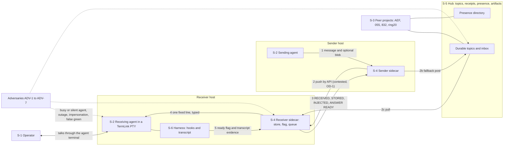
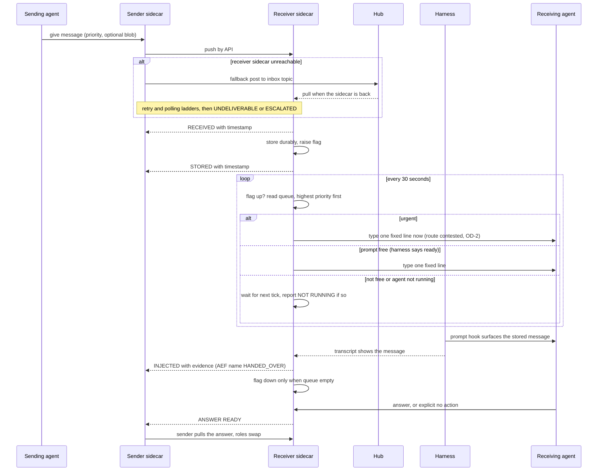
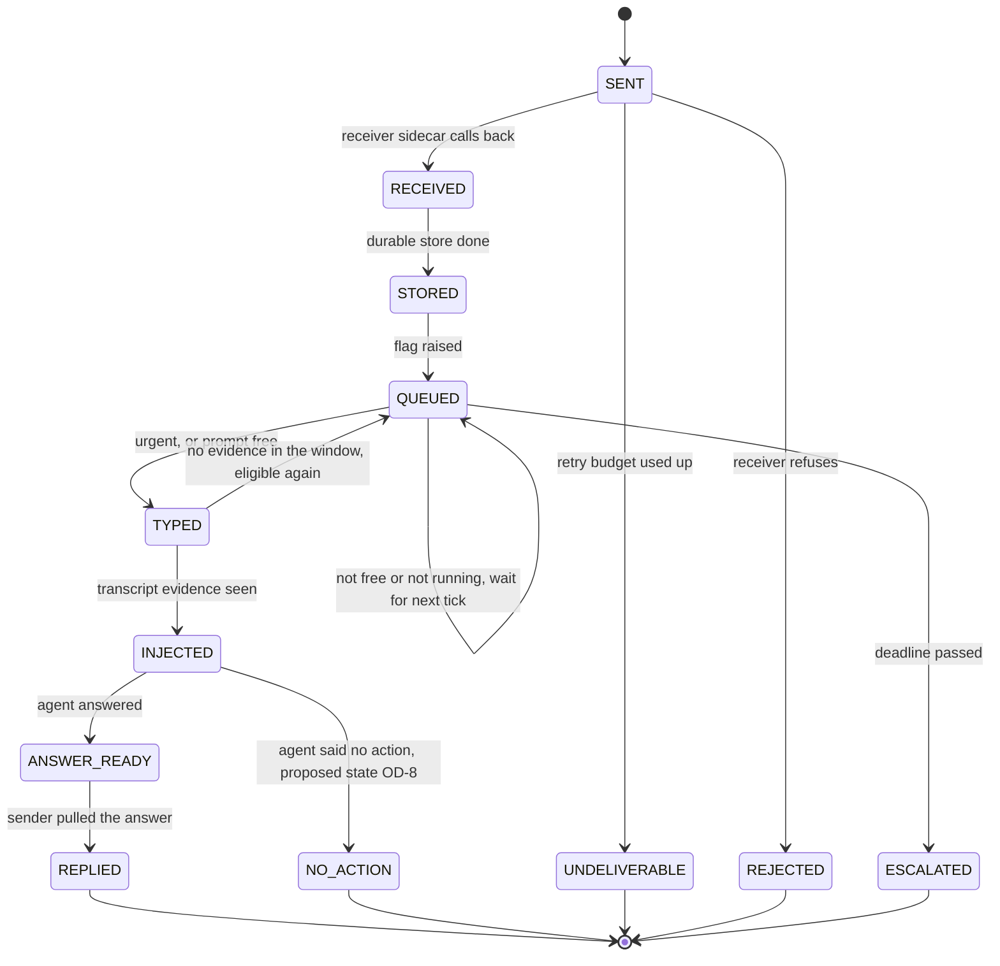

# Interactive agent communication: step 1, requirements

**Task:** T-3344 · **Arc:** arc-011 · **Chain:** arc-011-design, step 1 · **Role:** requirements collector
**Status:** DRAFT in batch mode. The operator interview on the open questions (section 9) is pending, so completion condition 6.1 of the card is not yet met.
**Review link:** none yet. This project's Watchtower has no inline design-review page (profile P2.1). The operator reads this file in the repository.

## 0 Version history

| Version | Date | Change | Task |
|---|---|---|---|
| 0.1 | 2026-10-04 | First draft, batch mode. The operator's confirmed requirements R-1.1..R-14.4 are re-cast into the role-card skeleton. The 18 open decisions are written as interview questions. | T-3344 |

## 1 Inputs of record

1.1 Short names used in this document. Line numbers are those of the file as hashed in 1.2.
1.1.a `RQ` = the headline requirements document.
1.1.b `IAC` = the full design.
1.1.c `RV1` = the external design review comparison.
1.1.d `RV2` = the routing consultation comparison.
1.1.e `T3330R`, `ARC11`, `HT`, `HA` and the other short names are as defined in the header of `RQ`.

1.2 Inputs, with the hash read at the start of this step.

| Short | Path | sha256 |
|---|---|---|
| RQ | `docs/design/interactive-agent-communication-requirements.md` | `1382ffcc0c028cb60a84e45cc9530c1958e0c06811a1cab6859af06078a6f8a1` |
| IAC | `docs/design/interactive-agent-communication.md` | `266fea47b5916d7b0181cf0f32968d408fb76a203d4b8da19d55f6f3a7e92196` |
| RV1 | `docs/reports/T-3335-design-review/comparison.md` | `a725852f9097511a9d2c2c67253ada3a3939b7483a9dbea36f1d512edfb6c887` |
| RV2 | `docs/reports/T-3335-routing-consult/comparison.md` | `7d40ef362096073b11628df256ea843d51788fc2f67fc14ca4bb5dd6aa7c7500` |

1.3 Also read: `docs/design/roles/cards/_common.md`, the requirements-collector card, the AEF adapter, the TermLink profile, `docs/design/roles/README.md`, the chain file and the hand-back schema.

1.4 How this step was run.
1.4.a Mode: batch. No human was present (`_common.md` 5.2).
1.4.b The operator's answers are the confirmed requirements R-1.1..R-13.1 of `RQ` (the operator said "Yes, that's fine", `RQ` header and decision log 2026-10-04). Section 14 of `RQ` (R-14.1..R-14.4) is labelled unconfirmed and is treated as unconfirmed here.
1.4.c Nothing in section 9 is decided. Section 9 is the list of questions the operator has not answered.
1.4.d Reviewer findings that the operator has not ruled on are in section 7 (Conflicts) and section 9 (Open questions). They are not in section 6 (Requirements).

## 2 Stakeholders, protected assets and adversaries

2.1 Stakeholders (the humans and agents that approve, use or are affected).
2.1.a **S-1 The operator.** The only human approver (profile P1.3). Talks to agents through each agent's own terminal. Wants 1:1, many-to-many and operator-to-agent conversation (`RQ` 1.1, 1 item 3).
2.1.b **S-2 Agents of this project.** Sessions of 010-termlink. Several may run at once (profile P3.1). They send, receive, get woken, reply.
2.1.c **S-3 Peer agents of other projects.** The framework agent (AEF, 999-Agentic-Engineering-Framework), 055-agentic-fleet-cockpit, 832-Workflow-designer, ring20-manager (hub .122), ring20-dashboard (hub .121), Penelope (profile P3.1). AEF built a parallel receiver (`RQ` 3 item 2).
2.1.d **S-4 Sidecars.** One process per agent. They hold the store, the flag and the queue, and they inject.
2.1.e **S-5 Hubs.** Carry topics, receipts, presence, artifacts and the fallback path.
2.1.f **S-6 Harnesses.** The programs that run an agent (Claude Code today, opencode at 055). They own the hooks and the transcript (`RQ` 7, `RV1` 13).
2.1.g **S-7 Maintainers of the estate.** Whoever deploys the sidecars (`RQ` 13).

2.2 Protected assets (what an attack or a failure would damage).
2.2.a **A-1 Message content and its durability.** A message that was accepted must not be lost.
2.2.b **A-2 The sender's knowledge of where its message is.** (`RQ` R-1.2.)
2.2.c **A-3 An agent's attention and session.** A typed line into a busy prompt can be discarded (T-2396, `RQ` 8 item 6).
2.2.d **A-4 Identity.** Project, agent and instance identity. All agents on one host sign as one TermLink identity today (`RQ` 11 item 5).
2.2.e **A-5 Credentials.** Hub secrets and TLS pins, sidecar API tokens (profile P3.2).
2.2.f **A-6 The truth of the status record.** The register and the docs must say what actually operates (`RQ` 15).

2.3 Adversaries. The operator has not named an adversary list. This list is the agent's proposal, built from failures that the record documents. The operator is asked to confirm it (gap GP-0, section 8).

| Id | Adversary | Documented evidence |
|---|---|---|
| ADV-1 | A confused or overloaded agent: busy when typed into, silent when woken, unaware of mail | T-2396; the 2026-10-03 incident, mail stored and receipted and never surfaced (`RQ` 5 item 2) |
| ADV-2 | A compromised or misbehaving session that injects, impersonates or force-interrupts | `RV1` point 17: any project can impersonate another with the one host key |
| ADV-3 | A component that reports success it did not earn (a dark guard that reads green) | `RQ` 15 item 2: arc-003, arc-004, S10 "recorded as built, not operating" |
| ADV-4 | A hub, host or network outage, or a blip | `RQ` R-3.2 "the hub goes down"; offline queue (`RQ` 4 item 1) |
| ADV-5 | A hurried or mis-heard operator: voice transcription turned "15" into "50" and "C" into "Cozzyte" | `RQ` 10 item 5; `RQ` 11 item 11 |
| ADV-6 | A stale or wrong binding: a second local hub, a wrong runtime directory, a deaf agent that looks alive | `RV2` items 36 and 65: two hubs on .107, an agent on the wrong one is deaf |
| ADV-7 | A malicious process with privilege on a host (reads secrets, calls the local sidecar API, edits the store) | Not documented as an incident. Named because the card requires it. The threat modeler (step 2) assesses it. |

2.4 What each stakeholder sees: the sender (S-2) sees the stages of section 4; the operator (S-1) sees escalations and, later, the digest; peers (S-3) see presence and receipts.

## 3 Drawings

### 3.1 Drawing D-1: context view (structure)

**Drawing D-1 — context: the system, its stakeholders, the adversaries and the neighbours**

3.1.1 Text equivalent of D-1.
3.1.1.a The sending agent hands a message and an optional blob to its own sidecar (arrow 1).
3.1.1.b The sender sidecar delivers it to the receiver sidecar by API (arrow 2). Whether this may cross hosts is open (OD-1). The fallback is a post to a hub topic that the receiver sidecar pulls (arrows 2b and 2c).
3.1.1.c The receiver sidecar reports the stages RECEIVED, STORED, INJECTED and ANSWER READY back to the sender sidecar (arrow 3).
3.1.1.d The receiver sidecar types one fixed line into the receiving agent's session (arrow 4). The receiving agent runs under a harness. The harness reports readiness and transcript evidence to the sidecar (arrow 5).
3.1.1.e The operator talks to an agent through that agent's terminal. No component for this leg is built (`RQ` 1 item 3).
3.1.1.f Peer projects reach the same hub topics and the presence directory.
3.1.1.g The adversaries act on the receiving agent, the receiver sidecar and the hub topics.

### 3.2 Drawing D-2: main flow (behaviour)

**Drawing D-2 — main flow from send to answer, including the refusal paths**

3.2.1 Text equivalent of D-2.
3.2.1.a The sender gives a message to its sidecar. The sidecar pushes it to the receiver sidecar by API.
3.2.1.b Refusal path 1, no receiver sidecar: the sender sidecar posts to the hub inbox topic. The receiver sidecar pulls it when it is back. Retry and polling ladders run, ending in UNDELIVERABLE or ESCALATED (R-30, R-31).
3.2.1.c The receiver sidecar answers RECEIVED, stores the message durably, raises the flag, then answers STORED (R-14, R-15, R-16).
3.2.1.d Every 30 seconds the receiver sidecar checks the flag and reads the queue, highest priority first (R-17, R-18).
3.2.1.e Urgent: it types one fixed line at once, even into a busy prompt (R-19). The route that makes this safe is open (OD-2).
3.2.1.f Not urgent and the harness says ready: it types the line (R-20, R-21).
3.2.1.g Refusal path 2, not ready or the agent is not running: the message waits for the next tick. NOT RUNNING is reported, never treated as busy (`IAC` 20a).
3.2.1.h The prompt hook surfaces the stored message. The transcript shows it. Only then is INJECTED reported to the sender (R-24). The flag comes down only when the queue is empty (R-25).
3.2.1.i The agent answers or says "no action" (R-28). The receiver sidecar tells the sender sidecar ANSWER READY. The sender pulls it. Roles swap (R-26, R-27).

### 3.3 Drawing D-3: lifecycle of a message (behaviour)

**Drawing D-3 — states of a message and the transitions the requirements allow**

3.3.1 Text equivalent of D-3.
3.3.1.a A message starts as SENT. It becomes RECEIVED, then STORED, then QUEUED when the flag is raised.
3.3.1.b A SENT message ends as REJECTED if the receiver refuses, or UNDELIVERABLE when the retry budget is used up.
3.3.1.c A QUEUED message stays QUEUED each tick while the prompt is not free or the agent is not running. It becomes TYPED when it is urgent or the prompt is free.
3.3.1.d TYPED is internal. It is not a stage the sender is told. The sender is told INJECTED only on transcript evidence (R-24). With no evidence in the window the message goes back to QUEUED.
3.3.1.e A QUEUED message whose deadline passes becomes ESCALATED.
3.3.1.f An INJECTED message ends as REPLIED (the sender pulled the answer) or as NO_ACTION. NO_ACTION is a proposed state that no implementation has. It needs an operator ruling (OD-8).
3.3.1.g The names INJECTED and HANDED_OVER, and the extra states, are not decided (OD-8). The drawing shows the states the requirements allow, with the proposed one marked.

## 4 Answers

4.1 The question set is drafted here, one question per topic of `RQ`, because the profile supplies none (card 2.2). Each answer is the operator's confirmed requirement, with the operator's own words where `RQ` records them. A question for which `RQ` holds no confirmed answer is listed in 4.3 as an open gap.

4.2 Answers from the confirmed requirements.

**QS-1 What does interactive communication mean, and who talks?**
4.2.1 Answer: agents hold interactive, two-way conversations while they work, 1:1, many-to-many and with the operator (R-1.1 of `RQ`). The sender always knows where its message is (R-1.2). No agent has to be attached or polling by hand for delivery to proceed (R-1.3). Source: operator read-back, `RQ` 1.
4.2.2 Operator's words: "I am absolutely very clear that I want to have this … after 20 times me telling you this is a really important part of this design, you don't have this quite essential part of bi-directional interactive communication." (`RQ` 1 item 11, CONSULT:13).
4.2.3 Follow-up QS-1.1, how does the operator talk to an agent? Answer on record: through the agent's own terminal. No component is built (`RQ` 1 item 3). Open as a design question, see GP-11.

**QS-2 What original capability must stay?**
4.2.4 Answer: keystroke injection and output read-back into a terminal (R-2.1), and conversation over the hub instead of fire-and-forget dispatch (R-2.2). Operator's words: "i wanted a means to simulate keyboard input and capture console output" (`RQ` 2 item 9, T243R:96).

**QS-3 What is a sidecar?**
4.2.5 Answer: one per agent; a separate, very simple process with an API (`RQ` R-3.1). Independent of the hub "because the hub goes down" (`RQ` R-3.2). It always respawns, portably, not only under systemd (`RQ` R-3.3). It carries the startup chain: start agent, session, project, hub (`RQ` R-3.4). It re-resolves when an FQDN or IP stops resolving (`RQ` R-3.5). Operator wording, "verbatim in intent": "a separate process exposing an API, deliberately independent of the hub because the hub goes down. Very simple. Always respawns. It also carries the startup chain — start agent, start session, start project, start hub — and re-resolves when an FQDN or IP stops resolving." (`RQ` 3 item 10, RAIL:111-117).
4.2.6 Operator's principle for respawn: "reliability and fragility, so I'm not to save a few tokens just to get a quick solution. I want a solid solution." (`RQ` 3 item 12, ARC11:360-361).
4.2.7 Follow-up QS-3.1, is the sidecar API local only or does it send across hosts? The record holds two answers that conflict, see conflict C-2 and OD-1.

**QS-4 How is a message sent?**
4.2.8 Answer: the sender gives the message, optionally with a blob, to its own sidecar's API (`RQ` R-4.1). The sender's sidecar delivers it to the receiver's sidecar API, push first (`RQ` R-4.2). The hub is the fallback, plus discovery and blob storage (`RQ` R-4.3). Operator's words: "Send: sender agent -> its own sidecar (API) -> the receiver's sidecar (API)." (T3330R:252). And "We have multiple hosts, so that's not a question." (`RQ` 4 item 6, T-3397:270-273).

**QS-5 How is a message received?**
4.2.9 Answer: RECEIVED, the receiver's sidecar calls the sender's sidecar immediately (`RQ` R-5.1). STORED, the message is stored durably and a second call goes back (`RQ` R-5.2). A new-message flag is raised (`RQ` R-5.3). Operator's words: "We store it and immediately go back to the sidecar receiver … an API call that's received." (`RQ` 5 item 10, T3330R:229). The read-back has four calls: RECEIVED, STORED, INJECTED, ANSWER READY (T3330R:252-259).

**QS-6 How often, and what does the tick do?**
4.2.10 Answer: a cron-style job checks the flag every 30 seconds (`RQ` R-6.1). With the flag up it reads the queue, highest priority first (`RQ` R-6.2). Urgent is injected immediately even when the agent is busy, by a route that cannot silently lose the message (`RQ` R-6.3). Not urgent: injected if the prompt is free, otherwise it waits for the next tick (`RQ` R-6.4). Operator's words: "Every 30 seconds … when the flag is up, the message queue gets read … urgent gets injected immediately. Non-urgent, we check again if the prompt is free. If the prompt is not free, we wait again until the next 30 seconds." (CONSULT:17).
4.2.11 Follow-up QS-6.1, what is urgent and how is it marked? Answer on record: the queue has a `priority` clamped to [-9,9], and urgent is band 5 or more by default in the built injector (`RQ` 6 item 3, ARC11 S8 and S9). No confirmed requirement fixes the marking. See candidate C-4 in OD-17.
4.2.12 Follow-up QS-6.2, urgent into a busy prompt. Answer: confirmed as a bypass (R-6.3). The operator's earlier ruling SQ-4 said the opposite and has not been recorded as superseded. Open: OD-2.

**QS-7 Who says the prompt is free?**
4.2.13 Answer: the agent's own harness. The Stop hook marks ready at the end of a turn, and the prompt-submit hook clears it before the next turn (`RQ` R-7.1). It is not inferred from the screen: a long tool call looks idle but is not safe to type into (`RQ` R-7.2).

**QS-8 What is typed, and when is it reported?**
4.2.14 Answer: one short line is typed into the session with `termlink pty inject` (`RQ` R-8.1). INJECTED (AEF: HANDED_OVER) is reported only with evidence from the agent's transcript that it saw the message (`RQ` R-8.2). The flag comes down only when the queue is empty (`RQ` R-8.3). Operator's words: "INJECTED: called back to the sender's sidecar once the message is in the prompt. … The flag is cleared only when the queue is empty." (T3330R:257-258).

**QS-9 How does the answer come back?**
4.2.15 Answer: ANSWER READY, the receiver's sidecar tells the sender's sidecar and the sender pulls the answer (`RQ` R-9.1). Roles swap for the reply (`RQ` R-9.2). A woken agent always replies or explicitly says "no action", never silence (`RQ` R-9.3). If an agent's ears are dead it halts instead of assuming there is no mail (`RQ` R-9.4).

**QS-10 What happens when a push cannot land?**
4.2.16 Answer: the other side polls: 15 s, 1 min, 5 min, 15 min, 1 h, 4 h, 1 day, 3 days, 1 week, 1 month, 1 quarter, 1 year, each rung twice (`RQ` R-10.1). This ladder is the framework default for all polling, changeable per situation (`RQ` R-10.2). Operator's words: "that should be the standard fallback mechanism for the framework for any polling activities. It can be changed situationally, but that should be the standard." (IN-AEF@180).
4.2.17 Follow-up QS-10.1, was the first rung 15 s or 50 s? Dictation said "50". It was read as 15 and "pending operator correction" (T3330R:261). The operator confirmed the read-back, but no explicit correction is recorded. Open: OD-3.

**QS-11 How is an agent addressed?**
4.2.18 Answer: five levels, host, hub, project, session, agent (`RQ` R-11.1). Each level has a canonical name and an instance identity: FQDN for the host, a hub name, the `pid` for the project, a role for the agent (`RQ` R-11.2). Messages carry `to_circuit` and never fall back across projects (`RQ` R-11.3). Operator's decision on the key: T-3325 Q1 = C, recorded from a voice reading, overturnable (`RQ` 11 item 11).

**QS-12 What is recorded, reported and alarmed?**
4.2.19 Answer: every step is a timestamped event, copied to the hub, pullable from any agent (`RQ` R-12.1). Each agent posts a daily digest and reflects on it (`RQ` R-12.2). Alarms only for urgent messages. Everything else escalates when it piles up, like audit warnings (`RQ` R-12.3). Later: an observability database and learning from it, possibly a hub-steward agent (`RQ` R-12.4). Operator's words: "Liveness alarm only for urgent messages. Everything else accumulates and escalates when it piles up, like audit warnings (design to be decided)." (T3330R:265).

**QS-13 How does it ship?**
4.2.20 Answer: every sidecar ships with every TermLink deployment (`RQ` R-13.1). Operator's words: "are all the sidecars we develop … part of our [TermLink] package? When the deployment is done we should deploy all the sidecars with it." (T3330R:230).

**QS-14 Which earlier items were discussed once and lost? (UNCONFIRMED)**
4.2.21 `RQ` section 14 lists four candidates: R-14.1 native consumer, R-14.2 typed assignment and result messages, R-14.3 the hub refuses to call a message delivered without a receipt, R-14.4 the startup chain. The operator has not confirmed or dropped them. They are carried as R-40..R-43 with status "unconfirmed". Open: OD-13.

4.3 Open gaps: questions for which no answer is on record. Each is also a finding of the gap review (section 8).

| Id | Question | Status |
|---|---|---|
| QS-15 | Who may call a sidecar API, and with what credential? | Open gap GP-1 |
| QS-16 | What if a session in the conversation is compromised or hostile? | Open gap GP-2 |
| QS-17 | How many messages may one peer push, and how many may be outstanding? | Open gap GP-3 |
| QS-18 | What must keep working when the hub, the sender host or the receiver host is offline? | Open gap GP-4 |
| QS-19 | What is the recovery after a sidecar restarts in the middle of a delivery? | Open gap GP-5 |
| QS-20 | How is an agent, a peer, a credential or a role revoked? | Open gap GP-6 |
| QS-21 | Which identifiers are stable, who mints them, and what is the unit of "read"? | Open gap GP-7 |
| QS-22 | What does the sender see when the target cannot be reached by design (no hooks, no PTY, other OS)? | Open gap GP-8 |
| QS-23 | Who are the adversaries? | Open gap GP-0, list proposed in 2.3 |

## 5 Glossary

5.1 Each term is defined once. Later roles MUST use these meanings. A term marked (contested) has a definition the operator has not settled.

| Term | Meaning |
|---|---|
| Agent | A running AI session that does work. It has a role and an instance. |
| Circuit | The five-level address of an agent: host, hub, project, session, agent. Carried in `to_circuit`. |
| Conversation | A series of messages with one `conversation_id`. |
| Doorbell | The one fixed line typed into a session to make it look at its stored mail. It carries a count and ids, no peer content. |
| Flag | The new-message marker the sidecar raises when a message is stored and lowers only when the queue is empty. |
| Hub | The server that carries durable topics, receipts, presence and artifacts. Per host or per fleet. State is per hub (G-060). |
| Harness | The program that runs an agent and owns its hooks and its transcript. |
| Home hub | The hub that holds a project's identity and decides liveness for it (contested, OD-18, OD-11). |
| Injection | Typing the doorbell into the agent's session. Typing is not the same as the agent seeing the message. |
| INJECTED | The stage reported to the sender when transcript evidence shows the agent saw the message. AEF calls it HANDED_OVER (contested, OD-8). |
| Instance | One running copy at a level, for example one session. It has a runtime id. |
| Message | One post carrying content, a priority, an id and a conversation id, with an optional blob. |
| Polling ladder | The standard waiting cadence 15 s to 1 year, each rung twice (R-30). |
| Priority | A number in [-9,9] on a queued message. Urgent is a high band (contested, C-4 in OD-17). |
| Queue | The sidecar's store of messages not yet handed over, ordered by priority then arrival. |
| RECEIVED | The receiver's sidecar tells the sender's sidecar immediately that it has the message (contested, OD-4). |
| Retry ladder | AEF's schedule for re-sending a post, 2×1 min to 2×1 month, then dead-letter (D-600). Not the same as the polling ladder (contested, OD-3). |
| Role | The function an agent serves in a project, such as manager. A role is not an instance. |
| Sidecar | The separate, simple process per agent that stores, flags, queues, injects and reports. |
| STORED | The message is durable on the receiver side and a second call goes back (contested, OD-4). |
| Stage | One named step of delivery reported to the sender: SENT, RECEIVED, STORED, INJECTED, ANSWER READY, REPLIED and the failure stages. |
| Startup chain | Start agent, start session, start project, start hub (R-9, never built). |
| Tick | The 30-second check of the flag. |
| Transcript evidence | A record in the receiver's own session transcript that shows the agent saw the message. |
| Urgent | A message that is injected at once even when the agent is busy (R-19). How it is marked is open. |
| Unreachable | An agent that cannot be woken now. Not the same as dead. |

## 6 Requirements

6.1 How to read this section.
6.1.a R-1..R-39 are the operator's confirmed requirements (`RQ` R-1.1..R-13.1), carried over one for one. R-40..R-43 are unconfirmed (`RQ` section 14).
6.1.b Each requirement has: **a** statement, **b** type, priority and source, **c** rationale, **d** verification method, **e** acceptance criteria, **f** what it holds against (only where it says something MUST be impossible), **g** status note.
6.1.c Types: functional, security invariant, interface, operational, quality. Priority: P1 needed for the goal, P2 needed for a solid system, P3 later or unconfirmed.
6.1.d The closing rule of the operator's standing instruction applies to every verification below: nothing is called working until a live test with two real running agents and a negative control passes (profile P1.2.e, `IAC` item 58).
6.1.e Where a requirement is contested by a reviewer, the statement stays as the operator confirmed it. The contest is named in **g** and decided in section 9.
6.1.f "Status" facts come from `RQ` section 15 (2026-10-03) and were not re-measured in this step.

### 6.2 Goal (`RQ` section 1)

R-1 **Interactive conversation.**
R-1.a Agents MUST hold interactive, two-way conversations with each other while they are working: 1:1, many-to-many, and agents with the operator.
R-1.b Functional · P1 · source `RQ` R-1.1; operator, 2026-10-03: "I am absolutely very clear that I want to have this …".
R-1.c Rationale: this is the goal the other requirements serve.
R-1.d Verification: live test with two real agents (1:1), then three (many-to-many); a demonstration for the operator leg.
R-1.e Acceptance. (1) Given agents A and B both running, when A sends a turn with a `conversation_id`, then the turn is in B's transcript and B's reply, with the same id, reaches A. (2) Given agents A, B and C on one broadcast topic, when A posts, then B and C each receive it. (3) The operator leg has no acceptance criterion yet, because no component is designed for it (GP-11).
R-1.g Status: 1:1 and broadcast carry on the hub. The live leg into a running agent does not operate on this host. The operator leg is designed only.

R-2 **The sender always knows where its message is.**
R-2.a The sender MUST be able to see, for every message it sent, the stage the message has reached with a timestamp. A message MUST NOT be in transit with its stage invisible to the sender.
R-2.b Functional, security invariant · P1 · source `RQ` R-1.2.
R-2.c Rationale: the operator's failure was "you've been telling me it works" while mail sat stored and unseen (`RQ` 1 item 11).
R-2.d Verification: negative-control test. Stop the receiver's injector, then read the sender's record.
R-2.e Acceptance. Given a message was sent and the receiver's sidecar is stopped, when the sender reads its record, then the stage is SENT or waiting or overdue and is never INJECTED or delivered. Given the receiver is healthy, when the message passes each stage, then the sender's record carries one timestamped row per stage.
R-2.f Holds against: ADV-3 (false success), ADV-4 (outage), ADV-1 (silent agent).
R-2.g Status: built in pieces (sender ledger, ack tracker). The per-message timeline is designed, not built (`RQ` 1 item 4d).

R-3 **No one has to be attached.**
R-3.a No agent MUST have to be attached or polling by hand for delivery to proceed.
R-3.b Operational · P1 · source `RQ` R-1.3.
R-3.c Rationale: an agent in the middle of work cannot also watch a mailbox.
R-3.d Verification: live test with a receiver left idle at its prompt that runs no polling.
R-3.e Acceptance. Given the receiving agent is idle at its prompt and runs no polling, when a message is sent, then the message appears in its transcript within a stated bound (proposed: two ticks plus margin, not confirmed).
R-3.g Status: NOT met for agents on this host (`RQ` 1 item 5). A running session cannot be made injectable afterwards (PL-237). Conflict C-3, question OD-6.

### 6.3 Origins (`RQ` section 2)

R-4 **Keep keystroke injection and output read-back.**
R-4.a The system MUST keep the ability to inject keystrokes into a terminal session and read its output back.
R-4.b Interface · P1 · source `RQ` R-2.1; operator: "i wanted a means to simulate keyboard input and capture console output".
R-4.c Rationale: the founding verb of TermLink and the base of the injector.
R-4.d Verification: `scripts/session-selftest.sh` (spawn, exec a sentinel, cleanup).
R-4.e Acceptance. Given a spawned session, when `termlink exec <s> 'echo <sentinel>' --json` runs, then the result is ok, exit code 0, and stdout carries the sentinel.
R-4.g Status: built and operating.

R-5 **Conversation over the hub, not fire-and-forget.**
R-5.a Agents MUST be able to exchange conversation turns as durable hub messages that carry a `conversation_id`, in place of fire-and-forget dispatch.
R-5.b Functional · P1 · source `RQ` R-2.2.
R-5.c Rationale: T-256 replaced one-shot dispatch with a conversation.
R-5.d Verification: fixture and live test over `channel post` and `channel subscribe`.
R-5.e Acceptance. Given a topic and two agents, when A posts a turn with a `conversation_id` and B subscribes, then B reads the turn with the same id.
R-5.g Status: built on the hub.

### 6.4 The sidecar (`RQ` section 3)

R-6 **One sidecar per agent, simple, with an API.**
R-6.a Each agent MUST have one sidecar: a separate, very simple process with an API.
R-6.b Functional, quality · P1 · source `RQ` R-3.1; operator wording "a separate process exposing an API … Very simple."
R-6.c Rationale: carrying delivery must not depend on any LLM turn.
R-6.d Verification: process inspection and an API call; a review of size against a measure that the operator has not given.
R-6.e Acceptance. Given agent X is registered, when the agent's own process is killed, then X's sidecar is still running and its status call answers. Given two agents, then there are two sidecar processes.
R-6.g Status: built as shell scripts for three agents; the API that exists is local control only (`RQ` 3 item 1). "Very simple" has no measure (GP-12).

R-7 **Independent of the hub.**
R-7.a A sidecar MUST NOT need the hub to be up to accept, store, flag and inject a message from a sender on the same host.
R-7.b Operational · P1 · source `RQ` R-3.2; operator: "deliberately independent of the hub because the hub goes down".
R-7.c Rationale: a hub outage must not stop local delivery.
R-7.d Verification: stop the hub, then run the live test on one host.
R-7.e Acceptance. Given the hub is stopped, when agent A on host H sends to agent B on host H, then B's sidecar stores and flags the message and the flow of R-17..R-25 completes.
R-7.g Status: partial. TermLink's sidecar reads hub topics to learn of mail. AEF's receiver takes loopback mail with no hub (`RQ` 3 item 3). `RV1` section 2 says GLM and 055 call this requirement untestable or without a stated benefit. Question: OD-1.

R-8 **Always respawns, portably.**
R-8.a A sidecar that dies MUST be restarted by a supervisor on hosts with systemd and on hosts without it.
R-8.b Operational · P1 · source `RQ` R-3.3; operator: "I want a solid solution." (SQ-8).
R-8.c Rationale: a sidecar that stays dead is a silent deaf agent.
R-8.d Verification: kill the sidecar with SIGKILL and watch for the new process, on a systemd host and on a cron or launchd host.
R-8.e Acceptance. Given a running sidecar, when it is killed with SIGKILL, then a new sidecar for the same agent runs within the supervision interval (today 5 min) and its heartbeat is fresh.
R-8.g Status: built and operating on this host. Not verified on macOS.

R-9 **Carries the startup chain.**
R-9.a The sidecar MUST carry the startup chain: start the agent, the session, the project and the hub.
R-9.b Functional · P3 · source `RQ` R-3.4; operator spec wording (RAIL:111-117).
R-9.c Rationale: the operator wants one component that brings the whole chain up.
R-9.d Verification: start from a fully stopped state, in a test estate.
R-9.e Acceptance. Given the project, session, agent and hub are all stopped, when the startup chain runs, then each level is started in order and each is verified live before the next.
R-9.g Status: not built, not designed beyond one sentence. The scope is contested: the 7-vendor review says no agent is respawned by inbound mail without an explicit grant (`RQ` O15.2). Question: OD-15.

R-10 **Re-resolves a moved peer.**
R-10.a A sidecar MUST re-resolve a peer's address when the FQDN or IP stops resolving.
R-10.b Functional · P2 · source `RQ` R-3.5.
R-10.c Rationale: hosts change address.
R-10.d Verification: fixture that changes name resolution between two sends.
R-10.e Acceptance. Given a peer's FQDN now resolves to a new IP, when the sender's sidecar sends, then it uses the new address, or reports the failure to resolve. It never keeps sending to the old address silently.
R-10.g Status: partial. It notices a change and does not reconnect (`RQ` 3 item 6).

### 6.5 Sending (`RQ` section 4)

R-11 **Hand the message to the own sidecar.**
R-11.a The sender MUST give the message, optionally with a blob, to its own sidecar's API.
R-11.b Interface · P1 · source `RQ` R-4.1.
R-11.c Rationale: one local send point where durability and identity are applied.
R-11.d Verification: API fixture and live test.
R-11.e Acceptance. Given a sender and its sidecar, when the sender calls send with a message and a blob, then the call returns a message id, and the receiver verifies the blob's sha256 before the message is flagged.
R-11.g Status: there is no send API on the TermLink sidecar. Senders use `agent-send.sh` and `channel post` (`RQ` 4 item 1). AEF has `fw sidecar send` on one host.

R-12 **Sidecar to sidecar, push first.**
R-12.a The sender's sidecar MUST deliver the message to the receiver's sidecar API, trying push first.
R-12.b Functional · P1 · source `RQ` R-4.2; operator: "Send: sender agent -> its own sidecar (API) -> the receiver's sidecar (API)."
R-12.c Rationale: delivery without the hub as the first path.
R-12.d Verification: live test with a hub-side counter that stays unchanged on the push path.
R-12.e Acceptance. Given both sidecars are up, when a message is sent, then it reaches the receiver sidecar by a direct API call and no message post is made to a hub topic on that path.
R-12.g Status: same host in AEF only. Cross-host is designed only. All three weighted reviewers disagree for cross-host, and the charter forbids a second bus (`RV1` points 2 and 11). Conflict C-2, question OD-1.

R-13 **The hub is the fallback.**
R-13.a The hub MUST serve as the fallback path, and as discovery and blob storage.
R-13.b Functional · P1 · source `RQ` R-4.3.
R-13.c Rationale: a message must still arrive when no receiver sidecar answers.
R-13.d Verification: stop the receiver sidecar, send, restart it.
R-13.e Acceptance. Given the receiver's sidecar is down, when a message is sent, then it is on the receiver's hub inbox topic, and when the sidecar returns it is pulled, stored and flagged, and the sender's record shows each stage reached.
R-13.g Status: built and operating.

### 6.6 Receiving (`RQ` section 5)

R-14 **RECEIVED, immediately.**
R-14.a On accepting a message the receiver's sidecar MUST call the sender's sidecar with RECEIVED and a timestamp, immediately.
R-14.b Interface · P1 · source `RQ` R-5.1; operator: "an API call that's received".
R-14.c Rationale: the sender learns at once that the message arrived.
R-14.d Verification: live test with timestamps on both sides.
R-14.e Acceptance. Given the receiver sidecar is up, when it accepts a message, then the sender's record gains a RECEIVED row, with the receiver's timestamp, within a bound (proposed: 2 s, not confirmed).
R-14.g Status: TermLink posts a hub receipt on a 15 s poll, per topic, with no per-message id (`RQ` 5 item 1). AEF answers synchronously, same host. Contested: OD-4 (one call or two), OD-5 (callback or record and pull).

R-15 **STORED, durably, then a second call.**
R-15.a The receiver MUST store the message durably, and then call the sender again with STORED. STORED MUST NOT be reported before the store is durable.
R-15.b Functional, security invariant · P1 · source `RQ` R-5.2; operator read-back "STORED: called again once stored."
R-15.c Rationale: a message that survives a sidecar restart is the base of "no silent loss".
R-15.d Verification: kill the receiver sidecar after STORED and restart it.
R-15.e Acceptance. Given STORED was reported, when the receiver sidecar is killed and restarted, then the message is still in the store with the same id. Given a store that fails, then STORED is not reported.
R-15.f Holds against: ADV-3, ADV-4.
R-15.g Status: no distinct STORED call exists in either build. AEF's RECEIVED already means stored. Contested: OD-4.

R-16 **A new-message flag is raised.**
R-16.a After the message is durably stored the sidecar MUST raise a new-message flag. The flag MUST NOT be raised before the store.
R-16.b Functional · P1 · source `RQ` R-5.3.
R-16.c Rationale: the tick reads the flag, so the flag is the trigger for injection.
R-16.d Verification: fixture and live inspection of the flag file.
R-16.e Acceptance. Given a message is stored, then the flag exists with a timestamp and a pending count, and the message is already readable from the store at that moment.
R-16.g Status: built and operating for three agents. Its pending count is shared with the sidecar's own auto-ack, so 0 can mean "receipted", not "seen" (`RQ` 5 item 2).

### 6.7 The 30-second tick (`RQ` section 6)

R-17 **Check the flag every 30 seconds.**
R-17.a A job MUST check the new-message flag every 30 seconds.
R-17.b Functional · P1 · source `RQ` R-6.1; operator: "Every 30 seconds …".
R-17.c Rationale: bounds pickup latency when the agent is idle. System cron cannot do 30 s, so it is a supervised loop (`IAC` 17a).
R-17.d Verification: tick log over 100 consecutive ticks.
R-17.e Acceptance. Given a running sidecar, then consecutive ticks are at most 30 s plus a stated tolerance apart, and a tick that finds the flag up proceeds to R-18.
R-17.g Status: TermLink: not built (installed driver is `*/5`, checks no prompt). AEF: built (`SIDECAR_TICK`, default 30) for armed agents only.

R-18 **Read the queue, highest priority first.**
R-18.a With the flag up, the job MUST read the queue in order of priority, highest first, and by arrival time within one priority.
R-18.b Functional · P1 · source `RQ` R-6.2.
R-18.c Rationale: urgent mail must not wait behind routine mail.
R-18.d Verification: fixture with three queued messages.
R-18.e Acceptance. Given queued messages P=5 (arrived second), P=0 (first) and P=-1 (third), when the tick reads the queue, then the order is P=5, P=0, P=-1. Two messages with equal priority are read oldest first.
R-18.g Status: built inside the injector, which nothing schedules (`RQ` 6 item 1).

R-19 **Urgent: injected immediately, by a route that cannot silently lose it.**
R-19.a An urgent message MUST be injected immediately, even when the agent is busy, by a route that cannot silently lose the message.
R-19.b Security invariant · P1 · source `RQ` R-6.3; operator, 2026-10-03: "inject when it's free and with urgent bypass" and "urgent gets injected immediately".
R-19.c Rationale: the operator wants an interruption that is not waited out. The qualifier is the operator's own: "Reliability is important at all times but can also be out of band." (SCAPI:207-208).
R-19.d Verification: live test with the receiver inside a long tool call, plus a negative control in which the typed line is discarded.
R-19.e Acceptance. Given an urgent message and a receiver in the middle of a long tool call, when the message is handled, then (1) it is already durable in the store, (2) a line is typed at once, (3) either transcript evidence appears and INJECTED is reported, or the message becomes eligible again and an escalation follows, and (4) the message count in the store is the same before and after. A discarded typed line never causes the message to vanish.
R-19.f Holds against: ADV-1 (a busy agent discards the typed line, T-2396), ADV-4.
R-19.g Status: contested. Two of three weighted reviewers say never type into a busy prompt, and the operator's own earlier ruling SQ-4 says the same and is not recorded as superseded (`RQ` 6 item 16a, `RV1` point 10). No safe route is built (`RQ` 6 item 6). Conflict C-1, question OD-2.

R-20 **Not urgent: only when the prompt is free.**
R-20.a A non-urgent message MUST be injected only if the prompt is free. Otherwise it MUST wait for the next tick.
R-20.b Functional · P1 · source `RQ` R-6.4; operator: "If the prompt is not free, we wait again until the next 30 seconds."
R-20.c Rationale: typing into a busy prompt loses the text.
R-20.d Verification: live test with a busy receiver and a negative control.
R-20.e Acceptance. Given a non-urgent message and a receiver that is not ready, when a tick runs, then nothing is typed and the message stays queued with the flag up. Given the receiver becomes ready, when the next tick runs, then the line is typed. If the agent is not running, then NOT RUNNING is reported and not treated as busy.
R-20.g Status: TermLink built it behind the screen classifier, not scheduled. AEF built it behind the ready flag, armed agents only.

### 6.8 Readiness (`RQ` section 7)

R-21 **Readiness is reported by the harness.**
R-21.a The harness's own hooks MUST report readiness: the Stop hook marks the session ready at the end of a turn and the prompt-submit hook clears it before the next turn. A missing or unreadable flag MUST read as not ready.
R-21.b Interface · P1 · source `RQ` R-7.1.
R-21.c Rationale: only the harness knows a turn is open.
R-21.d Verification: hook fixture and live test.
R-21.e Acceptance. Given the Stop hook fired for session S, then S's record says ready. Given a prompt is submitted, then S's record says not ready before the new turn starts. Given S's record is missing, then S reads not ready.
R-21.g Status: AEF built it for `claude-fw --termlink` sessions. TermLink has none. Reviewers want a harness-neutral adapter (`RV1` point 13). Question: OD-7.

R-22 **Readiness is not inferred from the screen.**
R-22.a The system MUST NOT decide that a prompt is free from what the screen shows.
R-22.b Security invariant · P1 · source `RQ` R-7.2.
R-22.c Rationale: a long tool call looks idle and is unsafe to type into.
R-22.d Verification: live test with a long silent tool call.
R-22.e Acceptance. Given a receiver inside a 60-second silent tool call with a quiet screen, when a tick runs, then no non-urgent line is typed.
R-22.f Holds against: ADV-1.
R-22.g Status: the built TermLink classifier infers from the screen. `IAC` still says so. The operator once said "use PTY inject when the cursor is silent". Conflict C-5, question OD-7.

### 6.9 Injection (`RQ` section 8)

R-23 **One short line is typed.**
R-23.a The sidecar MUST type one short line into the agent's session with `termlink pty inject`. The line MUST NOT carry peer content.
R-23.b Interface · P1 · source `RQ` R-8.1.
R-23.c Rationale: the content arrives by the prompt hook, so a lost keystroke cannot lose content.
R-23.d Verification: fixture that records the typed text.
R-23.e Acceptance. Given a queued message, when the sidecar injects, then the typed text is one line, holds a count and message ids and no message body, and the target is the session named in the claim written before typing.
R-23.g Status: built in AEF and in the TermLink injector. Operating for armed sessions only.

R-24 **INJECTED only with evidence.**
R-24.a INJECTED (AEF: HANDED_OVER) MUST be reported only when the agent's transcript shows it saw the message. A typed line alone MUST NOT be reported as INJECTED.
R-24.b Security invariant · P1 · source `RQ` R-8.2; operator: "INJECTED: called back to the sender's sidecar once the message is in the prompt."
R-24.c Rationale: "a rung is not a read" (PL-253).
R-24.d Verification: the receiver-side prover `scripts/session-message-selftest.sh`, plus a discard negative control.
R-24.e Acceptance. Given a line typed into a prompt that discards it, when the evidence window passes (AEF: 90 s), then INJECTED is not reported and the message is eligible again. Given the transcript carries the message, then INJECTED is reported with its timestamp.
R-24.f Holds against: ADV-3 (a sidecar that claims success), ADV-1.
R-24.g Status: AEF built it. The TermLink injector posts a weaker stage on a BUSY transition. Mapping is undecided. Contested: OD-8.

R-25 **The flag comes down only when the queue is empty.**
R-25.a The sidecar MUST lower the flag only when the queue is empty.
R-25.b Functional · P2 · source `RQ` R-8.3.
R-25.c Rationale: a lowered flag with queued mail hides that mail from the tick.
R-25.d Verification: fixture with two queued messages.
R-25.e Acceptance. Given two queued messages, when one is handed over, then the flag stays up. When the second is handed over, then the flag is down.
R-25.g Status: designed. Not verified as built. The injector has an open gap that re-serves the oldest offset (`RQ` 8 item 5).

### 6.10 Answering (`RQ` section 9)

R-26 **ANSWER READY.**
R-26.a When an answer is ready, the receiver's sidecar MUST tell the sender's sidecar, and the sender MUST be able to pull the answer.
R-26.b Interface · P1 · source `RQ` R-9.1; operator read-back "ANSWER READY: … the sender pulls it."
R-26.c Rationale: the sender learns of the answer without polling.
R-26.d Verification: live test.
R-26.e Acceptance. Given the receiver stored a reply, when it calls ANSWER READY, then the sender's record shows it with a timestamp, and the pulled answer equals the reply.
R-26.g Status: not built in TermLink. AEF delivers a reply as a new send. Contested: OD-5.

R-27 **Roles swap for the reply.**
R-27.a The reply MUST use the same path and the same stages with sender and receiver swapped.
R-27.b Functional · P2 · source `RQ` R-9.2.
R-27.c Rationale: one path, one set of guarantees.
R-27.d Verification: live test of both directions.
R-27.e Acceptance. Given a reply from B to A, then A's sidecar shows RECEIVED, STORED and INJECTED for it, with timestamps, as B's did for the first message.
R-27.g Status: partial. TermLink's reply goes through `channel.post` (`RQ` 9 item 3).

R-28 **A woken agent replies or says "no action".**
R-28.a A woken agent MUST reply, or explicitly say "no action". It MUST NOT stay silent.
R-28.b Security invariant · P1 · source `RQ` R-9.3.
R-28.c Rationale: "silence always means a bug" (T-2402).
R-28.d Verification: live test with a negative control in which the agent posts nothing.
R-28.e Acceptance. Given an injected message, when the agent's turn ends with neither a reply nor a declared no-action, then an escalation is raised within the deadline. Given the agent posts an acknowledged-no-action, then the sender sees that terminal state.
R-28.f Holds against: ADV-1.
R-28.g Status: skill text only, no hook enforces it. Neither sender state set has a no-action state (`RQ` 9 item 4). Question: OD-8.

R-29 **Deaf means halt.**
R-29.a If an agent's ears are dead it MUST halt message-dependent work and say so. It MUST NOT assume there is no mail.
R-29.b Security invariant · P1 · source `RQ` R-9.4 (June, confirmed).
R-29.c Rationale: "no flag" only means "no mail" if the listener is alive.
R-29.d Verification: stale-heartbeat fixture and live test.
R-29.e Acceptance. Given the sidecar heartbeat is stale, when the agent checks for mail, then the verdict is DEAF and the agent reports the halt. Given a fresh heartbeat and no flag, then the verdict is CLEAR.
R-29.f Holds against: ADV-3, ADV-4, ADV-6 (a deaf agent that looks alive).
R-29.g Status: `notify-check.sh` exists. Nothing runs it at a yield point, so no owner (`RQ` 9 item 5).

### 6.11 Fallback polling (`RQ` section 10)

R-30 **The polling ladder.**
R-30.a Where a push cannot land, the other side MUST poll on this schedule, each rung twice: 15 s, 1 min, 5 min, 15 min, 1 h, 4 h, 1 day, 3 days, 1 week, 1 month, 1 quarter, 1 year.
R-30.b Functional · P2 · source `RQ` R-10.1; operator: "that should be the standard fallback mechanism for the framework for any polling activities."
R-30.c Rationale: a standard cadence instead of ad-hoc retries.
R-30.d Verification: simulated-clock test of the rung times.
R-30.e Acceptance. Given a failed push and a simulated clock, then polls occur at 15 s ×2, 1 min ×2, 5 min ×2 and so on through 1 year ×2, in that order.
R-30.g Status: designed only. The first rung "15" was read from the dictation "50" and has no recorded correction. All three weighted reviewers call the year-long polling wrong (`RV1` point 4). Conflict C-6, question OD-3.

R-31 **The ladder is the framework default.**
R-31.a The ladder of R-30 MUST be the framework default for all polling, and MUST be changeable per situation.
R-31.b Functional · P2 · source `RQ` R-10.2.
R-31.c Rationale: one default, no per-script cadence.
R-31.d Verification: config fixture.
R-31.e Acceptance. Given a poll with no explicit schedule, then it uses the default ladder. Given a per-situation override, then it uses the override and the default is unchanged.
R-31.g Status: designed only. AEF filed T-3770 to reconcile it with its retry ladder.

### 6.12 Addressing and identity (`RQ` section 11)

R-32 **Five-level circuit.**
R-32.a An agent MUST be addressed by a five-level circuit: host, hub, project, session, agent.
R-32.b Interface · P1 · source `RQ` R-11.1.
R-32.c Rationale: a message must name its target exactly.
R-32.d Verification: parser fixture on both grammars.
R-32.e Acceptance. Given a circuit in path form and in the V9 form, then both parse to the same five levels, and writing emits path form.
R-32.g Status: built as `to_circuit` (T-3325). It decides which sidecar wakes. Nothing wakes an agent on this host.

R-33 **Two identities per level.**
R-33.a Each level MUST have a canonical name and an instance identity: FQDN for the host, a hub name, the `pid` for the project, a role for the agent.
R-33.b Interface · P2 · source `RQ` R-11.2.
R-33.c Rationale: names survive restarts, instance ids tell copies apart.
R-33.d Verification: identity fixture.
R-33.e Acceptance. Given an address, then each of the five levels yields both a name and an instance id. Given the hub's TLS fingerprint rotates, then the hub name is unchanged.
R-33.g Status: partial. The hub id used today is the rotating TLS fingerprint and a hub name is not built. The project slot still uses the folder name (`RQ` 11 item 3). Questions: OD-11, OD-12.

R-34 **Never fall back across projects.**
R-34.a A message addressed with `to_circuit` MUST NOT be delivered to an agent of a different project.
R-34.b Security invariant · P1 · source `RQ` R-11.3; agreed by both sides (IN-AEF@129, IN-010@141).
R-34.c Rationale: a wrong delivery is worse than a visible failure.
R-34.d Verification: fixture with only a wrong-project sidecar present.
R-34.e Acceptance. Given `to_circuit` names project P and only project Q's sidecar is present, then nothing is delivered or woken at Q and the sender sees the target as unreachable.
R-34.f Holds against: ADV-2 (impersonation, shared host key), ADV-6 (wrong binding).
R-34.g Status: built for the wake decision. A message with no address still wakes everyone (`IAC` 11a). Question on the session level: OD-10.

### 6.13 Telemetry (`RQ` section 12)

R-35 **Every step is a timestamped event, copied to the hub.**
R-35.a Every step MUST be recorded as a timestamped event, copied to the hub, and pullable from any agent.
R-35.b Operational · P2 · source `RQ` R-12.1; operator: "to collect the telemetry of our communications … the different steps, how much time it takes and how much delay".
R-35.c Rationale: the operator wants to learn from delivery delays.
R-35.d Verification: fixture that sends a message through all stages, then a pull from a second agent.
R-35.e Acceptance. Given a message that passed four stages, when a different agent pulls its journey, then it receives events carrying message id, step, time, from and to, in order, and the copy to the hub did not sit in the message's own path.
R-35.g Status: designed only. The retention window is open: OD-16.

R-36 **Daily digest and reflection.**
R-36.a Each agent MUST post a daily digest and reflect on it.
R-36.b Operational · P3 · source `RQ` R-12.2; operator: "one times per day".
R-36.c Rationale: traffic data is only useful if someone reads it.
R-36.d Verification: scheduled-job fixture.
R-36.e Acceptance. Given 24 hours of traffic, then each agent has posted one digest with counts per step, delays, stuck messages and unanswered messages. A missing digest is itself visible.
R-36.g Status: not built.

R-37 **Alarms only for urgent.**
R-37.a The system MUST raise an immediate alarm only for urgent messages. All other problems MUST escalate when they pile up, like audit warnings.
R-37.b Operational · P2 · source `RQ` R-12.3; operator: "Liveness alarm only for urgent messages. Everything else accumulates and escalates …".
R-37.c Rationale: alarm fatigue.
R-37.d Verification: fixture with an overdue urgent message and a pile of routine ones.
R-37.e Acceptance. Given an urgent message unhandled past its deadline, then an alarm is raised at once. Given many routine messages unhandled, then no immediate alarm is raised and an escalation entry appears when the pile crosses a threshold (the threshold is to be decided).
R-37.g Status: designed only. How it surfaces, and where the last rung lands, is open (OD-14). "Design to be decided" is the operator's own phrase.

R-38 **Later: observability database, learning, hub steward.**
R-38.a The telemetry MUST stay readable by a later observability database, and a hub-steward agent MAY be added.
R-38.b Quality · P3 · source `RQ` R-12.4.
R-38.c Rationale: the operator wants learning from traffic later.
R-38.d Verification: review.
R-38.e Acceptance. Given telemetry events on the hub, a later consumer can read all of them without a change to the message path.
R-38.g Status: later. The steward is T-3333, captured.

### 6.14 Deployment (`RQ` section 13)

R-39 **Every sidecar ships with every deployment.**
R-39.a Every sidecar MUST ship with every TermLink deployment, and MUST start from the deployment and not from a source checkout.
R-39.b Operational · P1 · source `RQ` R-13.1; operator: "When the deployment is done we should deploy all the sidecars with it."
R-39.c Rationale: today about 13 scripts run only from `/opt/termlink`.
R-39.d Verification: install on a clean host or container from the release artifact, then start a sidecar.
R-39.e Acceptance. Given a clean host with the release artifact installed and no `/opt/termlink` checkout, when an agent is registered, then its sidecar can be started and passes the live test.
R-39.g Status: NOT met. Releases publish the binary only (`RQ` 13 item 1). Question: OD-9.

### 6.15 Unconfirmed: discussed once and lost (`RQ` section 14)

6.15.1 R-40..R-43 are not confirmed by the operator. They are listed so that nothing is silently dropped. Keep or drop: OD-13.

R-40 **Native consumer (unconfirmed).**
R-40.a For agents the project launches, the agent SHOULD confirm receipt from inside its own turn.
R-40.b Functional · P3 · source `RQ` R-14.1 (T-2838, GO 2026-08-25).
R-40.c Rationale: "A receipt cannot exist unless a turn happened." (T2838R:175-208).
R-40.d Verification: spike S2 re-run.
R-40.e Acceptance. Given an agent launched by the project, then no receipt exists for a message unless a turn of that agent took place.
R-40.g Status: partly met by AEF's prompt hook plus transcript evidence (`RQ` 14 item 1).

R-41 **Typed assignment and result messages (unconfirmed).**
R-41.a Assignments and results SHOULD be typed messages (`assignment.v0`, `result_manifest.v0`).
R-41.b Interface · P3 · source `RQ` R-14.2.
R-41.c Rationale: an orchestrator needs machine-readable hand-offs.
R-41.d Verification: schema fixture.
R-41.e Acceptance. Given an `assignment.v0` message, then a consumer validates it against the schema and a malformed one is refused with a stated reason.
R-41.g Status: helpers only, no verb uses them.

R-42 **The hub does not call a message delivered without a receipt (unconfirmed).**
R-42.a The hub SHOULD refuse to call a message delivered without a receipt.
R-42.b Security invariant · P3 · source `RQ` R-14.3.
R-42.c Rationale: "delivered" equal to "hub accepted" was the original failure.
R-42.d Verification: hub fixture.
R-42.e Acceptance. Given a post with no receipt, then the hub reports it as delivered-unconfirmed and never as delivered.
R-42.f Holds against: ADV-3.
R-42.g Status: not built. The CLI already says delivered-unconfirmed versus consumed (`RQ` 14 item 1).

R-43 **The startup chain (unconfirmed, duplicate).**
R-43.a Same sentence as R-9.
R-43.b Functional · P3 · source `RQ` R-14.4.
R-43.c Rationale: see R-9.
R-43.d Verification: see R-9.
R-43.e Acceptance: see R-9.
R-43.g Status: `RQ` itself says it duplicates R-3.4. Proposed disposition: merge into R-9. Not decided: OD-13.

