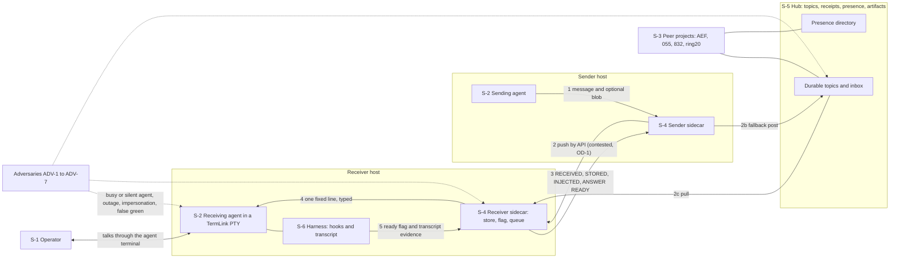
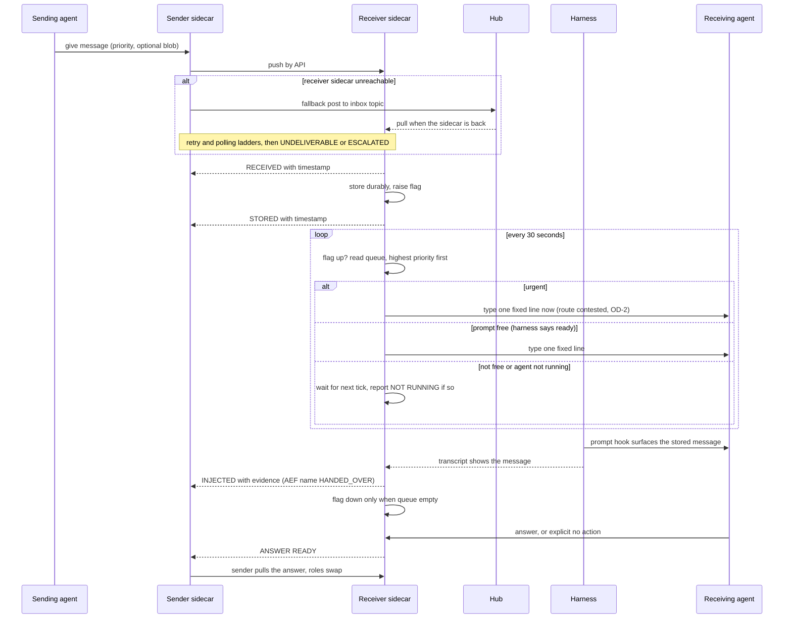
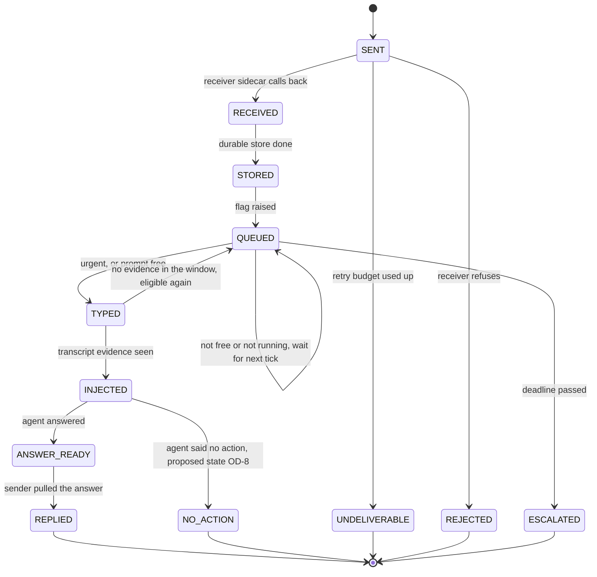

# Interactive agent communication: step 1, requirements

**Task:** T-3344 · **Arc:** arc-011 · **Chain:** arc-011-design, step 1 · **Role:** requirements collector
**Status:** DRAFT in batch mode. The operator interview on the open questions (section 9) is pending, so completion condition 6.1 of the card is not yet met.
**Review link:** none yet. This project's Watchtower has no inline design-review page (profile P2.1). The operator reads this file in the repository.

## 0 Version history

| Version | Date | Change | Task |
|---|---|---|---|
| 0.1 | 2026-10-04 | First draft, batch mode. The operator's confirmed requirements R-1.1..R-14.4 are re-cast into the role-card skeleton. The 18 open decisions are written as interview questions. | T-3344 |

## 1 Inputs of record

1.1 Short names used in this document. Line numbers are those of the file as hashed in 1.2.
1.1.a `RQ` = the headline requirements document.
1.1.b `IAC` = the full design.
1.1.c `RV1` = the external design review comparison.
1.1.d `RV2` = the routing consultation comparison.
1.1.e `T3330R`, `ARC11`, `HT`, `HA` and the other short names are as defined in the header of `RQ`.

1.2 Inputs, with the hash read at the start of this step.

| Short | Path | sha256 |
|---|---|---|
| RQ | `docs/design/interactive-agent-communication-requirements.md` | `1382ffcc0c028cb60a84e45cc9530c1958e0c06811a1cab6859af06078a6f8a1` |
| IAC | `docs/design/interactive-agent-communication.md` | `266fea47b5916d7b0181cf0f32968d408fb76a203d4b8da19d55f6f3a7e92196` |
| RV1 | `docs/reports/T-3335-design-review/comparison.md` | `a725852f9097511a9d2c2c67253ada3a3939b7483a9dbea36f1d512edfb6c887` |
| RV2 | `docs/reports/T-3335-routing-consult/comparison.md` | `7d40ef362096073b11628df256ea843d51788fc2f67fc14ca4bb5dd6aa7c7500` |

1.3 Also read: `docs/design/roles/cards/_common.md`, the requirements-collector card, the AEF adapter, the TermLink profile, `docs/design/roles/README.md`, the chain file and the hand-back schema.

1.4 How this step was run.
1.4.a Mode: batch. No human was present (`_common.md` 5.2).
1.4.b The operator's answers are the confirmed requirements R-1.1..R-13.1 of `RQ` (the operator said "Yes, that's fine", `RQ` header and decision log 2026-10-04). Section 14 of `RQ` (R-14.1..R-14.4) is labelled unconfirmed and is treated as unconfirmed here.
1.4.c Nothing in section 9 is decided. Section 9 is the list of questions the operator has not answered.
1.4.d Reviewer findings that the operator has not ruled on are in section 7 (Conflicts) and section 9 (Open questions). They are not in section 6 (Requirements).

## 2 Stakeholders, protected assets and adversaries

2.1 Stakeholders (the humans and agents that approve, use or are affected).
2.1.a **S-1 The operator.** The only human approver (profile P1.3). Talks to agents through each agent's own terminal. Wants 1:1, many-to-many and operator-to-agent conversation (`RQ` 1.1, 1 item 3).
2.1.b **S-2 Agents of this project.** Sessions of 010-termlink. Several may run at once (profile P3.1). They send, receive, get woken, reply.
2.1.c **S-3 Peer agents of other projects.** The framework agent (AEF, 999-Agentic-Engineering-Framework), 055-agentic-fleet-cockpit, 832-Workflow-designer, ring20-manager (hub .122), ring20-dashboard (hub .121), Penelope (profile P3.1). AEF built a parallel receiver (`RQ` 3 item 2).
2.1.d **S-4 Sidecars.** One process per agent. They hold the store, the flag and the queue, and they inject.
2.1.e **S-5 Hubs.** Carry topics, receipts, presence, artifacts and the fallback path.
2.1.f **S-6 Harnesses.** The programs that run an agent (Claude Code today, opencode at 055). They own the hooks and the transcript (`RQ` 7, `RV1` 13).
2.1.g **S-7 Maintainers of the estate.** Whoever deploys the sidecars (`RQ` 13).

2.2 Protected assets (what an attack or a failure would damage).
2.2.a **A-1 Message content and its durability.** A message that was accepted must not be lost.
2.2.b **A-2 The sender's knowledge of where its message is.** (`RQ` R-1.2.)
2.2.c **A-3 An agent's attention and session.** A typed line into a busy prompt can be discarded (T-2396, `RQ` 8 item 6).
2.2.d **A-4 Identity.** Project, agent and instance identity. All agents on one host sign as one TermLink identity today (`RQ` 11 item 5).
2.2.e **A-5 Credentials.** Hub secrets and TLS pins, sidecar API tokens (profile P3.2).
2.2.f **A-6 The truth of the status record.** The register and the docs must say what actually operates (`RQ` 15).

2.3 Adversaries. The operator has not named an adversary list. This list is the agent's proposal, built from failures that the record documents. The operator is asked to confirm it (gap GP-0, section 8).

| Id | Adversary | Documented evidence |
|---|---|---|
| ADV-1 | A confused or overloaded agent: busy when typed into, silent when woken, unaware of mail | T-2396; the 2026-10-03 incident, mail stored and receipted and never surfaced (`RQ` 5 item 2) |
| ADV-2 | A compromised or misbehaving session that injects, impersonates or force-interrupts | `RV1` point 17: any project can impersonate another with the one host key |
| ADV-3 | A component that reports success it did not earn (a dark guard that reads green) | `RQ` 15 item 2: arc-003, arc-004, S10 "recorded as built, not operating" |
| ADV-4 | A hub, host or network outage, or a blip | `RQ` R-3.2 "the hub goes down"; offline queue (`RQ` 4 item 1) |
| ADV-5 | A hurried or mis-heard operator: voice transcription turned "15" into "50" and "C" into "Cozzyte" | `RQ` 10 item 5; `RQ` 11 item 11 |
| ADV-6 | A stale or wrong binding: a second local hub, a wrong runtime directory, a deaf agent that looks alive | `RV2` items 36 and 65: two hubs on .107, an agent on the wrong one is deaf |
| ADV-7 | A malicious process with privilege on a host (reads secrets, calls the local sidecar API, edits the store) | Not documented as an incident. Named because the card requires it. The threat modeler (step 2) assesses it. |

2.4 What each stakeholder sees: the sender (S-2) sees the stages of section 4; the operator (S-1) sees escalations and, later, the digest; peers (S-3) see presence and receipts.

## 3 Drawings

### 3.1 Drawing D-1: context view (structure)

**Drawing D-1 — context: the system, its stakeholders, the adversaries and the neighbours**

3.1.1 Text equivalent of D-1.
3.1.1.a The sending agent hands a message and an optional blob to its own sidecar (arrow 1).
3.1.1.b The sender sidecar delivers it to the receiver sidecar by API (arrow 2). Whether this may cross hosts is open (OD-1). The fallback is a post to a hub topic that the receiver sidecar pulls (arrows 2b and 2c).
3.1.1.c The receiver sidecar reports the stages RECEIVED, STORED, INJECTED and ANSWER READY back to the sender sidecar (arrow 3).
3.1.1.d The receiver sidecar types one fixed line into the receiving agent's session (arrow 4). The receiving agent runs under a harness. The harness reports readiness and transcript evidence to the sidecar (arrow 5).
3.1.1.e The operator talks to an agent through that agent's terminal. No component for this leg is built (`RQ` 1 item 3).
3.1.1.f Peer projects reach the same hub topics and the presence directory.
3.1.1.g The adversaries act on the receiving agent, the receiver sidecar and the hub topics.

### 3.2 Drawing D-2: main flow (behaviour)

**Drawing D-2 — main flow from send to answer, including the refusal paths**

3.2.1 Text equivalent of D-2.
3.2.1.a The sender gives a message to its sidecar. The sidecar pushes it to the receiver sidecar by API.
3.2.1.b Refusal path 1, no receiver sidecar: the sender sidecar posts to the hub inbox topic. The receiver sidecar pulls it when it is back. Retry and polling ladders run, ending in UNDELIVERABLE or ESCALATED (R-30, R-31).
3.2.1.c The receiver sidecar answers RECEIVED, stores the message durably, raises the flag, then answers STORED (R-14, R-15, R-16).
3.2.1.d Every 30 seconds the receiver sidecar checks the flag and reads the queue, highest priority first (R-17, R-18).
3.2.1.e Urgent: it types one fixed line at once, even into a busy prompt (R-19). The route that makes this safe is open (OD-2).
3.2.1.f Not urgent and the harness says ready: it types the line (R-20, R-21).
3.2.1.g Refusal path 2, not ready or the agent is not running: the message waits for the next tick. NOT RUNNING is reported, never treated as busy (`IAC` 20a).
3.2.1.h The prompt hook surfaces the stored message. The transcript shows it. Only then is INJECTED reported to the sender (R-24). The flag comes down only when the queue is empty (R-25).
3.2.1.i The agent answers or says "no action" (R-28). The receiver sidecar tells the sender sidecar ANSWER READY. The sender pulls it. Roles swap (R-26, R-27).

### 3.3 Drawing D-3: lifecycle of a message (behaviour)

**Drawing D-3 — states of a message and the transitions the requirements allow**

3.3.1 Text equivalent of D-3.
3.3.1.a A message starts as SENT. It becomes RECEIVED, then STORED, then QUEUED when the flag is raised.
3.3.1.b A SENT message ends as REJECTED if the receiver refuses, or UNDELIVERABLE when the retry budget is used up.
3.3.1.c A QUEUED message stays QUEUED each tick while the prompt is not free or the agent is not running. It becomes TYPED when it is urgent or the prompt is free.
3.3.1.d TYPED is internal. It is not a stage the sender is told. The sender is told INJECTED only on transcript evidence (R-24). With no evidence in the window the message goes back to QUEUED.
3.3.1.e A QUEUED message whose deadline passes becomes ESCALATED.
3.3.1.f An INJECTED message ends as REPLIED (the sender pulled the answer) or as NO_ACTION. NO_ACTION is a proposed state that no implementation has. It needs an operator ruling (OD-8).
3.3.1.g The names INJECTED and HANDED_OVER, and the extra states, are not decided (OD-8). The drawing shows the states the requirements allow, with the proposed one marked.

## 4 Answers

4.1 The question set is drafted here, one question per topic of `RQ`, because the profile supplies none (card 2.2). Each answer is the operator's confirmed requirement, with the operator's own words where `RQ` records them. A question for which `RQ` holds no confirmed answer is listed in 4.3 as an open gap.

4.2 Answers from the confirmed requirements.

**QS-1 What does interactive communication mean, and who talks?**
4.2.1 Answer: agents hold interactive, two-way conversations while they work, 1:1, many-to-many and with the operator (R-1.1 of `RQ`). The sender always knows where its message is (R-1.2). No agent has to be attached or polling by hand for delivery to proceed (R-1.3). Source: operator read-back, `RQ` 1.
4.2.2 Operator's words: "I am absolutely very clear that I want to have this … after 20 times me telling you this is a really important part of this design, you don't have this quite essential part of bi-directional interactive communication." (`RQ` 1 item 11, CONSULT:13).
4.2.3 Follow-up QS-1.1, how does the operator talk to an agent? Answer on record: through the agent's own terminal. No component is built (`RQ` 1 item 3). Open as a design question, see GP-11.

**QS-2 What original capability must stay?**
4.2.4 Answer: keystroke injection and output read-back into a terminal (R-2.1), and conversation over the hub instead of fire-and-forget dispatch (R-2.2). Operator's words: "i wanted a means to simulate keyboard input and capture console output" (`RQ` 2 item 9, T243R:96).

**QS-3 What is a sidecar?**
4.2.5 Answer: one per agent; a separate, very simple process with an API (`RQ` R-3.1). Independent of the hub "because the hub goes down" (`RQ` R-3.2). It always respawns, portably, not only under systemd (`RQ` R-3.3). It carries the startup chain: start agent, session, project, hub (`RQ` R-3.4). It re-resolves when an FQDN or IP stops resolving (`RQ` R-3.5). Operator wording, "verbatim in intent": "a separate process exposing an API, deliberately independent of the hub because the hub goes down. Very simple. Always respawns. It also carries the startup chain — start agent, start session, start project, start hub — and re-resolves when an FQDN or IP stops resolving." (`RQ` 3 item 10, RAIL:111-117).
4.2.6 Operator's principle for respawn: "reliability and fragility, so I'm not to save a few tokens just to get a quick solution. I want a solid solution." (`RQ` 3 item 12, ARC11:360-361).
4.2.7 Follow-up QS-3.1, is the sidecar API local only or does it send across hosts? The record holds two answers that conflict, see conflict C-2 and OD-1.

**QS-4 How is a message sent?**
4.2.8 Answer: the sender gives the message, optionally with a blob, to its own sidecar's API (`RQ` R-4.1). The sender's sidecar delivers it to the receiver's sidecar API, push first (`RQ` R-4.2). The hub is the fallback, plus discovery and blob storage (`RQ` R-4.3). Operator's words: "Send: sender agent -> its own sidecar (API) -> the receiver's sidecar (API)." (T3330R:252). And "We have multiple hosts, so that's not a question." (`RQ` 4 item 6, T-3397:270-273).

**QS-5 How is a message received?**
4.2.9 Answer: RECEIVED, the receiver's sidecar calls the sender's sidecar immediately (`RQ` R-5.1). STORED, the message is stored durably and a second call goes back (`RQ` R-5.2). A new-message flag is raised (`RQ` R-5.3). Operator's words: "We store it and immediately go back to the sidecar receiver … an API call that's received." (`RQ` 5 item 10, T3330R:229). The read-back has four calls: RECEIVED, STORED, INJECTED, ANSWER READY (T3330R:252-259).

**QS-6 How often, and what does the tick do?**
4.2.10 Answer: a cron-style job checks the flag every 30 seconds (`RQ` R-6.1). With the flag up it reads the queue, highest priority first (`RQ` R-6.2). Urgent is injected immediately even when the agent is busy, by a route that cannot silently lose the message (`RQ` R-6.3). Not urgent: injected if the prompt is free, otherwise it waits for the next tick (`RQ` R-6.4). Operator's words: "Every 30 seconds … when the flag is up, the message queue gets read … urgent gets injected immediately. Non-urgent, we check again if the prompt is free. If the prompt is not free, we wait again until the next 30 seconds." (CONSULT:17).
4.2.11 Follow-up QS-6.1, what is urgent and how is it marked? Answer on record: the queue has a `priority` clamped to [-9,9], and urgent is band 5 or more by default in the built injector (`RQ` 6 item 3, ARC11 S8 and S9). No confirmed requirement fixes the marking. See candidate C-4 in OD-17.
4.2.12 Follow-up QS-6.2, urgent into a busy prompt. Answer: confirmed as a bypass (R-6.3). The operator's earlier ruling SQ-4 said the opposite and has not been recorded as superseded. Open: OD-2.

**QS-7 Who says the prompt is free?**
4.2.13 Answer: the agent's own harness. The Stop hook marks ready at the end of a turn, and the prompt-submit hook clears it before the next turn (`RQ` R-7.1). It is not inferred from the screen: a long tool call looks idle but is not safe to type into (`RQ` R-7.2).

**QS-8 What is typed, and when is it reported?**
4.2.14 Answer: one short line is typed into the session with `termlink pty inject` (`RQ` R-8.1). INJECTED (AEF: HANDED_OVER) is reported only with evidence from the agent's transcript that it saw the message (`RQ` R-8.2). The flag comes down only when the queue is empty (`RQ` R-8.3). Operator's words: "INJECTED: called back to the sender's sidecar once the message is in the prompt. … The flag is cleared only when the queue is empty." (T3330R:257-258).

**QS-9 How does the answer come back?**
4.2.15 Answer: ANSWER READY, the receiver's sidecar tells the sender's sidecar and the sender pulls the answer (`RQ` R-9.1). Roles swap for the reply (`RQ` R-9.2). A woken agent always replies or explicitly says "no action", never silence (`RQ` R-9.3). If an agent's ears are dead it halts instead of assuming there is no mail (`RQ` R-9.4).

**QS-10 What happens when a push cannot land?**
4.2.16 Answer: the other side polls: 15 s, 1 min, 5 min, 15 min, 1 h, 4 h, 1 day, 3 days, 1 week, 1 month, 1 quarter, 1 year, each rung twice (`RQ` R-10.1). This ladder is the framework default for all polling, changeable per situation (`RQ` R-10.2). Operator's words: "that should be the standard fallback mechanism for the framework for any polling activities. It can be changed situationally, but that should be the standard." (IN-AEF@180).
4.2.17 Follow-up QS-10.1, was the first rung 15 s or 50 s? Dictation said "50". It was read as 15 and "pending operator correction" (T3330R:261). The operator confirmed the read-back, but no explicit correction is recorded. Open: OD-3.

**QS-11 How is an agent addressed?**
4.2.18 Answer: five levels, host, hub, project, session, agent (`RQ` R-11.1). Each level has a canonical name and an instance identity: FQDN for the host, a hub name, the `pid` for the project, a role for the agent (`RQ` R-11.2). Messages carry `to_circuit` and never fall back across projects (`RQ` R-11.3). Operator's decision on the key: T-3325 Q1 = C, recorded from a voice reading, overturnable (`RQ` 11 item 11).

**QS-12 What is recorded, reported and alarmed?**
4.2.19 Answer: every step is a timestamped event, copied to the hub, pullable from any agent (`RQ` R-12.1). Each agent posts a daily digest and reflects on it (`RQ` R-12.2). Alarms only for urgent messages. Everything else escalates when it piles up, like audit warnings (`RQ` R-12.3). Later: an observability database and learning from it, possibly a hub-steward agent (`RQ` R-12.4). Operator's words: "Liveness alarm only for urgent messages. Everything else accumulates and escalates when it piles up, like audit warnings (design to be decided)." (T3330R:265).

**QS-13 How does it ship?**
4.2.20 Answer: every sidecar ships with every TermLink deployment (`RQ` R-13.1). Operator's words: "are all the sidecars we develop … part of our [TermLink] package? When the deployment is done we should deploy all the sidecars with it." (T3330R:230).

**QS-14 Which earlier items were discussed once and lost? (UNCONFIRMED)**
4.2.21 `RQ` section 14 lists four candidates: R-14.1 native consumer, R-14.2 typed assignment and result messages, R-14.3 the hub refuses to call a message delivered without a receipt, R-14.4 the startup chain. The operator has not confirmed or dropped them. They are carried as R-40..R-43 with status "unconfirmed". Open: OD-13.

4.3 Open gaps: questions for which no answer is on record. Each is also a finding of the gap review (section 8).

| Id | Question | Status |
|---|---|---|
| QS-15 | Who may call a sidecar API, and with what credential? | Open gap GP-1 |
| QS-16 | What if a session in the conversation is compromised or hostile? | Open gap GP-2 |
| QS-17 | How many messages may one peer push, and how many may be outstanding? | Open gap GP-3 |
| QS-18 | What must keep working when the hub, the sender host or the receiver host is offline? | Open gap GP-4 |
| QS-19 | What is the recovery after a sidecar restarts in the middle of a delivery? | Open gap GP-5 |
| QS-20 | How is an agent, a peer, a credential or a role revoked? | Open gap GP-6 |
| QS-21 | Which identifiers are stable, who mints them, and what is the unit of "read"? | Open gap GP-7 |
| QS-22 | What does the sender see when the target cannot be reached by design (no hooks, no PTY, other OS)? | Open gap GP-8 |
| QS-23 | Who are the adversaries? | Open gap GP-0, list proposed in 2.3 |

## 5 Glossary

5.1 Each term is defined once. Later roles MUST use these meanings. A term marked (contested) has a definition the operator has not settled.

| Term | Meaning |
|---|---|
| Agent | A running AI session that does work. It has a role and an instance. |
| Circuit | The five-level address of an agent: host, hub, project, session, agent. Carried in `to_circuit`. |
| Conversation | A series of messages with one `conversation_id`. |
| Doorbell | The one fixed line typed into a session to make it look at its stored mail. It carries a count and ids, no peer content. |
| Flag | The new-message marker the sidecar raises when a message is stored and lowers only when the queue is empty. |
| Hub | The server that carries durable topics, receipts, presence and artifacts. Per host or per fleet. State is per hub (G-060). |
| Harness | The program that runs an agent and owns its hooks and its transcript. |
| Home hub | The hub that holds a project's identity and decides liveness for it (contested, OD-18, OD-11). |
| Injection | Typing the doorbell into the agent's session. Typing is not the same as the agent seeing the message. |
| INJECTED | The stage reported to the sender when transcript evidence shows the agent saw the message. AEF calls it HANDED_OVER (contested, OD-8). |
| Instance | One running copy at a level, for example one session. It has a runtime id. |
| Message | One post carrying content, a priority, an id and a conversation id, with an optional blob. |
| Polling ladder | The standard waiting cadence 15 s to 1 year, each rung twice (R-30). |
| Priority | A number in [-9,9] on a queued message. Urgent is a high band (contested, C-4 in OD-17). |
| Queue | The sidecar's store of messages not yet handed over, ordered by priority then arrival. |
| RECEIVED | The receiver's sidecar tells the sender's sidecar immediately that it has the message (contested, OD-4). |
| Retry ladder | AEF's schedule for re-sending a post, 2×1 min to 2×1 month, then dead-letter (D-600). Not the same as the polling ladder (contested, OD-3). |
| Role | The function an agent serves in a project, such as manager. A role is not an instance. |
| Sidecar | The separate, simple process per agent that stores, flags, queues, injects and reports. |
| STORED | The message is durable on the receiver side and a second call goes back (contested, OD-4). |
| Stage | One named step of delivery reported to the sender: SENT, RECEIVED, STORED, INJECTED, ANSWER READY, REPLIED and the failure stages. |
| Startup chain | Start agent, start session, start project, start hub (R-9, never built). |
| Tick | The 30-second check of the flag. |
| Transcript evidence | A record in the receiver's own session transcript that shows the agent saw the message. |
| Urgent | A message that is injected at once even when the agent is busy (R-19). How it is marked is open. |
| Unreachable | An agent that cannot be woken now. Not the same as dead. |

