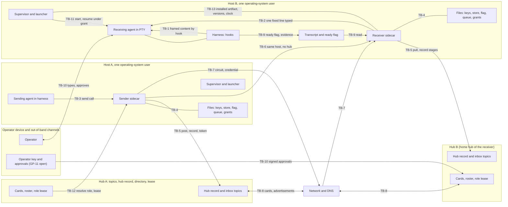

# Interactive agent communication: step 2, threat model

**Task:** T-3351 · **Arc:** arc-011 · **Chain:** arc-011-design, step 2 · **Role:** threat modeler
**Status:** DRAFT v0.1 for independent review, then for the operator's acceptance of the residual risks (section 20). Nothing in this document is approved. Everything tagged **[P]** is a proposal; the operator decides.
**Review link:** none. This project's Watchtower has no inline design-review page (profile P2.1). The operator reads this file in the repository.

## 0 Version history

| Version | Date | Change | Task |
|---|---|---|---|
| 0.1 | 2026-10-07 | First complete draft. Assets, adversaries ADV-1..ADV-10 with privileges (GP-15) and three proposed additions, 13 trust boundaries with the full STRIDE matrix plus the four additions, 56 threats, the circuit trust model, same-id and same-sequence-number analysis, peer-content framing, fleet admission, revocation, durability scope (GP-13), evidence producers (GP-14), bypass inventory, 27 security invariants, proposed numbers, 14 residual risks, 12 change requests. | T-3351 |

## 1 Inputs of record

1.1 The four inputs the orchestrator named. The hashes are the full sha256 values I computed myself at the start of this step (`sha256sum`), not copied from the brief. They match the prefixes in the brief.

| Short | Path | sha256 |
|---|---|---|
| REQ | `docs/design/interactive-agent-communication-01-requirements.md` (v0.4.1, approved) | `14aa257a0ea399426bcffb7d51b8008df843d9d115b7aea966cb1a776df897f2` |
| LOG | `docs/design/interactive-agent-communication/interview-step-01.md` | `aad8308e1924df293270d628b224dafc4814f675a4a61485dd2c1797a7114edd` |
| SUM | `docs/reports/T-3344-step1-rulings-summary.md` | `6381769f3b2a98f3bdc1e1cfe6c6c16c35891b5e5c9fedca55014ceaff13e418` |
| CHAIN | `docs/design/interactive-agent-communication-role-chain.yaml` | `ea67bf4fc4638f2271d53f05240d11a2c2e50c232d1d6945ac13514ec9e62c26` |

1.2 Also read, in the order the brief gave (hashes computed the same way).

| Short | Path | sha256 |
|---|---|---|
| RULES | `CLAUDE.md` (project sections above `## Core Principle`) | `71d6e89d5d1603416a1a7e3a7c896c563ccfd0ead237863a192613a017a569e7` |
| COMMON | `docs/design/roles/cards/_common.md` | `cca38806358d7a6c09e64289164977a825f2cf57e914f672076ff77a2bdb5563` |
| CARD | `docs/design/roles/cards/threat-modeler.md` | `69c793b5a7c5128d82e8d956a8454908acdd85d1ceb2263021a70f5188101625` |
| ADAPTER | `docs/design/roles/adapters/aef.md` | `d840a77649888cdbfd37d1166c15eecd6cd3c8399d497fb6b1b2c52455c6c4a4` |
| PROFILE | `docs/design/roles/profiles/termlink.md` | `b6bc160242d96ca9a8fc167c6845e292529c162fa23faa2945d4742b676e7b21` |
| SCHEMA | `docs/design/roles/schemas/role-handback-1.schema.json` | `288a4e312f00bac978a4b2a87e57ee8a05cb14f916d77c397e601e03c703c148` |

1.3 How this step was run.
1.3.a Mode: batch. No human was present (`_common.md` 5.2). I read the requirements document in full (sections 0 to 13) and the parts of the interview log and summary that bear on trust (OD-1, OD-14, OD-15, CAND-16, GP-0, section 11 of SUM).
1.3.b Where the AEF adapter names ring20 paths or commands this project lacks (`role-chain.py`, `fw reviewer judge`, `design-render-check.py`, the `docs/designs/agent-authorization-broker/` paths), the profile governs (P2.1, P4.5). The drawings were checked with `mmdc` and the local Chromium, the method the step-1 document used (section 22).
1.3.c I did not change the step-1 document and did not rule on anything. Where a mitigation would change a ruled requirement, it is a change request in section 21 (CR-n), not an edit.
1.3.d Facts about what runs today come from REQ, from `CLAUDE.md` and from the profile. I did **not** re-measure the host. Each such fact carries the tag **[H]** (historical, from the record). A fact the record does not hold is stated as an assumption **[A]**.

## 2 Method, vocabulary and how to read this document

2.1 What this document is. A list of who could misuse the interactive-communication system, how, against what, and what stops them. Step 3 will turn the security invariants (section 18) into the security floor and decide the phasing; step 4 designs against both.

2.2 Identifiers. Each kind is numbered once in the whole document.
2.2.a `A-n` an asset (section 3). `ADV-n` an adversary (section 4). `TB-n` a trust boundary (section 5). `TH-n` a threat (section 15).
2.2.b `SI-n` a security invariant: a property that MUST hold in every phase and that a test or probe can check (section 18). `PR-n` a proposed requirement or number, tagged **[P]** (sections 7 to 13 and 19). `PN-n` a proposed number (section 19).
2.2.c `RR-n` a residual risk the operator may accept or reject (section 20). `CR-n` a change request to the requirements step (section 21). `BP-n` a bypass route (section 17). `OQ-n` an open question or a decision only the operator can take (section 22).
2.2.d `R-n`, `OD-n`, `CAND-n`, `GP-n`, `ADV-n` (1..10) and `QS-n` are the step-1 identifiers, unchanged. Where a threat or invariant restates a ruled requirement, it cites it and adds nothing.

2.3 Plain-language meaning of the security words used. Each is explained here once.
2.3.a **STRIDE** is the checklist of six ways to attack a boundary: **S**poofing (pretending to be someone), **T**ampering (changing data), **R**epudiation (denying you did something, and no proof either way), **I**nformation disclosure (reading what you should not), **D**enial of service (making it stop working), **E**levation of privilege (getting rights you were not given).
2.3.b The four additions the card requires. **Confused deputy**: a component with legitimate rights is tricked into using them for someone who has none. **Approved ≠ executed**: the human approved one action and a different one ran. **Replay**: recording a valid message or credential and sending it again later. **Break-glass**: the emergency path that skips the normal rules; it is a standing weak spot because it exists.
2.3.c **Credential**: a secret or a signed statement that proves who you are or what you may do. A **bearer** credential works for whoever holds it (steal it, use it). A **sender-constrained** credential also needs proof that you hold a private key, so a stolen copy is useless alone.
2.3.d **Proof of possession**: showing you hold the private key by signing a fresh challenge. **Channel binding**: tying a credential to one network connection so it cannot be replayed on another. **Nonce**: a random value used once.
2.3.e **Equivocation**: one sender telling two receivers (or the same receiver twice) different things under the same number or id. **Fencing token**: a number that only goes up, so a stale holder of a role is recognised and refused.
2.3.f **TOFU** (trust on first use): accepting an identity the first time you see it and pinning it, then refusing any change. The first contact is only as safe as the person who approved it.
2.3.g **Trust boundary**: a place where data or control passes from something trusted at one level to something trusted at another. **Same-uid**: processes running as the same operating-system user on one host; the operating system gives them no protection from each other.
2.3.h **Likelihood** and **impact** are rated low, medium or high, each with a reason. Likelihood is what the record suggests (an incident, a documented weakness, or only a possibility). Impact is the damage if it works.

2.4 Evidence used and not re-measured **[H]**.
2.4.a All agents on one host sign as one TermLink identity today (REQ 2.2.d, `RQ` 11 item 5). Per-agent signing keys exist (T-3346, runme action 8) but they are files under the same operating-system user (LOG OD-15 point 1).
2.4.b The hub holds a 32-byte HMAC secret and a persistent TLS certificate; clients pin the certificate (TOFU) and cache secrets in `~/.termlink/secrets/` (RULES, "Hub Auth Rotation Protocol"). A token has a scope (Observe is the read-only scope).
2.4.c The hub dedupe holds `(sender_id, client_msg_id)` for 5 minutes only, and `sender_id` is the host identity fingerprint, not an agent (REQ R-51.c; RULES post-idempotency row).
2.4.d AEF's receiver uses a bearer token on loopback (REQ GP-1). `termlink pty inject`, `exec`, `remote exec` and `channel post` exist and are reachable to any holder of a session or a hub secret (RULES; REQ R-4).
2.4.e Incidents the threat model uses as evidence: 2026-10-03 mail stored and never surfaced; 2026-10-04 stray second hub (32 sessions split); 2026-10-06 three identities consumed one inbox, wake-ups to the wrong session, about 94 handled messages replayed after a re-vendor, 21 local fixes at risk after the re-vendor (REQ 2.4a); the 32,205-refusal sidecar (LOG OD-14); T-2396 typed input lost into a busy prompt; G-058, G-060, G-063, G-069.

## 3 Assets (card 3.1)

3.1 What an attacker wants. A-1..A-6 are the step-1 assets (REQ 2.2), restated; A-7..A-12 are what this step adds.

| Id | Asset | Why an attacker wants it | Source |
|---|---|---|---|
| A-1 | Message content and its durability | Read it, change it, or make an accepted message vanish | REQ 2.2.a |
| A-2 | The sender's knowledge of where its message is (the truth of the stage) | A false green hides loss and lets later harm go unseen | REQ 2.2.b, ADV-3 |
| A-3 | An agent's attention and session (its context, its terminal, its turn) | Whoever gets text into the agent's context borrows the agent's rights on its host | REQ 2.2.c |
| A-4 | Identity: who sent, who receives, which project, which instance | Impersonate, redirect, or be silently replaced | REQ 2.2.d |
| A-5 | Credentials: hub secrets, TLS pins, sidecar API tokens, signing keys | Anyone holding them acts as the owner | REQ 2.2.e |
| A-6 | The truth of the status record and the audit record | A record that lies, or can be rewritten, ends accountability | REQ 2.2.f |
| A-7 | The ability to act on a host through an agent (run commands, edit files, push, approve) | The real prize: peer text turned into action | profile P3.2; CLAUDE.md |
| A-8 | The operator's approvals and the sovereignty gates (grants, re-home, admission, pins) | An approval obtained by trickery unlocks everything below it | R-63, R-64, R-65, R-54, R-67 |
| A-9 | Circuit credentials and the directory (cards, roster, home-hub bindings) | Control of routing: who receives whose mail | R-46, R-60 |
| A-10 | The role "main" and the lease (who answers a project) | Receive every request addressed to the project | R-67 |
| A-11 | Availability of delivery and of the agent's turn (attention budget) | Interrupt storms and floods make the agents unusable (Codex, `RV1` point 18) | R-56 |
| A-12 | The installed artifact and the estate's version state (binary, vendored scripts, clocks) | A poisoned or rolled-back component sits under every other control | ADV-10; REQ 2.4a.6 |

3.2 The most valuable four, for the attack trees (D-3): A-7 (act on a host through an agent), A-4/A-9 (steer or read another agent's mail), A-2/A-6 (make the system lie), A-5/A-8 (steal credentials or approvals).

## 4 Adversaries and their privileges (card 3.2, GP-0, GP-15)

4.1 Privilege vocabulary. For each adversary I state five things, because "what can it do" is the question GP-15 asks.
4.1.a **Position**: where it starts. **Files and keys**: what it can read and write on disk. **Sockets and APIs**: what it can call. **Hub access**: what a hub lets it do. **Cannot (assumed)**: what I assume it cannot do; if that assumption is false, the threats that rely on it are understated.

4.2 ADV-1..ADV-10 (confirmed by GP-0, REQ 2.3) with their privileges. ADV-2 is split by position because the privileges differ sharply.

| Id | Position | Files and keys | Sockets and APIs | Hub access | Cannot (assumed) |
|---|---|---|---|---|---|
| ADV-1 confused or overloaded agent | A legitimate agent, honest, busy, silent or unaware of mail | Its own transcript, its own agent key, its own tasks | Its own sidecar through the normal send path | Posts as itself | Act as another agent; it fails to act, it does not attack |
| ADV-2a compromised session, same host as victims | A session of any project on the host that was hijacked or prompt-injected; it runs as the same operating-system user as the other agents (uid 0 on this host **[H]**) | Everything that user can read: the shared host key, all per-agent keys (plain files), `~/.termlink/secrets/*.hex`, every sidecar store and flag, sibling transcripts, the runtime directory | Every local socket and PTY of that user: `pty inject`, `exec`, sidecar APIs, AEF loopback bearer token (readable file) | Whatever tokens the user's files hold; posts as the shared host identity | Read another host's secrets (unless stored here); act as the operator on the operator device; break TLS or signatures |
| ADV-2b compromised session, remote peer | A hijacked agent in a peer project on another host, admitted to the fleet | Only its own host's files; its own project's agent keys | Only what a peer is offered: send to a sidecar or a hub inbox, request a circuit, read topics its token allows | Its own project's identity and registrations | Reach this host's files or sockets; forge another project's signature |
| ADV-3 component reporting success it did not earn | A sidecar, adapter, hook, canary or status call inside the trust base, buggy or compromised | Its own role's records (stage records, ready flag, the transcript it parses) | The APIs its role has | Writes the stages its role writes | Be detected by the thing it reports on; this is the point |
| ADV-4 outage | A hub, host or network outage or a blip | none | none | none | It has no intent; its effect is missing messages, missing callbacks, a gap |
| ADV-5 hurried or mis-heard operator | The operator, by voice transcription or haste ("15" heard as "50") | The operator's authority: approvals, `runme`, pins, grants | The operator terminal, the out-of-band channels | Approves anything the operator may approve | Intend harm; it approves what it did not read |
| ADV-6 stale or wrong binding | An honest component bound to the wrong hub, the wrong runtime directory, a misfiled signing key, or a second live copy of one project | The legitimate credentials of the thing it is mis-bound to | Calls the wrong endpoint with valid credentials | Valid, but on the wrong hub or as the wrong identity | Know it is wrong; it looks alive |
| ADV-7 malicious process with privilege on a host | Root or the same user on one host; installed software or a stolen shell | Everything on that host: all keys, all secrets, all stores, transcripts, binaries, the supervisor's unit files | All local APIs and PTYs; can start and kill processes | Acts as that host (and as every agent on it) on every hub whose secret the host holds | Reach other hosts or the operator device; forge signatures of keys it never read |
| ADV-8 flooding or looping peer | An admitted peer, or two auto-responders, with valid credentials | none on this host | Send, request circuits, post to inboxes | Posts within its token's rate | Read this host's files; it is loud, not stealthy |
| ADV-9 stale or partitioned authority holder | The holder of the role "main": alive as a process, cannot take a turn, or cut off from its hub | Its own state | Renews or fails to renew its lease | Holds a lease and a generation number | Write other agents' state; it is a failure, not an attack, unless induced (TH-33) |
| ADV-10 estate drift | Skewed clocks, mixed versions, a re-vendor that deletes local fixes; also whoever performs installs and upgrades | Can overwrite vendored files and binaries (the 2026-10-06 re-vendor did) | The installer, `fw upgrade`, cron | none beyond the installer's | Intend harm; it silently removes protections |

4.3 Adversaries added by this step. The brief and the requirements say "step 2 may add more". These are **[P]** proposals for the operator to confirm (OQ-1).

| Id | Position | Files and keys | Sockets and APIs | Hub access | Cannot (assumed) |
|---|---|---|---|---|---|
| ADV-11 compromised or rogue hub | A hub in the fleet whose secret, certificate, signing key and database an attacker holds, or a hub an attacker runs | All data that hub stores: topics, hub records, cards, credentials it minted | Serves every client that connects to it | Reads, withholds, reorders and forges what it serves; declares DEAD for projects it is home hub of; mints circuit credentials for its own projects | Forge an agent's signature, another hub's signature, or a message another hub never sent |
| ADV-12 unadmitted joiner | A host or hub nobody in the fleet approved, able to reach hub ports (or approved by mistake at first contact) | none | Connect, register, advertise, request first contact | none until admitted | Hold any fleet secret; it tries to be admitted or to poison what an unauthenticated listener accepts |
| ADV-13 network attacker | On the path between hosts or hubs, or controlling DNS | none | Observe, delay, drop, modify, replay packets; change what a name resolves to | none | Break TLS or a signature; it can still replay and redirect |

4.4 The one structural fact that decides how much is achievable (it sets the limits of every per-agent control below).
4.4.a **[H]** All agents on a host run as one operating-system user. The operating system therefore does not separate them, and ADV-2a holds the same files and sockets as ADV-7 at user level. A per-agent key stored as a file under that user stops accidents (ADV-6, ADV-1) and remote attackers (ADV-2b, ADV-13). It does **not** stop a malicious same-user process from reading a sibling's key.
4.4.b Two designs follow, and the operator chooses (OQ-2). (i) Accept it: the floor assumes same-user agents are mutually trusted for confidentiality of keys, and per-agent keys are about attribution and misfiling. (ii) Separate the agents by operating-system user or by container, which makes the per-agent key a real boundary. This document models (i) because it is what exists, and records the cost as RR-2.

## 5 Trust boundaries and data flow (card 3.3)

5.1 Thirteen boundaries. The five flows that matter are: a message from sender agent to receiver agent (arrows 1 to 5 of REQ D-1), the hub record that mirrors every stage, the circuit set up through the hubs, the cards the hubs exchange, and the operator's approvals.

**Drawing D-1 — data flow with the trust boundaries TB-1 to TB-13**

5.1.1 Text equivalent of D-1.
5.1.1.a A sending agent calls its own sidecar (TB-3). The sidecar reads and writes its local files: store, flag, queue, keys, grants (TB-4).
5.1.1.b The sender sidecar posts to a hub and writes the hub record, using a hub token (TB-5). For a new conversation on one host without the hub, it would call the receiver sidecar directly (TB-6, the question J4). For an established conversation it connects to the receiver sidecar by a circuit across the network with a hub-minted credential (TB-7).
5.1.1.c Hubs exchange cards and advertisements over the network (TB-8). Each hub keeps a directory and the role lease; a sender resolves a role there (TB-12).
5.1.1.d The receiver sidecar pulls from its home hub and writes each stage to the hub record (TB-5). It types one fixed line into the receiving agent's terminal (TB-2). The harness hook delivers framed peer content into the agent's context (TB-1). The harness writes the ready flag and the transcript, and the sidecar reads them as evidence (TB-9).
5.1.1.e The operator types into the agent's terminal, approves actions and, in the future, signs approvals with an operator key (TB-10). A supervisor starts or resumes an agent under a grant (TB-11). The installed artifact, the versions and the clocks are shared state under all of it (TB-13).

5.2 The thirteen boundaries.

| Id | Boundary | What crosses | Trust change |
|---|---|---|---|
| TB-1 | Peer content into the agent's context (hook channel, framed text, blob, reply) | Text written by a peer becomes input to a model that has rights on a host | Untrusted data enters a trusted reader. In Claude Code, hook output is delivered with the harness's own standing, which is more than a user message |
| TB-2 | Sidecar into the agent's terminal (the typed doorbell) | Keystrokes into a PTY | Sidecar authority becomes the agent's input; if the PTY is at a shell, it is a command |
| TB-3 | Local callers into the sidecar API (send, status, admin) | A request to send as this agent, or to change sidecar state | Any local process, or the agent, acts through the sidecar's rights (confused-deputy risk) |
| TB-4 | The sidecar and its local files (store, flag, queue, keys, grants, and the transcript it reads) | Durable state | Same-user processes write what the sidecar trusts |
| TB-5 | Sidecar and hub (posts, pulls, hub record, directory writes, token) | Messages, stages, registrations over TLS with an HMAC token | Hub operator and every token holder see and shape the record |
| TB-6 | Sidecar to sidecar on one host without the hub (the J4 question) | A new conversation set up locally | Trust would rest on the operating-system user |
| TB-7 | Sidecar to sidecar across hosts (the circuit) | Turns, receipts, credentials, over the network | A hub-minted credential replaces per-message hub mediation |
| TB-8 | Hub to hub (cards, advertisements, admission) | Directory facts about projects and liveness | One hub's statements are believed by another |
| TB-9 | Harness and transcript to sidecar (readiness and hand-over evidence) | A ready flag and transcript lines | The sidecar believes what files written by same-user processes say |
| TB-10 | Operator and system (terminal, approvals, out-of-band channels, break-glass) | Decisions, overrides, approvals | The human's authority is exercised through a screen the system draws |
| TB-11 | Starting and resuming agents (supervisor, launcher, grants) | Authority to run a new process | Inbound mail may cause a process to start (R-64, R-65) |
| TB-12 | Role resolution and the lease at the home hub | Which agent answers "main"; DEAD declarations | The hub decides who receives, and who is dead |
| TB-13 | The installed estate (binary, vendored scripts, versions, clocks) | Code and time | Everything else relies on it being the intended code at the right time |

