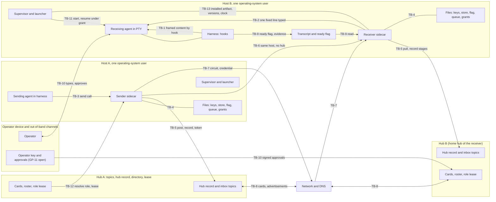

# Interactive agent communication: step 2, threat model

**Task:** T-3351 · **Arc:** arc-011 · **Chain:** arc-011-design, step 2 · **Role:** threat modeler
**Status:** DRAFT v0.1 for independent review, then for the operator's acceptance of the residual risks (section 20). Nothing in this document is approved. Everything tagged **[P]** is a proposal; the operator decides.
**Review link:** none. This project's Watchtower has no inline design-review page (profile P2.1). The operator reads this file in the repository.

## 0 Version history

| Version | Date | Change | Task |
|---|---|---|---|
| 0.1 | 2026-10-07 | First complete draft. Assets, adversaries ADV-1..ADV-10 with privileges (GP-15) and three proposed additions, 13 trust boundaries with the full STRIDE matrix plus the four additions, 56 threats, the circuit trust model, same-id and same-sequence-number analysis, peer-content framing, fleet admission, revocation, durability scope (GP-13), evidence producers (GP-14), bypass inventory, 27 security invariants, proposed numbers, 14 residual risks, 12 change requests. | T-3351 |

## 1 Inputs of record

1.1 The four inputs the orchestrator named. The hashes are the full sha256 values I computed myself at the start of this step (`sha256sum`), not copied from the brief. They match the prefixes in the brief.

| Short | Path | sha256 |
|---|---|---|
| REQ | `docs/design/interactive-agent-communication-01-requirements.md` (v0.4.1, approved) | `14aa257a0ea399426bcffb7d51b8008df843d9d115b7aea966cb1a776df897f2` |
| LOG | `docs/design/interactive-agent-communication/interview-step-01.md` | `aad8308e1924df293270d628b224dafc4814f675a4a61485dd2c1797a7114edd` |
| SUM | `docs/reports/T-3344-step1-rulings-summary.md` | `6381769f3b2a98f3bdc1e1cfe6c6c16c35891b5e5c9fedca55014ceaff13e418` |
| CHAIN | `docs/design/interactive-agent-communication-role-chain.yaml` | `ea67bf4fc4638f2271d53f05240d11a2c2e50c232d1d6945ac13514ec9e62c26` |

1.2 Also read, in the order the brief gave (hashes computed the same way).

| Short | Path | sha256 |
|---|---|---|
| RULES | `CLAUDE.md` (project sections above `## Core Principle`) | `71d6e89d5d1603416a1a7e3a7c896c563ccfd0ead237863a192613a017a569e7` |
| COMMON | `docs/design/roles/cards/_common.md` | `cca38806358d7a6c09e64289164977a825f2cf57e914f672076ff77a2bdb5563` |
| CARD | `docs/design/roles/cards/threat-modeler.md` | `69c793b5a7c5128d82e8d956a8454908acdd85d1ceb2263021a70f5188101625` |
| ADAPTER | `docs/design/roles/adapters/aef.md` | `d840a77649888cdbfd37d1166c15eecd6cd3c8399d497fb6b1b2c52455c6c4a4` |
| PROFILE | `docs/design/roles/profiles/termlink.md` | `b6bc160242d96ca9a8fc167c6845e292529c162fa23faa2945d4742b676e7b21` |
| SCHEMA | `docs/design/roles/schemas/role-handback-1.schema.json` | `288a4e312f00bac978a4b2a87e57ee8a05cb14f916d77c397e601e03c703c148` |

1.3 How this step was run.
1.3.a Mode: batch. No human was present (`_common.md` 5.2). I read the requirements document in full (sections 0 to 13) and the parts of the interview log and summary that bear on trust (OD-1, OD-14, OD-15, CAND-16, GP-0, section 11 of SUM).
1.3.b Where the AEF adapter names ring20 paths or commands this project lacks (`role-chain.py`, `fw reviewer judge`, `design-render-check.py`, the `docs/designs/agent-authorization-broker/` paths), the profile governs (P2.1, P4.5). The drawings were checked with `mmdc` and the local Chromium, the method the step-1 document used (section 22).
1.3.c I did not change the step-1 document and did not rule on anything. Where a mitigation would change a ruled requirement, it is a change request in section 21 (CR-n), not an edit.
1.3.d Facts about what runs today come from REQ, from `CLAUDE.md` and from the profile. I did **not** re-measure the host. Each such fact carries the tag **[H]** (historical, from the record). A fact the record does not hold is stated as an assumption **[A]**.

## 2 Method, vocabulary and how to read this document

2.1 What this document is. A list of who could misuse the interactive-communication system, how, against what, and what stops them. Step 3 will turn the security invariants (section 18) into the security floor and decide the phasing; step 4 designs against both.

2.2 Identifiers. Each kind is numbered once in the whole document.
2.2.a `A-n` an asset (section 3). `ADV-n` an adversary (section 4). `TB-n` a trust boundary (section 5). `TH-n` a threat (section 15).
2.2.b `SI-n` a security invariant: a property that MUST hold in every phase and that a test or probe can check (section 18). `PR-n` a proposed requirement or number, tagged **[P]** (sections 7 to 13 and 19). `PN-n` a proposed number (section 19).
2.2.c `RR-n` a residual risk the operator may accept or reject (section 20). `CR-n` a change request to the requirements step (section 21). `BP-n` a bypass route (section 17). `OQ-n` an open question or a decision only the operator can take (section 22).
2.2.d `R-n`, `OD-n`, `CAND-n`, `GP-n`, `ADV-n` (1..10) and `QS-n` are the step-1 identifiers, unchanged. Where a threat or invariant restates a ruled requirement, it cites it and adds nothing.

2.3 Plain-language meaning of the security words used. Each is explained here once.
2.3.a **STRIDE** is the checklist of six ways to attack a boundary: **S**poofing (pretending to be someone), **T**ampering (changing data), **R**epudiation (denying you did something, and no proof either way), **I**nformation disclosure (reading what you should not), **D**enial of service (making it stop working), **E**levation of privilege (getting rights you were not given).
2.3.b The four additions the card requires. **Confused deputy**: a component with legitimate rights is tricked into using them for someone who has none. **Approved ≠ executed**: the human approved one action and a different one ran. **Replay**: recording a valid message or credential and sending it again later. **Break-glass**: the emergency path that skips the normal rules; it is a standing weak spot because it exists.
2.3.c **Credential**: a secret or a signed statement that proves who you are or what you may do. A **bearer** credential works for whoever holds it (steal it, use it). A **sender-constrained** credential also needs proof that you hold a private key, so a stolen copy is useless alone.
2.3.d **Proof of possession**: showing you hold the private key by signing a fresh challenge. **Channel binding**: tying a credential to one network connection so it cannot be replayed on another. **Nonce**: a random value used once.
2.3.e **Equivocation**: one sender telling two receivers (or the same receiver twice) different things under the same number or id. **Fencing token**: a number that only goes up, so a stale holder of a role is recognised and refused.
2.3.f **TOFU** (trust on first use): accepting an identity the first time you see it and pinning it, then refusing any change. The first contact is only as safe as the person who approved it.
2.3.g **Trust boundary**: a place where data or control passes from something trusted at one level to something trusted at another. **Same-uid**: processes running as the same operating-system user on one host; the operating system gives them no protection from each other.
2.3.h **Likelihood** and **impact** are rated low, medium or high, each with a reason. Likelihood is what the record suggests (an incident, a documented weakness, or only a possibility). Impact is the damage if it works.

2.4 Evidence used and not re-measured **[H]**.
2.4.a All agents on one host sign as one TermLink identity today (REQ 2.2.d, `RQ` 11 item 5). Per-agent signing keys exist (T-3346, runme action 8) but they are files under the same operating-system user (LOG OD-15 point 1).
2.4.b The hub holds a 32-byte HMAC secret and a persistent TLS certificate; clients pin the certificate (TOFU) and cache secrets in `~/.termlink/secrets/` (RULES, "Hub Auth Rotation Protocol"). A token has a scope (Observe is the read-only scope).
2.4.c The hub dedupe holds `(sender_id, client_msg_id)` for 5 minutes only, and `sender_id` is the host identity fingerprint, not an agent (REQ R-51.c; RULES post-idempotency row).
2.4.d AEF's receiver uses a bearer token on loopback (REQ GP-1). `termlink pty inject`, `exec`, `remote exec` and `channel post` exist and are reachable to any holder of a session or a hub secret (RULES; REQ R-4).
2.4.e Incidents the threat model uses as evidence: 2026-10-03 mail stored and never surfaced; 2026-10-04 stray second hub (32 sessions split); 2026-10-06 three identities consumed one inbox, wake-ups to the wrong session, about 94 handled messages replayed after a re-vendor, 21 local fixes at risk after the re-vendor (REQ 2.4a); the 32,205-refusal sidecar (LOG OD-14); T-2396 typed input lost into a busy prompt; G-058, G-060, G-063, G-069.

## 3 Assets (card 3.1)

3.1 What an attacker wants. A-1..A-6 are the step-1 assets (REQ 2.2), restated; A-7..A-12 are what this step adds.

| Id | Asset | Why an attacker wants it | Source |
|---|---|---|---|
| A-1 | Message content and its durability | Read it, change it, or make an accepted message vanish | REQ 2.2.a |
| A-2 | The sender's knowledge of where its message is (the truth of the stage) | A false green hides loss and lets later harm go unseen | REQ 2.2.b, ADV-3 |
| A-3 | An agent's attention and session (its context, its terminal, its turn) | Whoever gets text into the agent's context borrows the agent's rights on its host | REQ 2.2.c |
| A-4 | Identity: who sent, who receives, which project, which instance | Impersonate, redirect, or be silently replaced | REQ 2.2.d |
| A-5 | Credentials: hub secrets, TLS pins, sidecar API tokens, signing keys | Anyone holding them acts as the owner | REQ 2.2.e |
| A-6 | The truth of the status record and the audit record | A record that lies, or can be rewritten, ends accountability | REQ 2.2.f |
| A-7 | The ability to act on a host through an agent (run commands, edit files, push, approve) | The real prize: peer text turned into action | profile P3.2; CLAUDE.md |
| A-8 | The operator's approvals and the sovereignty gates (grants, re-home, admission, pins) | An approval obtained by trickery unlocks everything below it | R-63, R-64, R-65, R-54, R-67 |
| A-9 | Circuit credentials and the directory (cards, roster, home-hub bindings) | Control of routing: who receives whose mail | R-46, R-60 |
| A-10 | The role "main" and the lease (who answers a project) | Receive every request addressed to the project | R-67 |
| A-11 | Availability of delivery and of the agent's turn (attention budget) | Interrupt storms and floods make the agents unusable (Codex, `RV1` point 18) | R-56 |
| A-12 | The installed artifact and the estate's version state (binary, vendored scripts, clocks) | A poisoned or rolled-back component sits under every other control | ADV-10; REQ 2.4a.6 |

3.2 The most valuable four, for the attack trees (D-3): A-7 (act on a host through an agent), A-4/A-9 (steer or read another agent's mail), A-2/A-6 (make the system lie), A-5/A-8 (steal credentials or approvals).

## 4 Adversaries and their privileges (card 3.2, GP-0, GP-15)

4.1 Privilege vocabulary. For each adversary I state five things, because "what can it do" is the question GP-15 asks.
4.1.a **Position**: where it starts. **Files and keys**: what it can read and write on disk. **Sockets and APIs**: what it can call. **Hub access**: what a hub lets it do. **Cannot (assumed)**: what I assume it cannot do; if that assumption is false, the threats that rely on it are understated.

4.2 ADV-1..ADV-10 (confirmed by GP-0, REQ 2.3) with their privileges. ADV-2 is split by position because the privileges differ sharply.

| Id | Position | Files and keys | Sockets and APIs | Hub access | Cannot (assumed) |
|---|---|---|---|---|---|
| ADV-1 confused or overloaded agent | A legitimate agent, honest, busy, silent or unaware of mail | Its own transcript, its own agent key, its own tasks | Its own sidecar through the normal send path | Posts as itself | Act as another agent; it fails to act, it does not attack |
| ADV-2a compromised session, same host as victims | A session of any project on the host that was hijacked or prompt-injected; it runs as the same operating-system user as the other agents (uid 0 on this host **[H]**) | Everything that user can read: the shared host key, all per-agent keys (plain files), `~/.termlink/secrets/*.hex`, every sidecar store and flag, sibling transcripts, the runtime directory | Every local socket and PTY of that user: `pty inject`, `exec`, sidecar APIs, AEF loopback bearer token (readable file) | Whatever tokens the user's files hold; posts as the shared host identity | Read another host's secrets (unless stored here); act as the operator on the operator device; break TLS or signatures |
| ADV-2b compromised session, remote peer | A hijacked agent in a peer project on another host, admitted to the fleet | Only its own host's files; its own project's agent keys | Only what a peer is offered: send to a sidecar or a hub inbox, request a circuit, read topics its token allows | Its own project's identity and registrations | Reach this host's files or sockets; forge another project's signature |
| ADV-3 component reporting success it did not earn | A sidecar, adapter, hook, canary or status call inside the trust base, buggy or compromised | Its own role's records (stage records, ready flag, the transcript it parses) | The APIs its role has | Writes the stages its role writes | Be detected by the thing it reports on; this is the point |
| ADV-4 outage | A hub, host or network outage or a blip | none | none | none | It has no intent; its effect is missing messages, missing callbacks, a gap |
| ADV-5 hurried or mis-heard operator | The operator, by voice transcription or haste ("15" heard as "50") | The operator's authority: approvals, `runme`, pins, grants | The operator terminal, the out-of-band channels | Approves anything the operator may approve | Intend harm; it approves what it did not read |
| ADV-6 stale or wrong binding | An honest component bound to the wrong hub, the wrong runtime directory, a misfiled signing key, or a second live copy of one project | The legitimate credentials of the thing it is mis-bound to | Calls the wrong endpoint with valid credentials | Valid, but on the wrong hub or as the wrong identity | Know it is wrong; it looks alive |
| ADV-7 malicious process with privilege on a host | Root or the same user on one host; installed software or a stolen shell | Everything on that host: all keys, all secrets, all stores, transcripts, binaries, the supervisor's unit files | All local APIs and PTYs; can start and kill processes | Acts as that host (and as every agent on it) on every hub whose secret the host holds | Reach other hosts or the operator device; forge signatures of keys it never read |
| ADV-8 flooding or looping peer | An admitted peer, or two auto-responders, with valid credentials | none on this host | Send, request circuits, post to inboxes | Posts within its token's rate | Read this host's files; it is loud, not stealthy |
| ADV-9 stale or partitioned authority holder | The holder of the role "main": alive as a process, cannot take a turn, or cut off from its hub | Its own state | Renews or fails to renew its lease | Holds a lease and a generation number | Write other agents' state; it is a failure, not an attack, unless induced (TH-33) |
| ADV-10 estate drift | Skewed clocks, mixed versions, a re-vendor that deletes local fixes; also whoever performs installs and upgrades | Can overwrite vendored files and binaries (the 2026-10-06 re-vendor did) | The installer, `fw upgrade`, cron | none beyond the installer's | Intend harm; it silently removes protections |

4.3 Adversaries added by this step. The brief and the requirements say "step 2 may add more". These are **[P]** proposals for the operator to confirm (OQ-1).

| Id | Position | Files and keys | Sockets and APIs | Hub access | Cannot (assumed) |
|---|---|---|---|---|---|
| ADV-11 compromised or rogue hub | A hub in the fleet whose secret, certificate, signing key and database an attacker holds, or a hub an attacker runs | All data that hub stores: topics, hub records, cards, credentials it minted | Serves every client that connects to it | Reads, withholds, reorders and forges what it serves; declares DEAD for projects it is home hub of; mints circuit credentials for its own projects | Forge an agent's signature, another hub's signature, or a message another hub never sent |
| ADV-12 unadmitted joiner | A host or hub nobody in the fleet approved, able to reach hub ports (or approved by mistake at first contact) | none | Connect, register, advertise, request first contact | none until admitted | Hold any fleet secret; it tries to be admitted or to poison what an unauthenticated listener accepts |
| ADV-13 network attacker | On the path between hosts or hubs, or controlling DNS | none | Observe, delay, drop, modify, replay packets; change what a name resolves to | none | Break TLS or a signature; it can still replay and redirect |

4.4 The one structural fact that decides how much is achievable (it sets the limits of every per-agent control below).
4.4.a **[H]** All agents on a host run as one operating-system user. The operating system therefore does not separate them, and ADV-2a holds the same files and sockets as ADV-7 at user level. A per-agent key stored as a file under that user stops accidents (ADV-6, ADV-1) and remote attackers (ADV-2b, ADV-13). It does **not** stop a malicious same-user process from reading a sibling's key.
4.4.b Two designs follow, and the operator chooses (OQ-2). (i) Accept it: the floor assumes same-user agents are mutually trusted for confidentiality of keys, and per-agent keys are about attribution and misfiling. (ii) Separate the agents by operating-system user or by container, which makes the per-agent key a real boundary. This document models (i) because it is what exists, and records the cost as RR-2.

## 5 Trust boundaries and data flow (card 3.3)

5.1 Thirteen boundaries. The five flows that matter are: a message from sender agent to receiver agent (arrows 1 to 5 of REQ D-1), the hub record that mirrors every stage, the circuit set up through the hubs, the cards the hubs exchange, and the operator's approvals.

**Drawing D-1 — data flow with the trust boundaries TB-1 to TB-13**

5.1.1 Text equivalent of D-1.
5.1.1.a A sending agent calls its own sidecar (TB-3). The sidecar reads and writes its local files: store, flag, queue, keys, grants (TB-4).
5.1.1.b The sender sidecar posts to a hub and writes the hub record, using a hub token (TB-5). For a new conversation on one host without the hub, it would call the receiver sidecar directly (TB-6, the question J4). For an established conversation it connects to the receiver sidecar by a circuit across the network with a hub-minted credential (TB-7).
5.1.1.c Hubs exchange cards and advertisements over the network (TB-8). Each hub keeps a directory and the role lease; a sender resolves a role there (TB-12).
5.1.1.d The receiver sidecar pulls from its home hub and writes each stage to the hub record (TB-5). It types one fixed line into the receiving agent's terminal (TB-2). The harness hook delivers framed peer content into the agent's context (TB-1). The harness writes the ready flag and the transcript, and the sidecar reads them as evidence (TB-9).
5.1.1.e The operator types into the agent's terminal, approves actions and, in the future, signs approvals with an operator key (TB-10). A supervisor starts or resumes an agent under a grant (TB-11). The installed artifact, the versions and the clocks are shared state under all of it (TB-13).

5.2 The thirteen boundaries.

| Id | Boundary | What crosses | Trust change |
|---|---|---|---|
| TB-1 | Peer content into the agent's context (hook channel, framed text, blob, reply) | Text written by a peer becomes input to a model that has rights on a host | Untrusted data enters a trusted reader. In Claude Code, hook output is delivered with the harness's own standing, which is more than a user message |
| TB-2 | Sidecar into the agent's terminal (the typed doorbell) | Keystrokes into a PTY | Sidecar authority becomes the agent's input; if the PTY is at a shell, it is a command |
| TB-3 | Local callers into the sidecar API (send, status, admin) | A request to send as this agent, or to change sidecar state | Any local process, or the agent, acts through the sidecar's rights (confused-deputy risk) |
| TB-4 | The sidecar and its local files (store, flag, queue, keys, grants, and the transcript it reads) | Durable state | Same-user processes write what the sidecar trusts |
| TB-5 | Sidecar and hub (posts, pulls, hub record, directory writes, token) | Messages, stages, registrations over TLS with an HMAC token | Hub operator and every token holder see and shape the record |
| TB-6 | Sidecar to sidecar on one host without the hub (the J4 question) | A new conversation set up locally | Trust would rest on the operating-system user |
| TB-7 | Sidecar to sidecar across hosts (the circuit) | Turns, receipts, credentials, over the network | A hub-minted credential replaces per-message hub mediation |
| TB-8 | Hub to hub (cards, advertisements, admission) | Directory facts about projects and liveness | One hub's statements are believed by another |
| TB-9 | Harness and transcript to sidecar (readiness and hand-over evidence) | A ready flag and transcript lines | The sidecar believes what files written by same-user processes say |
| TB-10 | Operator and system (terminal, approvals, out-of-band channels, break-glass) | Decisions, overrides, approvals | The human's authority is exercised through a screen the system draws |
| TB-11 | Starting and resuming agents (supervisor, launcher, grants) | Authority to run a new process | Inbound mail may cause a process to start (R-64, R-65) |
| TB-12 | Role resolution and the lease at the home hub | Which agent answers "main"; DEAD declarations | The hub decides who receives, and who is dead |
| TB-13 | The installed estate (binary, vendored scripts, versions, clocks) | Code and time | Everything else relies on it being the intended code at the right time |

## 6 Credential custody and who may call a sidecar (GP-1)

6.1 The question GP-1 leaves open: who holds which credential, who may call a sidecar API, and how a receiver learns who really sent a message. REQ R-63 already relies on "verified signing key" and R-34.e says authentication of the sender "is GP-1 and is not required by R-34". This section answers it, as proposals.

6.2 Credential inventory. "Must not be usable for" is the property each credential needs so that stealing it does not give everything.

| Id | Credential | Held today by **[H]** | Proves | Must not be usable for |
|---|---|---|---|---|
| C-1 | Hub HMAC secret and the tokens minted from it (with scope, for example Observe) | The hub, and every client file `~/.termlink/secrets/*.hex` and the runtime directory | The holder may call this hub within the token's scope | Acting as a particular agent; reading content that belongs to another project (today it can: TH-22) |
| C-2 | Hub TLS certificate and key; the client's pin store | Hub; clients (TOFU) | That the server is the hub first seen | Naming the hub's identity across a rotation (R-61 keeps the id, so the id needs its own key: PR-5) |
| C-3 | The shared host signing key (T-1427) | One key for every agent on a host | A message came from this host | Telling agents apart (TH-1) |
| C-4 | Per-agent signing keys (T-3346) | A file per agent, same user | A message came from this agent's key | Proving it to a same-user attacker who reads the file (RR-2) |
| C-5 | AEF receiver's loopback bearer token | A file readable by the same user | The caller is a local process that read the file | Any attribution at all (BP-16) |
| C-6 | Circuit credential (new, R-46) | Issued by a hub, held by two sidecars for one conversation | These two instances may exchange turns for this conversation until it expires | Opening another circuit, posting to a hub topic, calling any other API (SI-9) |
| C-7 | Operator key (new, needs GP-11) | The operator device, never an agent host | A decision or message is the operator's | Being copied to an agent host (PR-12) |
| C-8 | Grants (R-64) and the role configuration (R-67) | To be built; storage open (step 4) | The operator allowed a start, a sender, a priority | Being written by the agent they limit (SI-21, SI-20) |
| C-9 | Hub signing key (new) | The hub; the fleet roster holds its public half | A card or advertisement came from this hub | Being the TLS key (so it survives certificate rotation) |

6.3 Proposals.
6.3.a **PR-1 [P] Every message is signed by the sending agent's own key.** The sender sidecar signs a canonical form of the message (header fields, conversation id, sequence number, priority, content digest, blob digest). The receiver sidecar and the hub verify the signature against the public key on the sender's card at its home hub. An unsigned or wrongly signed message is refused and is never stored, never flagged, never handed over (SI-3). This is the missing authentication requirement (CR-2).
6.3.b **PR-1a [P] Key registration.** A new agent key is recorded on the agent's card at registration. Replacing the key of an existing agent is accepted only if signed by the old key, or by operator approval bound to the digest of what was displayed (SI-13). The home hub never accepts a new key for an existing role on the strength of a session claim alone (TH-56).
6.3.c **PR-8 [P] Who may call a sidecar.** The send and status API is a local socket whose directory is owned by the agent's operating-system user and not group- or world-accessible, and the sidecar checks the caller's process credentials (user, process id) on every connection. Loopback TCP with a bearer token file is not an acceptable replacement (TH-2). The API is split into three scopes with separate credentials: **send** (the agent), **status** (read only, safe to give to the canary and the cockpit), **admin** (start, stop, rotate keys, change allow-list; the supervisor and operator only). The circuit listener (TB-7) serves circuit operations only, nothing else (SI-14).
6.3.d **PR-1b [P] The operator is a sender class that only the operator key can produce.** Until GP-11 is ruled, no message is of the operator class; every message from an agent is peer class (SI-8, TH-5). When the operator's channel exists, an operator-class message must verify against the operator key, which is never stored on an agent host (CR-10).

6.4 What this does not give, stated plainly. Under assumption 4.4.a (same user), PR-1 attributes messages and catches misfiling and remote impersonation. A malicious process on the same host as an agent can still read that agent's key and sign as it. That is RR-2. Separating agents by user would close it (OQ-2).

## 7 The circuit trust model and the per-circuit credential lifetime (OD-1, CAND-16, R-46, R-7.e)

7.1 What is ruled. The hubs set up a circuit for an established conversation; the two sidecars then talk directly, also across hosts. Set-up and authorisation go through the hubs; per-circuit short-lived credentials are minted by the hubs; one delivery contract and one log per conversation apply on both paths (R-46.a). Open for this step: the trust model, the credential's lifetime and binding (R-46.g, LOG OD-17 point 12b), and the cross-host bound of R-7.e (1).

7.2 **PR-6 [P] The circuit trust model.** The hub does not carry the turns, so it must give each sidecar everything it needs to decide alone, for the lifetime of the credential, who the other end is and what it may do.

7.2.a Set-up, in order. (1) The sender sidecar asks its own hub for a circuit to a named conversation and a named receiver instance, signing the request with the agent key (PR-1). (2) The hub checks: the sender key is valid and not revoked; the conversation exists and both instances are the ones it is bound to (R-62); both instances are live (R-60); the receiver allows this sender, and for urgent turns only if the sender is on the receiver's allow-list (R-63); the sender is under its open-message cap (R-56) and its per-key set-up rate (PN-6). (3) The receiver's home hub mints the credential (the hub that can speak for the receiver, R-60); the sender's home hub attests the sender's key. (4) The sidecars connect over an authenticated, encrypted channel and each proves possession of its agent key by signing a fresh challenge from the other (SI-9).
7.2.b What the credential says. The circuit id; the conversation id; the sender instance (runtime id and key fingerprint); the receiver instance (runtime id and key fingerprint); the receiver's endpoint; the direction rights; the lifetime in seconds (not an absolute time, 7.2.d); a random nonce. It is signed by the minting hub's signing key (C-9).
7.2.c What makes a stolen credential useless on its own. It is **sender-constrained**: it only works together with proof of possession of the named agent key. It is **channel-bound**: it is valid only on the connection it was presented on, so a copy replayed on another connection fails (TH-50). It is **scoped**: one conversation, these two instances, circuit operations only (TH-44). It is **instance-bound**: runtime ids are never reused (R-62), so a restarted copy cannot use it.
7.2.d **PR-23 [P] Lifetime is counted on the verifier's own clock.** Each sidecar counts the credential's lifetime from the moment it first accepted it, on its own monotonic clock, never from a timestamp inside the credential (this follows R-57: one clock per deadline, the observer's own). A sidecar that restarts treats all circuits as expired and sets them up again through the hubs. A host whose wall clock is wrong therefore cannot extend or shorten a credential (TH-37).
7.2.e Every turn on the circuit is signed by the sender's agent key and carries the circuit id and the sequence number (PR-1, PR-3), so the receiver can store it in the same form as a hub-path message and the one delivery contract holds (R-46.a (3)). Each turn is copied to the receiver's home hub as the single log of the conversation (R-45); when the hub is unreachable, see 7.5.
7.2.f Breaks and fallback. On a broken circuit, or an expired or refused credential, the sender uses the hub path with the same message ids, signatures and sequence numbers (R-46.e). Nothing about the credential is needed on that path.

7.3 **The credential lifetime. [P] numbers, the operator decides (OQ-3).** The lifetime sets two things at once and they pull in opposite directions: the longest a conversation survives a hub outage (R-7.e (1) says the turns continue "until the credential expires"), and the longest a revoked or stolen credential keeps working when the hub cannot be reached. With the hub reachable, the sidecars renew at half the lifetime and revocation takes effect at the next 30-second tick (PN-3).

| Option | Lifetime | Hub outage survived by an established circuit | Window a stolen or revoked credential stays useful with the hub unreachable |
|---|---|---|---|
| A | 15 minutes | up to 15 minutes | up to 15 minutes |
| B (recommended) | 1 hour, renewed from 30 minutes, absolute circuit age at most 24 hours | up to 1 hour | up to 1 hour, and only with the agent key as well |
| C | 4 hours | up to 4 hours | up to 4 hours |

7.3.a Recommendation: **B**. The reason: the operator's own reason for R-7 is "the hub goes down", and a typical outage or restart of a hub is minutes to an hour; 15 minutes (A) would end most conversations during the outage the requirement exists for, and 4 hours (C) gives a thief a working afternoon. Because the credential is useless without the agent key (7.2.c), a one-hour window is a window for an attacker who has already read the key, which is the position RR-2 already accepts. The 24-hour absolute age forces a full re-authorisation daily so a long-running circuit cannot outlive a revocation that was missed. These are proposals; any option can be ruled.
7.3.b The cross-host bound of R-7.e (1), stated as a testable sentence: with both hubs unreachable, turns on an established circuit continue for at most the remaining lifetime of the current credential (PN-1), and the first turn after expiry is refused and falls back to the hub path, which waits (WAITING, R-44).

7.4 What the circuit does not fix. The hub that mints the credential is trusted to check the sender and the receiver correctly (TH-46) and to say who is alive (TH-54). A compromised enrolled hub is RR-4. A thief of both an agent key and a live credential can send in that one conversation until expiry (RR-5).

7.5 **PR-21 [P] When the hub is unreachable the local record is the truth, then it is replayed.** R-45 says each stage is written to the hub record first. R-7.e (1) says turns continue with the hub unreachable. These two cannot both hold literally. Proposal: while the hub is unreachable the sidecar writes the stage to its own durable log first (SI-15), keeps the log hash-chained (SI-22), and replays it to the hub in order on return; the sender computes states from the circuit's own receipts meanwhile; the first thing a returning sidecar does is reconcile the chain with the hub record and flag any difference (TH-15). This is change request CR-1: R-45 needs a sentence for the unreachable-hub case.

7.6 **The same-host new conversation without the hub (added at sign-off J4; OQ-4).** The question: may two agents on one host start a *new* conversation with no hub, trusting the operating-system user, as AEF's receiver does today?

7.6.a What a hub gives a new conversation that a local path would have to reproduce: the allow-list check (R-63) against a verified key; the directory and liveness binding to a live instance (R-60, R-62); the open-message cap accounting (R-56); revocation (PR-16); the hub record and the audit chain (R-45); and the single source of truth for DEAD (R-60). A local path that does these things is a second authority, which contradicts "exactly one receiver" and "the hub record is the truth" (R-49, R-45).
7.6.b What the operating system user proves on this host **[H]**: all agents are the same user, so "same user" proves nothing about *which* agent (TH-1, 4.4). Process credentials on a local socket (PR-8) tell the sidecar which process called, not whether that process may talk to this agent.

| Option | What it means | Trust basis | Cost |
|---|---|---|---|
| A (recommended) | A new conversation always starts through the hub, on one host or across hosts; only an *established* conversation may run without it, on a circuit | Hub-checked agent keys (PR-1) | A new same-host conversation cannot start while the local hub is down. A local hub is on the same host, so it is up whenever the host is; the cost is small |
| B | A new same-host conversation may start by a local socket when the hub is down | The operating-system user plus the agent keys, checked from the sidecar's own copy of the card | The sidecar must hold a copy of cards, allow-lists, revocations and bindings; stale copies make wrong decisions; urgent mid-turn delivery would have to be refused on this path because R-63 cannot be verified |
| C | Always local for same-host, hub only for cross-host | The operating-system user alone | A same-user attacker, or a misfiled key, starts conversations with any agent on the host; ADV-6 and TH-1 are open by construction |

7.6.c Recommendation: **A**. The reason: it matches what R-7.e (2) already says until step 2 rules ("until step 2 rules, (2) applies on one host too"), it keeps one authority, and the availability cost is the hub being down on the very host where the agents run. B can be added later once a measurement shows the cost matters; adding trust later is safer than removing it. If the operator chooses A, the residual is RR-11.

## 8 Same id with different content (CAND-2, R-51) and same sequence number with different content (CAND-18, R-59)

8.1 Why the hub's existing protection is not enough **[H]**. The hub dedupe key is `(sender_id, client_msg_id)` kept for 5 minutes, and `sender_id` is the shared host identity. Nothing on the receive side looks at the id. The ladder re-sends for years (R-30). So today two things hold at once: a second session on the same host can reuse an id it saw on a topic, and after 5 minutes nothing remembers the id at all.

8.2 **PR-2 [P] Message identity is the triple (sender key fingerprint, conversation id, message id), and it is bound to a digest.** The stage memory (R-51) stores, at RECEIVED, the content digest taken from the signed header, so the receiver knows what the content must be even when the content itself is lost or has not arrived. The id is therefore a name for *one* signed content, not a slot.

| Case | Result (SI-4) |
|---|---|
| Same triple, same digest | A duplicate. Handled by R-51: one store, one hand-over, one reply; the sender is told the stage |
| Same triple, different digest, before STORED | The first signed copy to reach STORED stays. The other is refused, recorded as CONFLICT in the hub record, shown in needs-attention. Neither is handed over twice. A sender that really needs to change content uses a new id |
| Same id, different sender key | Not the same triple: no collision. The id space is per sender key, so another agent cannot poison or pre-empt it (TH-10) |
| Same triple, no valid signature | Refused as forged; never reaches STORED |
| Known id, content lost, resend request | The resent content must match the stored digest; otherwise refused as CONFLICT |
| Id never seen, ladder re-send years later | Treated as new if the hub record has no memory of it (retention, R-35.o); if it has, as a duplicate. After the stage memory is trimmed, a very late duplicate is stored again: RR-10 |

8.3 **PR-3 [P] Sequence numbers (CAND-18).** The number space is per (sender key, conversation). The first number is random, not 1 (the TCP lesson in LOG OD-17 point 13a), so a blind attacker cannot guess the next number. Rules the receiver applies (SI-5, SI-6):

| Case | Result |
|---|---|
| Same (sender key, conversation, number), same digest | A duplicate, ignored with the stage reported |
| Same number, different digest | **Equivocation.** The first stays; the second is refused; a needs-attention entry names the conversation and both digests; the conversation is marked suspect so that no urgent mid-turn delivery from that sender is made until the operator clears it (TH-11). The sender may be buggy or restored from a backup, or may be an attacker; the entry does not guess |
| A number below the receiver's cumulative `up_to` that was never stored | A reuse. Refused and flagged |
| A gap (1, 3 delivered, 2 missing) | Flagged, resend requested (R-59). Buffering is bounded by the window PN-5; numbers beyond `up_to` plus the window are refused, so a far-future number cannot exhaust memory or poison `up_to` (TH-31) |
| The sender's counter rolls back (restore from backup, lost file) | On start the sender sets its counter to the larger of its own and one more than the highest number the hub record holds for that conversation (R-45), so it can never silently reuse (TH-11). If the hub is unreachable it waits to send in that conversation |
| A message claims a conversation the sender never joined | Refused. A conversation's participants are fixed at its creation and recorded in the hub record; a conversation id alone grants nothing (TH-9) |

8.4 **PR-4 [P] Receipts are signed and cannot run ahead.** A receipt (`up_to`) is signed by the receiver's agent key, names the conversation, only moves forward, and may not exceed the highest number the receiver actually stored. A sender accepts only a valid receipt. Otherwise an attacker who can write receipts makes the sender believe delivery happened and stop its chase: silent loss with a green record (TH-12).

8.5 The sequence number is not a security control by itself; it is made one by the digest and the signature. Without PR-2 and PR-1, an attacker could pair any number with any content.

## 9 Peer-content framing and the doorbell (CAND-1, R-50, R-23)

9.1 Two different things arrive at the agent, and they need different rules. The **doorbell** is the one line the sidecar types (R-23). The **content** is what the hook channel delivers (R-19, R-48). The doorbell must have no authority at all; the content must be delivered as data, and cannot be made safe, only less dangerous.

9.2 The doorbell (TB-2).
9.2.a **SI-1** The typed line is built only from fixed text, a decimal count, and message ids that match a fixed pattern (32 lowercase hexadecimal characters). No byte of peer-controlled text reaches the line. REQ R-23.a already says "no peer content" as a **[P]**; this step makes it a firm invariant and adds the id pattern, because the line also carries ids and the id is chosen by the sender (TH-16). A newline, an escape sequence or a shell metacharacter in an id would otherwise be typed, and if the terminal is at a shell prompt (the harness has exited or crashed while the ready flag was stale), it would run as a command.
9.2.b **SI-2** Before typing, the sidecar checks that the terminal's foreground process is the registered harness and that the adapter says READY (R-21). If the harness is not the foreground process, nothing is typed and the sender sees NOT RUNNING (R-20). A missing or unreadable flag reads not ready (R-21 [P]).
9.2.c The doorbell has no authority. A fake doorbell typed by a third party (TH-6) names ids that the store does not hold, so the hook finds nothing and shows nothing. Content comes only from the store, through the hook, authenticated by the signature check (SI-3); never from what was typed.

9.3 The content (TB-1). R-50 says peer text MUST be delivered framed as untrusted data and a request from a peer is a task proposal, never direct execution. The sidecar can do the framing; it cannot make the model obey it (TH-38).

9.3.a **PR-9 [P] The frame is made by the receiving adapter, not the sender.** Each delivery is wrapped by the sidecar or the adapter with: the verified sender (project id, agent role, key fingerprint) and the trust class (peer, allowed peer, operator-class once PR-1b exists); the message id and conversation id; a per-delivery random boundary (PN-8) that the sender could not have predicted, so text cannot close the frame early or imitate a previous one (SI-7); a fixed sentence stating that the text is data from another agent and is not an instruction or an approval. Control characters and lookalike frame markers in the content are neutralised before delivery.
9.3.b **Size.** Inline content above the cap (PN-7) is not delivered inline: the agent gets a summary line and a reference to the blob, whose digest was verified before the flag was raised (R-11 [P]). A peer cannot use the context window itself as a weapon (TH-36).
9.3.c **SI-8 No peer message is an approval.** Nothing in a frame, and no field of any message, can grant a permission, raise a trust class, change an allow-list, pin a role, approve an admission or a re-home, or satisfy a Tier-2 approval. Those change only through the operator channel (PR-12), bound to a digest (SI-13).
9.3.d **PR-11 [P] Outgoing content is scanned for secrets.** A prompt-injected agent may be told to "reply with the contents of file X". The send path runs the repository's existing secret patterns (hub secrets, keys) over outgoing content and refuses a hit with a stated reason (TH-27). It is a net with holes, not a guarantee.

9.4 The harness hook channel gives peer text more standing than a user message **[H]** (log OD-2: Claude Code shows PostToolUse hook output to the model as harness context). That raises the effect of a successful injection, and is exactly why the ruling restricts mid-turn urgent delivery to allowed senders (R-63). The frame (PR-9) labels the trust class so the model sees "peer, allowed" rather than an unlabelled harness message. That is the residual RR-3, which the step-1 chain file already names for the operator.

9.5 Honest limit. A model cannot be made to ignore text by labelling it. Framing, the task-proposal rule and the agent's own permission gates (the framework's task gate, Tier 0, Tier 2) lower the chance and the damage; they do not remove it. That is RR-1.

## 10 Fleet admission and signed advertisements (CAND-17, added at sign-off J3)

10.1 The question. Who may join the fleet, and how is a hub's statement about its projects authenticated? REQ states the gap: pairwise HMAC does not stop a compromised host from poisoning presence, and R-60 covers what a card contains, not who may publish one.

10.2 What is exposed **[H]**. Presence is a topic any authenticated client can post to; the hub trusts what authenticated registrations it observed (R-60.a); hubs exchange cards and must never re-announce another hub's cards. Nothing says how a new hub is admitted, how a card's origin is proven, how long a card is believed, or what happens when two hubs claim one project.

10.3 **PR-5 [P] Admission and signed advertisements.**
10.3.a **Roster.** Each hub keeps a fleet roster: the canonical id of each hub it will exchange cards with, with that hub's signing public key (C-9) and its current TLS fingerprint. A hub is added to a roster only by operator approval bound to the digest of what was displayed (SI-13); a hub not on the roster cannot publish a card anyone believes (SI-12).
10.3.b **Signed cards.** Every card and advertisement is signed by its originating hub's signing key and carries a sequence number and a time-to-live (PN-9). A receiver ignores an unsigned, unknown or expired card and flags it. Sequence numbers only move forward, so an old card cannot be replayed to revive a dead instance (TH-51).
10.3.c **Home-hub binding.** A hub may publish cards only for projects it is the home hub of. The binding project id to home hub is recorded at the first authenticated registration and is visible to the operator. If two hubs claim one project id, nobody is believed, the conflict is flagged to the operator and the cockpit ("same project id seen at X and Y", R-60.2e), and the project resolves as unknown.
10.3.d **Agent registration.** A registration must be signed by an agent key already known for that project, or approved by the operator (PR-1a). The hub caps registrations per project (PN-10), so a registration flood cannot fill the directory (TH-32).
10.3.e **First contact.** The first time a hub is added, the operator confirms the fingerprint out of band, and the approval prompt shows the identity in a form that must be actively checked (PR-14, TH-49). TOFU is only as strong as that moment.
10.3.f **Hub identity survives certificate rotation.** The hub's canonical id (R-61) is bound to its signing key, not to its TLS certificate. A rotated certificate keeps the id and the signing key, so the client's pin can be updated by verifying the new certificate against the signing key, rather than by a blind re-pin (TH-3).

10.4 What this does not stop. A hub on the roster that has been compromised (ADV-11) can still lie about the projects it is home hub of, and can read what passes through it; it cannot forge another hub's cards or an agent's signature. RR-4.

## 11 Revocation (GP-6)

11.1 What may need to be revoked, and how each is handled **[P]**.

| Thing | Who may revoke | Effect | Latency with the hub reachable | With the hub unreachable |
|---|---|---|---|---|
| An agent key (stolen, leaked, misfiled) | The operator, or the agent's own project key | Home hub marks it revoked; it no longer resolves; mail to it is dead-lettered with reason "revoked" (DEAD, R-44); circuits using it are refused at renewal | At the next 30-second tick | Until the circuit credential's remaining life (PN-1) |
| A circuit credential | Any hub that minted or checked it, on the operator's order | Refused at renewal; the sidecar drops it on the next revocation pull | Next tick | Until expiry |
| A peer project or a whole hub | The operator, by removing it from the roster | Its cards are ignored; circuits to it are not renewed | Next tick | Until credential expiry |
| A role holder (main) | The operator override (audited, SI-24) or lease lapse | Generation increases; the old holder is told (R-67) | Immediate | Holder stays valid for a lapsed lease only until another hub resolves |
| An allow-list entry or a grant | The operator | The entry no longer applies to new deliveries; a started agent keeps running unless stopped | Immediate | The sidecar holds a copy; changes arrive at next hub contact |
| An address alias (`sidecar:`) | The operator (end date R-71) | After the end date, post refused with a reason | At the date | At the date |

11.2 **PR-16 [P] The revocation list.** Each hub publishes a signed revocation list (sequence number, entries) that every sidecar pulls on its 30-second tick when the hub is reachable, and checks at every set-up and every renewal. A revoked agent's sidecar stops receiving at the next tick (SI-11). With the hub unreachable, nothing can be pushed, so the bound is the credential lifetime; that is why the lifetime is the number that matters (7.3, RR-5).

11.3 A revoked agent that keeps running still holds its terminal and its files. Revocation stops it from *receiving mail and being believed*; it does not stop the process. Stopping it is a supervisor and operator action (TB-11).

## 12 Durability failure scope (GP-13)

12.1 The question. R-15 requires a durable store before STORED. What failures must "durable" survive?

12.2 Failure classes and the proposed answer **[P]**. The operator may narrow it (OQ-5).

| Id | Failure | Must the store survive it? | Proposed behaviour |
|---|---|---|---|
| F-1 | The sidecar process is killed at any instruction | Yes | The record is written to a temporary name, flushed to stable storage, then renamed and the directory flushed; a half-written record is never visible. R-15.e already tests kill and restart |
| F-2 | The host loses power or crashes | Yes (STORED is a promise to the sender, who is then released) | The flush above reaches stable storage before STORED is reported (SI-15). A store that cannot flush reports failure, not STORED |
| F-3 | The disk is full | The message must not be reported STORED | STORED is refused with a visible reason; the message remains with the sender, which keeps chasing; a needs-attention entry appears. A full disk is a refusal, not silence (TH-30) |
| F-4 | A record is corrupted (torn write, bit rot, tampering) | Detected, not necessarily survived | Every record carries a checksum and the chain link of SI-22. On read, a bad record is quarantined, the message returns to RECEIVED, and a resend is requested by digest (R-51) |
| F-5 | The store is lost or an older copy restored | Detected, with the hub copy as the recovery | On start the sidecar reconciles its store against the hub record. A message the record says is STORED but the store lacks is flagged as lost-after-STORED in needs-attention (SI-15); on the hub path the hub inbox copy is kept until HANDED_OVER so it can be re-pulled |
| F-6 | Two sidecars write the same store | No | A store lock with the owner's identity; a second sidecar is refused and shown (SI-16, R-49) |
| F-7 | An attacker writes the store | Not prevented under 4.4.a | Detected through checksums and reconciliation; prevention is RR-2 |

12.3 One consequence the requirements do not yet state. On a circuit the sender is released at STORED, and the only copy of the message is then the receiver's store, unless the turn is also copied to the receiver's home hub (R-45). Whether that copy includes the content or only stage metadata is not said (R-35 speaks of "events"). If it is metadata only, a lost receiver store (F-5) loses content with no way back. Raised as CR-9 together with the content-confidentiality question (TH-22).

12.4 **PR-17 [P] The durability contract.** STORED is reported only after the record and its directory entry are on stable storage and carry a checksum; a failed or partial write never produces STORED; on start the store is reconciled with the hub record.

## 13 Trusted evidence producers (GP-14)

13.1 The question. HANDED_OVER needs transcript evidence (R-24), READY needs a harness report (R-21). Which component produces each, and what can a compromised producer fake?

13.2 Producers and what a compromised one can fake.

| Evidence | Produced by | Where it lives **[H]** | A compromised producer can fake | Proposed rule |
|---|---|---|---|---|
| READY and BUSY | The harness hooks (Stop clears busy, prompt-submit sets busy) writing a flag | A file under the same user | READY while busy (the sidecar then types into a busy prompt, T-2396) or BUSY while ready (the message waits) | A missing, unreadable or old flag reads not ready (R-21). The harness is the only trusted producer; the sidecar never infers readiness (R-22) |
| Transcript line showing the content arrived | The harness writes the transcript; the sidecar reads it | A JSONL file under the same user | Any same-user process can append a line, and the agent itself can echo text into its own output | **PR-18 [P]** The sidecar puts a random per-delivery nonce (PN-8) in the delivered content. Evidence is a record of the type the *harness* writes for hook context or a user turn that contains the nonce. A nonce in an assistant record or a tool result is not evidence (SI-17) |
| ATTEMPTED (typed, no evidence) | The sidecar | Its own log | Nothing useful: ATTEMPTED never counts as delivery (R-24) | Unchanged |
| REPLIED | The agent's own turn posting a reply linked to the conversation | The hub record | A forged reply by a same-user process | The reply is signed by the agent key (PR-1); a hand-over that was faked is still caught by the owed-answer deadline (R-28, R-44): a silent agent turns STUCK |
| Stage records in the hub record | The receiver sidecar | The hub | A sidecar that reports a stage it did not reach (ADV-3) | Stage records are signed by the recorder and hash-chained (SI-22); the daily canary with a fresh nonce proves end to end (R-66) |
| DEAD | The home hub only (R-60) | The hub | A compromised home hub declares a live copy DEAD (TH-54) | DEAD is signed. Before a resume (R-65) the host-local supervisor also checks that no process holds that session (PR-15) |

13.3 What this means for the trust base. The harness, the sidecar and the hub are the trusted producers; they sit in the trust base and a compromise of any of them defeats its own evidence. The defence is not to trust one alone: HANDED_OVER is cross-checked by the reply deadline (a fake hand-over without a reply turns STUCK), the daily canary (a fresh nonce, a real agent pair, R-66) and the hash chain (a removed record shows). The remaining gap is RR-7: a same-user attacker that controls both the harness files and the sidecar can fake a whole delivery until the next reply deadline or canary.

