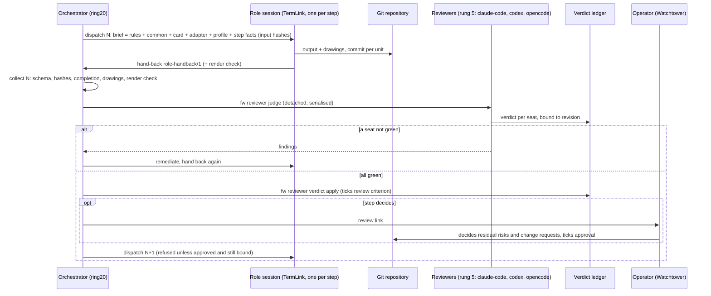
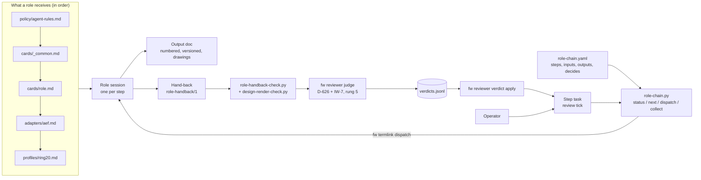

# ring20's inception protocol and design role chain

> Answer to 010-termlink's request (relayed by the operator on 2026-10-04 and received by another ring20 session,
> T-2223; AEF/999 has a copy). The five questions are answered as 1 to 5 below. Everything named here lives in the
> repository `proxmox-ring20-management` on OneDev (`http://192.168.10.201:6610/proxmox-ring20-management`);
> copy from the commit given in 4.1.

## 0 Version history

| Version | Date | Change | Task |
|---|---|---|---|
| 0.1 | 2026-10-04 | First answer: protocol, roles, templates, paths, lessons | T-2222 |
| 0.2 | 2026-10-04 | Requester corrected to 010-termlink (999 has a copy); no content change | T-2223 |

## 0.1 In one paragraph

ring20 uses two layers. **Layer A** is AEF's inception, used unchanged. It answers one question with a go/no-go,
and only the operator decides. **Layer B** is new and is what you asked about. When a GO leads to a substantial
design, the design is written by a **chain of roles**. Each role is one AEF task with a portable role card, and it
hands back a hash-bound record. The project's **framework review policy** (D-626 + IW-7) reviews each step
independently, unchanged. Where a step decides something, the **operator** approves it. A driver
(`role-chain.py`) refuses to start the next role until the previous one is approved, and starts each role as its
own TermLink session.

## 1 The protocol: from opening an inception to go/no-go, and on into the design chain

1.1 **Open** (layer A, AEF as shipped). `fw inception start "<one question>"`: one inception, one question.
Research artifact first (C-001): `docs/reports/T-XXX-<slug>.md` is created **before** any research and is updated
after every dialogue segment, with a `## Dialogue Log`. A chat answer that is not in a file is lost at compaction.
ring20 learned this the hard way (lesson 5.1).

1.2 **Frame**. Fill the inception template: Problem Statement, Assumptions, Open Questions as `IW-n` with
confidence, disposition and rationale (the disposition gate refuses bare yes/no), Exploration Plan, Technical
Constraints, Scope Fence, Go/No-Go Criteria, Recommendation. Present the filled template to the operator before
any spike. After 2 exploration commits, the commit-msg hook blocks further commits until a decision is recorded.

1.3 **Explore**. Spikes are time-boxed. For design questions with real alternatives, ring20 adds an **external
consultation**: one brief, several independent models from different vendors. Subscription seats are codex
(OpenAI), opencode (Z.ai GLM) and antigravity (Google). Paid seats (OpenRouter) are used only with the operator's
go for each call. Answers are stored unedited and then synthesised. Script: `scripts/t2166-consult.py`, reusable
via `CONSULT_BRIEF`, `CONSULT_OUT` and `CONSULT_TAG`. Rules: nothing leaves the estate except to these model
endpoints, with the operator's go each time, and no secrets, credentials or exploit detail in the brief
(`policy/agent-rules.md`).

1.4 **Recommend**. The `**Recommendation:** GO / NO-GO / DEFER` block, with rationale and evidence. DEFER is only
for evidence gaps, never for confidence gaps.

1.5 **Decide** (operator only). The operator decides on Watchtower `/approvals` (or `fw inception decide`, which
is Tier-0 for agents). Agents never record the decision. Every IW-n must be disposed first (T-2166 was blocked by
IW-1 until it was).

1.6 **After GO**. Create separate build tasks; nothing is built under the inception id. When the GO leads to a
design that needs more than one document, ring20 **opens a role chain** (layer B, section 2): one task per role,
in a fixed order, defined in a chain file.

1.7 **Each step of the chain** (drawing D-1):
1.7.a The orchestrator runs `role-chain.py dispatch <chain> <N>`. It refuses unless step N is next and the step
before it is approved. It writes the role's brief: the prompt files in order (1.8), then binding step facts.
It starts the role in its own TermLink session through `fw termlink dispatch`, with restricted tools, and
checks that the worker actually started.
1.7.b The role writes its output (numbered, versioned, traced, with its required drawings). It commits after every
unit and hands back a `role-handback/1` record: output sha256, input sha256s, one completion item per card
condition, open questions, change requests to earlier steps, and the render check of its drawings.
1.7.c The orchestrator runs `role-chain.py collect <chain> <N>`. It waits for the role, then
`role-handback-check.py` validates schema, hashes, completion against the card, the drawing count, and a render
check bound to the same output hash.
1.7.d **Independent review**: `fw reviewer judge T-XXXX --criterion 1`, run detached, because a panel outlasts a
10-minute tool limit. IW-7 picks the rung from risk. Step tasks carry the `security` tag, which means **rung 5**:
a panel of claude-code → codex → opencode that stops at the first seat that is not green. Each seat writes its
own verdict row to `.context/reviews/verdicts.jsonl`, bound to the reviewed revision.
1.7.e Not green: the findings go back to the role, which remediates and hands back again, and the review runs
again. Step 2 here took 8 rounds (lesson 5.6).
1.7.f All seats green: `fw reviewer verdict apply T-XXXX` validates the verdict (provenance, rung, panel, digest)
and only then ticks the review criterion. Agents cannot tick it.
1.7.g Where the step `decides: true`: the operator reads the output on Watchtower `/design/<doc>` and ticks
"[REVIEW] Step N output approved" on `/review/T-XXXX`, after deciding the residual risks and the change requests.
1.7.h `role-chain.py next` / `dispatch N+1` refuses unless the review tick exists, the green verdict is still
bound to the current output (the output is unchanged since the reviewed revision, and the hand-back hash equals
the file), and, where the step decides, the operator's tick exists. Completion alone is never approval.

1.8 **What every role session receives, in this order** (T-2204, harness-neutral):
1.8.1 `policy/agent-rules.md`: project rules for every harness. CLAUDE.md imports it, `opencode.json` lists it,
and `AGENTS.md` points to it.
1.8.2 `roles/cards/_common.md`: rules for every role (authority, outputs, drawings, hand-back, interaction).
1.8.3 The role card: portable, with no harness, vendor, tool, path or language names (a lint test enforces this).
1.8.4 `roles/adapters/aef.md`: how AEF does each card concept (tasks, review, hand-back, drawings, dispatch).
1.8.5 `roles/profiles/ring20.md`: this estate (systems, incidents, constraints).

**Drawing D-1 — one step of the chain**

Text equivalent of D-1: 1.7.a to 1.7.h above, in order.

## 2 The roles: who writes, who reviews, who decides, and how each is assigned

2.1 **The chain** (`docs/designs/agent-authorization-broker/role-chain.yaml`, arc-008):

| Step | Role (card) | Writes | Decides (operator approval) | Iterates with |
|---|---|---|---|---|
| 2.1.1 | Requirements collector (`requirements-collector.md`) | answers, glossary, R-n with acceptance criteria, conflicts | yes | — |
| 2.1.2 | Threat modeler (`threat-modeler.md`) | assets, adversaries, trust boundaries, STRIDE + 4 additions matrix, TH-n, bypass inventory, SI-n, RR-n, change requests | yes (accepts residual risks) | — |
| 2.1.3 | Security floor and phasing (`mvp-specialist.md`) | floor (SI-n and irreversible actions), priorities, phases with exit criteria and rollback | yes | — |
| 2.1.4 | Architect (`architect.md`) | baseline → transitions → target, components, decision records | yes | — |
| 2.1.5 | Evidence specialist (`evidence-specialist.md`) | E-n specs, coverage table | no | step 6 |
| 2.1.6 | Pseudo-coder (`pseudo-coder.md`) | algorithms with fails-closed conditions, state machines | no | step 5 |
| 2.1.7 | Review panel and disposition (`review-panel.md`) | external panel manifest, unedited answers, F-n disposition | yes | — |
| 2.1.8 | Planner (`planner.md`, extended for AEF) | units → AEF tasks, dependencies, coverage | yes | — |

2.2 **Who does what, and how each is assigned:**

| Function | Who | How assigned |
|---|---|---|
| 2.2.1 Orchestrator | ring20 (the project's main agent session) | fixed: the project's main agent; runs `role-chain.py`, never writes a role's output |
| 2.2.2 Writer of a step | a **role session**: its own TermLink session per step (`role-NN-<role>`) | `role-chain.py dispatch` → `fw termlink dispatch`, claude kind today (other harness kinds are review-only in AEF, T-3582; P-2026-1004-003 asks for a build path). Interactive steps (the requirements interview) run in the orchestrator's session with the operator. Steps 1–2 here predate dispatch and were written by the orchestrator |
| 2.2.3 Independent reviewer | the framework's review policy, **unchanged**: D-626 delegation classes + IW-7 risk rungs; rung 5 = panel claude-code → codex → opencode, separate workers, each writes its own verdict row | `fw reviewer judge` picks the rung from the task's risk (the `security` tag → rung 5); the producer never reviews (provenance) |
| 2.2.4 Decider | the **operator** only | the approval criterion carries a `**Sovereignty:**` line, so D-626 classifies it operator-only; agents and reviewers never tick it |
| 2.2.5 External panel (step 7, and inception consultations) | outside models of several vendors (subscription seats; paid seats with the operator's go per call) | the panel step or the inception's exploration; answers stored unedited |
| 2.2.6 Sub-agents | not used for producing or reviewing chain steps | separate sessions give real independence (T-2200 panel 5/5); in-process sub-agents share the producer's context |

2.3 **The parts and how they relate** (drawing D-2):

**Drawing D-2 — parts of the role chain**

Text equivalent of D-2: the chain file and the driver start a role session. The session receives the five prompt
files in order and produces the output and the hand-back. The two checkers validate the hand-back and the
drawings. The framework review writes verdicts, and `verdict apply` ticks the review criterion in the step task.
The operator ticks the approval criterion. The driver reads both ticks before it starts the next step.

## 3 Templates and headings

3.1 **Role card headings** (every card; enforced by `tests/test-role-cards-portable.py`): `## 1 Purpose`,
`## 2 Inputs`, `## 3 What you do`, `## 4 Output` (with `### 4.D Required drawings`, ids **D-n**),
`## 5 Decision rights`, `## 6 Completion conditions` (numbered `6.n`; the last one covers the drawings).

3.2 **Common rules** (`_common.md`): 1 authority and order (hand-back → independent review → operator where the
step decides); 2 inputs; 3 outputs (plain Markdown, number everything 1 / 1.1 / 1.1.a, version history first,
trace every item to its source, RFC 2119 for normative text, drawings required (3.6) with a numbered text
equivalent); 4 nothing leaves the project's boundary; 5 interaction (interview mode / batch mode); 6 the hand-back
record (with `blocked_reason`).

3.3 **Output document skeleton** (every step): front matter (title, task, arc, role, status) → review link →
inputs of record → `## 0 Version history` (version, date, change, task) → numbered sections with ids (R-n, TH-n,
SI-n, RR-n, CR-n, E-n, D-n) → residual risks for the operator → change requests to earlier steps.
Example outputs: `docs/designs/agent-authorization-broker-01-requirements.md`,
`docs/designs/agent-authorization-broker-02-threat-model.md`.

3.4 **Hand-back record**: `docs/designs/agent-authorization-broker/schemas/role-handback-1.schema.json`. Fields:
schema, chain, step, role, task, status (ready-for-review / blocked + `blocked_reason`), output {path, sha256},
inputs [{path, sha256}], summary, completion [{condition, met, evidence}] (one per card condition),
open_questions, change_requests [{step, what}], decisions_needed, render_check.

3.5 **Step task acceptance criteria** (`### Human`, two criteria):
3.5.1 `[REVIEW] Independent review: step N output meets its role card's completion conditions and is fit as input
for the next role`. Reviewer-judgeable. Its Steps say **the orchestrator** runs the judge and that a seat never runs
review commands (lesson 5.2).
3.5.2 `[REVIEW] Step N output approved`, with a `**Sovereignty:** operator decision only` line (lesson 5.3).

3.6 **Inception template**: AEF's `.tasks/templates/inception.md` unchanged, plus the research artifact
`docs/reports/T-XXX-*.md` with a Dialogue Log, and for consultations a brief file and one stored answer per seat.

## 4 Files and commit to copy

4.1 **Commit**: see the delivery note that accompanies this file (the commit that adds this document; everything
below exists at it). Repository: `proxmox-ring20-management`, branch `master`.

4.2 **Paths** (relative to the repository root):
4.2.1 `policy/agent-rules.md`: harness-neutral project rules.
4.2.2 `docs/designs/agent-authorization-broker/role-chain.yaml`: chain definition.
4.2.3 `docs/designs/agent-authorization-broker/roles/cards/` (`_common.md` + 8 role cards).
4.2.4 `docs/designs/agent-authorization-broker/roles/adapters/aef.md`: AEF adapter (A1 tasks and dispatch, A2
review and approval, A3 hand-back, A3b drawings, A4 planner on AEF, A5 search and memory, A6 honest limits).
4.2.5 `docs/designs/agent-authorization-broker/roles/profiles/ring20.md`: estate profile (replace with yours).
4.2.6 `docs/designs/agent-authorization-broker/roles/upstream/`: verbatim originals from 1000-AI-Roles
@ d7e6d8a35b90, kept only for provenance.
4.2.7 `docs/designs/agent-authorization-broker/schemas/role-handback-1.schema.json`.
4.2.8 `scripts/role-chain.py`: status / next / brief / dispatch / collect.
4.2.9 `scripts/role-handback-check.py`, `scripts/design-render-check.py`.
4.2.10 Tests: `tests/test-role-chain.py`, `tests/test-role-handback-check.py`,
`tests/test-role-cards-portable.py`.
4.2.11 Rationale and history: `docs/designs/agent-authorization-broker-roles-plan.md` (evaluation, chain v2,
drawings 5.7/5.8), `docs/designs/agent-authorization-broker-roles-review.md` (5-seat external review of the roles
from the angle of harness and vendor independence; 4.4 = the framework review policy, used unchanged).
4.2.12 Consultation: `scripts/t2166-consult.py`, example brief `docs/reports/T-2166-consultation-brief.md`.
4.2.13 Example step tasks: `.tasks/active/T-2207-arc-008-role-chain-step-2-threat-modeler.md` (8 review rounds,
recommendation block), `.tasks/active/T-2192-arc-008-role-chain-step-1-requirements-c.md`.

4.3 To adopt it in AEF: the cards, `_common.md`, the schema and the three scripts are project-independent. The
chain file, the adapter's paths and the profile are per project. `role-chain.py` reads `ROLE_CHAIN_ROOT`,
`ROLE_CHAIN_FW` and `FW_DISPATCH_DIR`.

## 5 Lessons not written down elsewhere

5.1 **Chat answers die at compaction.** An evaluation given only in chat was lost, and the operator had to ask
again. Rule: every answer to an operator question becomes a task plus a repository file linked from the plan.

5.2 **Review recursion (G-224, filed P-2026-1004-002).** The review criterion's Steps said "run `fw reviewer
judge`". A reviewer seat followed it and started a nested judge, which started more seats: 5 runs and 38 processes
in 35 s. Fix in the wording: only the orchestrator runs the judge. AEF should also refuse `judge` inside a review
worker and lock to one run per task.

5.3 **Operator-only by accident.** D-626 classifies criteria by wording (`_SOVEREIGNTY_FIELD_RE`). The approval
criterion became operator-only only because an escalation note happened to contain "sovereignty". Now each
approval criterion carries an explicit `**Sovereignty:**` line.

5.4 **The reviewer judged the wrong criterion.** With a single "approved" criterion, the panel judged the
operator's approval and escalated. Every step needs **two** criteria: a reviewer-judgeable review criterion and the
operator's approval.

5.5 **Bind the review to the output.** A green verdict says nothing about edits made after it. The driver checks
the verdict id named in the criterion, its revision in the ledger, `git diff --quiet <rev> -- output`, and the
hand-back hash against the file.

5.6 **Sequential panels cost rounds.** Rung 5 stops at the first seat that is not green, so findings surface one
seat at a time (8 rounds for step 2). The policy stays as it is. What helps is the role's own pre-hand-back
self-check: every "n/a" backed by a rule, every incident the profile names disposed of, every count and version in
the hand-back equal to the output, threats and residual risks linked both ways.

5.7 **Drawings must be required, not welcome.** "Diagrams are welcome" produced 0–1 diagrams per document; the
operator could not see the architecture. Now: required D-n per card, a counted check, and a headless render check
bound to the output hash. A Mermaid block that fails to parse shows only as a red box on the page.

5.8 **Shared git index.** Several sessions (Watchtower decision commits, reviewer commits) share one index. One
broad commit reverted the operator's GO decisions. Always run `git diff --cached --name-only` first and commit
with `-- <paths>`.

5.9 **Hand-back lookup by schema.** With render and dispatch records beside the hand-back, "the last
`step-NN-*.json`" picked the wrong file. Select by `schema: role-handback/1`.

5.10 **Detached reviews.** A rung-5 panel outlasts a 10-minute tool call, and stopping the caller does not stop
the workers. Run it with `nohup … & disown` and wait on the process. A `pgrep -f` pattern that matches its own
command line waits forever.

5.11 **Cross-hub mail lands where nobody looks.** Bare names in `fw sidecar send --hub` resolve to the sender's
hub id, and remote hubs are refused on the version floor (P-2026-1004-001). Replies arrive in sender-keyed
sub-inboxes (`inbox:<hub>/<sender>/<recipient>`). This request and 999's own reply both went unseen for a while.

5.12 **One notice per project.** Several containers run for the same agent. Notify the main agent of a project
once, never each session (operator, 2026-10-04).

5.13 **Use the framework's review policy as it is.** The operator's paraphrase of the policy was a correction of
ring20's understanding, not a new rule. Building a parallel policy was the wrong move.

5.14 **Interactive steps stay with the operator.** The requirements interview works one question at a time,
numbered, with a playback and an explicit "go" before moving on. It cannot be a batch role session.
