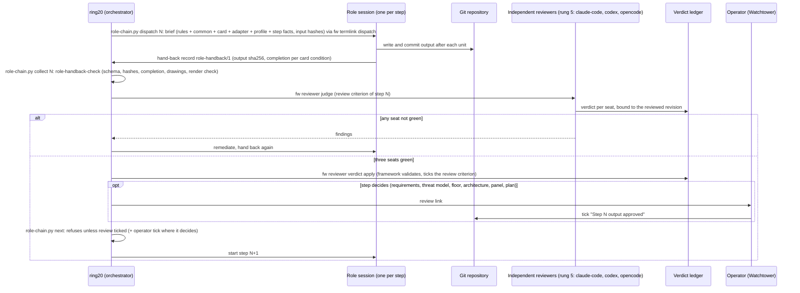
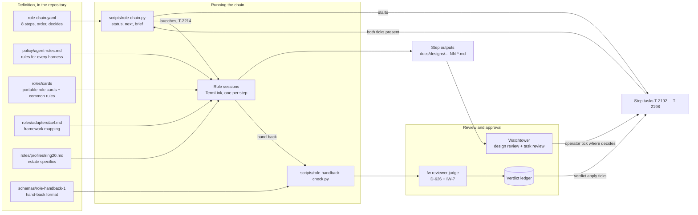

# Using the 1000-AI-Roles roles for the broker design

> **Review this page inline:** http://192.168.10.122:3000/design/agent-authorization-broker-roles-plan
> Companion to `docs/designs/agent-authorization-broker.md` (design v0.1).

## 1 What was asked, and what went wrong

1.1 Earlier today the operator asked whether the roles in `DimitriGeelen/1000-AI-Roles` could be used for the
broker design, naming the requirements collector, the MVP specialist, the pseudo-coder and the TDD evidence
specialist. The operator said it was a question, not an instruction.

1.2 ring20 read the role files and answered in the chat only. Nothing was written down, no task was opened, and
the design plan (section 9 of v0.1) was not changed. When the session was compacted, the answer was lost. The
operator had to ask again. That is the failure this document corrects: the evaluation now lives in the
repository under task T-2190, and section 6 below is a concrete plan, not a remark.

1.3 The design itself is **not finished**. v0.1 is a first sketch: requirements are ring20's own list without
acceptance tests, the architecture has only a target picture, and seven of its sections are marked
"to detail".

## 2 The repository

2.1 `1000-AI-Roles` holds ten Claude Code agent definitions under `.claude/agents/`: requirements-collector,
mvp-specialist, architect, planner, pseudo-coder, tdd-evidence-specialist, coder, documentation-writer,
git-mate, project-initiator.

2.2 They form one chain. Each role names its successor and hands over a file:

| # | Role | Hands over | Next |
|---|---|---|---|
| 2.2.1 | Requirements collector | `user-stories.md` | MVP specialist |
| 2.2.2 | MVP specialist | `mvp-requirements.md` | Architect |
| 2.2.3 | Architect | `architecture.md` | Planner |
| 2.2.4 | Planner | `task-list.json` | Pseudo-coder |
| 2.2.5 | Pseudo-coder | `pseudo-code.md` | TDD evidence specialist |
| 2.2.6 | TDD evidence specialist | `evidence-tests.md` | Coder |

2.3 Every role shares one interaction pattern: explain the plan and wait for "go"; present all questions up
front with hierarchical numbering (1, 1.1, 1.1.a); ask one question at a time; allow skip, back and overview;
show progress; finish with a summary the human can revise. That pattern is the operator's standing
"number everything" rule, already built in.

## 3 Evaluation per role

### 3.1 Requirements collector: use it, first

3.1.a **Fit: strong.** Section 5 of v0.1 lists R-1 to R-10, but ring20 wrote them. They were never elicited
from the operator, the stakeholders were never named, and no requirement has an acceptance test (D2 in the
v0.1 table).

3.1.b **What it adds:**
- 3.1.b.1 Stakeholders made explicit: the operator, ring20 sessions, other projects' agents (SMA, dashboard,
  Penelope, the framework agent), and the production systems the broker protects.
- 3.1.b.2 Elicitation as a numbered, one-question-at-a-time session with the operator instead of ring20
  guessing.
- 3.1.b.3 Output as user stories with Given-When-Then acceptance criteria, which is exactly what D2 is missing.

3.1.c **Adapt:** of its four phases (context, user, system, business), "business" shrinks to the operating
rules: who may approve, availability, break-glass. Nothing commercial applies.

### 3.2 MVP specialist: use it, for the phasing

3.2.a **Fit: strong.** Section 6.6 has phases 0, 1 and 2, but phase 1 alone contains a broker host, agent
and session identities, standing grants, phone approvals, asynchronous tickets and an audit host. That is too
much to prove anything early.

3.2.b **What it adds:**
- 3.2.b.1 Must/Should/Could on every feature, with its rule "default to no unless proven necessary".
- 3.2.b.2 A "basic version" target: the smallest thing that works once under ideal conditions. For the
  broker that could be one skill (the Cloudron app update that caused T-2153), one agent, one exact approval
  on the phone, and an executor holding the only write token.
- 3.2.b.3 Testable hypotheses. Example: "an exact-action approval on the phone is quick enough that the
  operator approves without friction and agents do not stall on it".

3.2.c **Adapt:** drop the go-to-market and growth parts of phase 4.

### 3.3 Architect: use it, approach B

3.3.a **Fit: good.** It covers sections 6.1 to 6.5 and the detail passes D3 to D6 and D9.

3.3.b **Approach choice.** The role asks for A (minimal), B (iterative) or C (enterprise, TOGAF).
**Recommendation: B.** A would ignore the security target; C would bury a single-operator estate in
ceremony. B matches the phasing the MVP specialist produces.

3.3.c **What it adds:**
- 3.3.c.1 Baseline, transition and target diagrams. v0.1 has only the target. The baseline (today: agents
  hold write credentials, approval files are forgeable) and one transition per phase are missing.
- 3.3.c.2 A measurement strategy per component: what data proves it works in production, decided before
  building. This is ring20's own probe rule (assert the invariant, not liveness; T-1521).
- 3.3.c.3 Options with pros and cons for the Product Owner, the operator, as section 6.5 already does for
  decision D-1.
- 3.3.c.4 A 500-line limit per file with sub-documents. v0.1 is 317 lines and will grow, so the detail
  passes become sub-documents.

### 3.4 Planner: do not adopt the file, keep the discipline

3.4.a The framework's task system already does this (`.tasks/`, arcs, verification gates). A separate
`task-list.json` would be a second, competing backlog.

3.4.b What we keep: its epic, feature and task breakdown with dependencies, applied when the build tasks are
created after the operator signs off.

3.4.c **Extended (T-2199, operator 2026-10-03):** the planner was written for another mechanism, so its
description was rewritten for the framework; since T-2204 it is the portable card
`docs/designs/agent-authorization-broker/roles/cards/planner.md` plus `roles/adapters/aef.md`
(P1 to P11: prior-art search, epic/feature/task mapped to arc/inception/build task, sizing, `fw task create`,
real ACs, pipefail-safe verification, dependencies, inception decisions, upstream routing).

### 3.5 Pseudo-coder: use it, for the security-critical logic

3.5.a **Fit: strong, and specific to this design.** In an authorization broker, ambiguity in the logic *is*
the vulnerability. G-219 (forgeable approval files) is exactly the kind of flaw an EDGE CASES section finds
before code exists.

3.5.b **Where to apply it.** Only to the algorithms that decide whether something runs:
- 3.5.b.1 Canonicalize and hash an action (RFC 8785).
- 3.5.b.2 Verify an approval: signature, single use (jti), expiry, binding to the exact hash.
- 3.5.b.3 Check a grant: agent, session, skill class, resource, time window.
- 3.5.b.4 The ticket state machine for asynchronous approvals, including timeout and cancel.
- 3.5.b.5 The post-condition check: does the platform's response match the approved target (the T-2153 class).
- 3.5.b.6 Revocation and break-glass.

3.5.c Its PROBLEM / APPROACH / ALGORITHM / EDGE CASES / COMPLEXITY format also gives the external reviewers
something precise to attack without any code.

### 3.6 TDD evidence specialist: use it, adapted

3.6.a **Fit: good for the principle, poor for the tooling.** The role is built around Puppeteer browser
tests. The broker is mostly an API; only the approval surface (D7) is a page.

3.6.b **What we keep:**
- 3.6.b.1 Assert-first: for each requirement, "suppose this worked perfectly, how would I tell?"
- 3.6.b.2 The EVIDENCE / ARRANGE / ACT / ASSERT format, one behaviour per test.
- 3.6.b.3 "Show me the data": no "tests pass" claim without the evidence. That matches the verification
  gate.
- 3.6.b.4 Written in the design phase, before code, as the acceptance tests of each requirement.

3.6.c **What we add for a security component:** negative and adversarial evidence, which the role does not
mention. Examples: a forged approval file, a replayed jti, arguments changed after approval, an expired
approval, a response naming a different target than the one approved, an agent without a grant.

3.6.d **What we drop:** cross-browser matrices, Core Web Vitals, "not headless only". Those keep their place
only for the approval page.

### 3.7 Not used

3.7.a Coder, documentation-writer, git-mate, project-initiator. The framework already covers them (git agent,
task system, project scaffolding), and they belong to the build, not the design.

## 4 Fit with our rules

4.1 **Authority.** Each role waits for the human's "go" before working. That fits the authority model: the
agent proposes, the operator decides.

4.2 **Where the outputs go.** Not the role's file names in the repo root. Each output becomes a section or
sub-document of the design under `docs/designs/agent-authorization-broker/`, reviewable inline on Watchtower.
Nothing leaves the estate.

4.3 **Model.** The role files name `claude-3-5-sonnet`, an old model. The roles are prompts, not a dependency:
ring20 runs them in its own session (the interactive ones need the operator anyway).

4.4 **External panel.** Unchanged. The roles structure the work; the panel still reviews the result (v0.1
section 9, round 2).

## 5 How this changes the design plan

5.1 The roles slot in between round 1 (operator comments on v0.1) and round 2 (external panel):

| Step | Role | Settles (v0.1 section 7) | Operator involvement |
|---|---|---|---|
| 5.1.1 | Requirements collector | D2 requirements, plus the actors part of D1 | **Interactive session**, numbered questions one at a time |
| 5.1.2 | MVP specialist | D11 phasing; a basic version and an MVP | Confirm Must/Should/Could |
| 5.1.3 | Architect (B) | D3 flows, D4 grants, D5 identity, D6 placement, D9 audit; baseline and transition diagrams | Decide D-1 (placement) and D-2 (root) |
| 5.1.4 | Pseudo-coder | The six algorithms in 3.5.b | None; reviewed by the panel |
| 5.1.5 | TDD evidence specialist | An evidence spec per requirement, including adversarial cases | Review the list |
| 5.1.6 | External panel, round 2 | Critical review of the result as v0.2 | Approve sending it out |
| 5.1.7 | Planner discipline | Build tasks after sign-off (v1.0) | Sign-off |

5.2 D7 (approval surface), D8 (credentials), D10 (break-glass) and D12 (upstream) run inside steps 5.1.1 to
5.1.3 as their questions come up.

5.3 **Codified as a chain of tasks (T-2191), now chain v2 (T-2204, after the T-2200 external review).**
Eight steps, one task each, run in order:

| Step | Task | Role | Output (reviewable inline on Watchtower) |
|---|---|---|---|
| 5.3.1 | T-2192 | Requirements collector | `agent-authorization-broker-01-requirements.md` |
| 5.3.2 | T-2207 | Threat modeler (new, operator "5a yes") | `agent-authorization-broker-02-threat-model.md` |
| 5.3.3 | T-2193 | Security floor and phasing | `agent-authorization-broker-03-floor-and-phasing.md` |
| 5.3.4 | T-2194 | Architect | `agent-authorization-broker-04-architecture.md` |
| 5.3.5 | T-2196 | Evidence specialist (iterates with 5.3.6) | `agent-authorization-broker-05-evidence.md` |
| 5.3.6 | T-2195 | Pseudo-coder | `agent-authorization-broker-06-pseudo-code.md` |
| 5.3.7 | T-2197 | Review panel and disposition | `agent-authorization-broker-07-panel-review.md` |
| 5.3.8 | T-2198 | Planner, after sign-off | `agent-authorization-broker-08-build-plan.md` |

5.4 **The hand-over rule.** Today: the step's "[REVIEW] Step N output approved" criterion, which only the
operator can tick; `scripts/role-chain.py next` refuses until it is ticked (T-2201: completion alone is not
approval). Planned (inception T-2206): each role runs as its own TermLink session with ring20 as
orchestrator; its output is reviewed under the framework's review policy (D-626 + IW-7); a positive verdict
bound to the output hash hands over to the next role; operator-only where a step decides.

5.5 **Vendor-independent role descriptions (T-2204).** Each role session receives, in order:
`policy/agent-rules.md` (project rules for every harness), `roles/cards/_common.md` (rules for every role,
including the `role-handback/1` record), its portable card in `roles/cards/` (no harness, vendor, tool, path or
language; enforced by `tests/test-role-cards-portable.py`), `roles/adapters/aef.md` (how the framework does it)
and `roles/profiles/ring20.md` (this estate). The upstream originals are provenance only, in `roles/upstream/`.

5.6 The chain definition is `docs/designs/agent-authorization-broker/role-chain.yaml`. `role-chain.py status`
shows where the chain stands; `brief N` lists what step N's session receives.

5.7 **How one step runs (drawing).** The sequence for every step of the chain, as built (T-2191, T-2213, T-2212,
and T-2214: `role-chain.py dispatch` starts the role session over TermLink, `collect` checks its hand-back; limits in
adapter A1.7):

5.8 **The parts and how they relate (drawing).**

## 6 Step 5.1.1 ready to start: the requirements collector's question overview

6.0 As the role prescribes, all questions up front. In the session they are asked one at a time; "skip",
"back" and "overview" work at any point.

### 6.1 Context and scope

6.1.1 In one sentence: what must the broker make impossible that is possible today?
6.1.2 What counts as success six months after it is live? Name something you could observe.
6.1.3 What is explicitly out of scope for the first version?
6.1.4 Which constraints are fixed: budget, hardware, the time you can spend approving, who maintains it?

### 6.2 Who is involved

6.2.1 Who may approve? Only you, or a deputy as well (and for which classes)?
6.2.2 Which agents must be able to use skills through the broker in the first version: ring20 only, or
also SMA, dashboard, Penelope, the framework agent?
6.2.3 Should other projects' agents be able to ask for grants on their own, or only through ring20?

### 6.3 What you do with it

6.3.1 When an approval arrives on your phone, what must it show for you to decide in seconds?
6.3.2 Which channel: Signal, ntfy, Watchtower, or more than one? Which is primary?
6.3.3 How many approvals per day would you accept before it becomes a nuisance?
6.3.4 Grants: per task, per session, or per time window? What is a sensible default length?
6.3.5 How do you want to see what was done under a grant: a daily digest, a page, only on request?
6.3.6 Revocation: what must "stop everything" do, and from where must you be able to trigger it?

### 6.4 What the system must guarantee

6.4.1 Which actions are destructive for you (always one-time exact approval), and which are routine
mutations?
6.4.2 Reads: may agents read production freely under a standing grant, including reading secrets' names
and metadata?
6.4.3 What may happen when you are unreachable for a day: everything stops, reads continue, or a deputy?
6.4.4 How long may an approval stay valid: minutes, an hour?
6.4.5 Must the audit log survive the loss of the broker host? Who besides you may read it?
6.4.6 Is a deliberately malicious agent in scope, and from which phase (decision D-6)?

### 6.5 Operating rules

6.5.1 Break-glass: when the broker or your phone is unavailable, who may do what, and how is it recorded?
6.5.2 Where may the broker live (decision D-1)? Is a separate small device outside the cluster acceptable?
6.5.3 What must keep working during the migration, without exception?

6.6 After the last question: a summary as user stories with Given-When-Then acceptance criteria, numbered
R-1, R-2, and so on. You revise it, then it replaces section 5 of the design.

## 7 For the operator

7.1 Reply with a number, or comment inline on this page:

- 7.1.a **Start step 5.1.1 now** (task T-2192, via `role-chain.py next`): the requirements session, one
  question at a time in this chat, starting at 6.1.1.
- 7.1.b Review this plan on Watchtower first and comment, then start.
- 7.1.c Change the plan (for example a different role order or approach A or C for the architect).

7.2 Recommendation: **7.1.a**. The requirements are the weakest part of v0.1, and every later role depends on
them.
